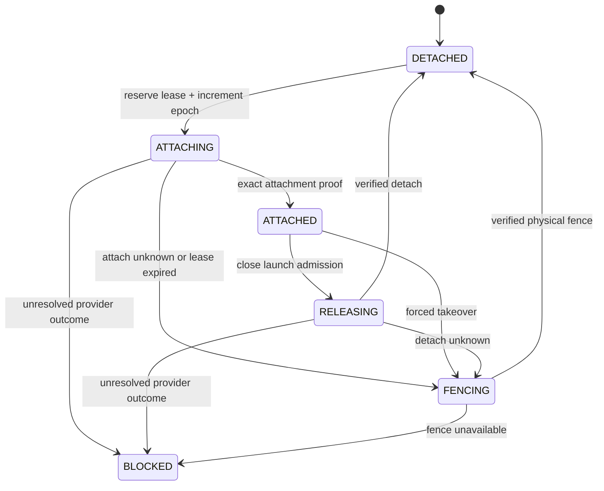

# Session Runtime Authority

## Scope

The implemented foundation provides:

- a single-client PostgreSQL `SERIALIZABLE` transaction executor;
- database-authoritative transaction time;
- bounded, provenance-aware serialization and deadlock retry;
- a checksum-bound initial authority schema;
- real-PostgreSQL migration and concurrency tests; and
- bounded OCI/Docker runnable-image inspection plus a one-use reservation
  capability.

The next authority slice will use that foundation as the central,
single-primary PostgreSQL authority for one portable session's writer
lifecycle. It will turn the structural records in
`session-storage-contracts.mjs` into serializable admission decisions for:

- session and storage registration;
- writable lease allocation and renewal;
- attachment, release, and force-fence transitions;
- operation and checkpoint-catalogue claims;
- exact platform-image reservations; and
- logical launcher admission.

The present foundation does not yet implement those business transitions or
authorize a writer. It also does not mount storage, launch a container, resolve
a registry tag, verify an image publisher, stop a writer, or prove a physical
fence. Those effects remain provider operations that a later authority can
invoke only after a reservation has committed. The current stopped-directory
backend declares `fencing: "manual"` and therefore cannot use lease expiration
alone for automatic host takeover.

## Protected Properties

The authority protects three different properties and keeps them distinct:

1. **Canonical identity**: one session record binds the immutable manifest,
   storage reference, backend capabilities, writer epoch, attachment, and
   operation state.
2. **Admission order**: every conflicting transition is serialized against the
   same PostgreSQL session row and revision. Database time, not a worker-host
   clock, decides lease expiry.
3. **Physical exclusion evidence**: only a backend proof can establish that a
   stale writer can no longer mutate storage. A higher database epoch blocks
   new logical admissions, but does not itself provide that proof.

The PostgreSQL foundation provides the transaction mechanism and schema for the
first two; their lifecycle transitions arrive in the next slice. The third must
be supplied by a capable storage backend or supervisor.

## Implemented PostgreSQL Transaction Boundary

The executor gives one callback a checked-out PostgreSQL client and one
`SERIALIZABLE READ WRITE` transaction from a pool dedicated to this executor.
The constructor accepts that pool only through the explicit `dedicatedPool`
option; legacy or ambiguous `pool` input is rejected. It:

1. resets the checked-out session outside a transaction with a verified
   `DISCARD ALL`;
2. obtains `transaction_timestamp()` and a transaction ID from that same
   database transaction;
3. exposes only a callback-scoped extended-protocol `query(text, values?)`
   capability and the canonical timestamp;
4. rejects an unsettled or suppressed failed query;
5. rechecks the transaction ID after every successful user query so
   callback-issued transaction control cannot be hidden by a later throw, and
   treats a query failure without a trusted PostgreSQL SQLSTATE as
   outcome-uncertain; and
6. accepts only an exact node-postgres `COMMIT` acknowledgement, then verifies
   another `DISCARD ALL` before returning the client to its dedicated pool.

Serialization failures and deadlocks may be retried only after PostgreSQL has
returned the exact transaction-rollback SQLSTATE and the client has been
destroyed or reset after a proved rollback. That rule also covers a `40001`
detected during `COMMIT`. A transport failure or any other `COMMIT` error is
outcome-uncertain and is never automatically replayed as a fresh operation.
Reset failure destroys the connection and preserves the already proved
committed or not-committed outcome. User-query failures without a SQLSTATE,
the connection/operator/system/internal error classes, and the explicit
`40003` completion-unknown state are likewise outcome-uncertain; a later
`ROLLBACK` cannot reclassify them.

The next authority slice must use that executor to lock or insert canonical
session and claim rows, validate the complete expected identity and revision,
and commit a durable reservation before any external provider callback starts.
An external callback must not be held inside a database transaction. Its
required protocol is:

```text
serializable reserve commit
          │
          ▼
external physical operation
          │
          ▼
serializable exact-CAS finalize
```

That future durable reservation must close launch, detach, fence, restore, and
other conflicting admission while the callback is in flight. If the callback
or finalization acknowledgement is uncertain, the reservation and blocked
state must remain visible for explicit reconciliation; the authority must
never roll back to an apparently safe state.

## Required Canonical Session Lifecycle

The canonical document uses the lifecycle from the storage contract:



A new writable acquisition and the beginning of force-fence advance the uint64
fencing epoch. Renewal preserves the complete writer tuple and extends only the
database-authoritative expiration. Epoch exhaustion fails closed.

Lease expiry closes mutation and launch admission. It does not change the
physical attachment state. After expiry, only exact-owner cleanup for the
unchanged tuple may attempt detach. Once a newer epoch has been allocated, the
old tuple is stale even for cleanup.

## Schema for Durable Claims and Reservations

Operation IDs, capture-attempt IDs, and reservation IDs are global authority
identities rather than session-volume data:

- an exact operation retry may replay only its complete canonical request and
  committed result;
- reusing an operation ID with a different session, kind, or request fails
  closed;
- an active reservation is unique for the operation and session conflict
  class;
- capture-attempt IDs and their operation IDs remain claimed by active records
  or permanent tombstones; and
- checkpoint catalogue entries are finalized only from the exact active
  capture attempt.

The PostgreSQL schema intentionally stores state-machine documents as `jsonb`
while keeping identities, revisions, timestamps, and uniqueness constraints in
relational columns. Business transitions remain in the authority code so a
database migration cannot silently invent a new lifecycle.

## Platform Image Reservation

The portable identity is the existing manifest's exact platform-manifest
digest, media type, Linux platform, and normalized Codex version. A trusted
resolver may add measured descriptor and executable evidence, but cannot
replace those four fields or accept an OCI index/tag as the portable identity.
The current resolver accepts a bounded runnable-image profile rather than every
OCI artifact extension: it validates the exact manifest and config bytes,
required config/rootfs structure, one or more recognized layer descriptors,
matching DiffID count, and supported standard descriptor metadata. OCI
manifest `mediaType` may be omitted as the specification permits. Artifact
manifests, unknown descriptor fields, non-HTTPS or credential-bearing
descriptor URLs, and unsupported layer media types are rejected deliberately.

Image reservation follows one-process object capability semantics:

1. validate the complete session manifest and trusted resolver projection;
2. mint an opaque, non-serializable reservation bound to that exact projection;
3. revalidate the projection immediately before launch;
4. consume the reservation exactly once during launcher admission.

A clone, JSON value, proxy wrapper, or reconstructed record is not a
reservation. The object capability prevents an untrusted serialized
`"trusted": true` field from becoming launch authority. It does not prove
registry availability, publisher signatures, or that a future container driver
actually launched the reserved bytes.

## Required Logical Launcher Admission

Launcher admission atomically re-reads:

- the immutable session manifest and storage reference;
- the current unexpired lease and fencing epoch;
- the exact writable attachment;
- the absence of another active authority reservation;
- checkpoint/recovery state required by the selected recovery class; and
- the consumed exact-image reservation.

It then commits a durable launch attempt before invoking a launcher callback.
`prepared`, `starting`, and `uncertain` attempts all block a second writer.
Success records the returned process and writer incarnation bindings; failure
is launchable again only when the supervisor has proved the complete old writer
boundary stopped and the authority has finalized that proof.

The next authority slice will introduce this launcher callback seam. A later
concrete Podman/Docker adapter must hold directory identity through the bind,
enforce rootless execution, fix the Codex CLI/config surface, and register the
exact writer with `StoppedWriterCapabilityCoordinator`.

## Operational Boundary

Production deployment requires:

- PostgreSQL 13 or newer for `pg_current_xact_id()`; CI validates PostgreSQL
  18.4;
- one authoritative PostgreSQL primary for these tables;
- a node-postgres pool dedicated to this executor so its verified
  `DISCARD ALL` lifecycle cannot invalidate another subsystem's session state;
- TLS, database authentication, backup, and access control outside this module;
- migration application before serving authority requests;
- durable database backups independent of session-volume snapshots;
- bounded retry and request deadlines at the service boundary; and
- reconciliation tooling for retained ambiguous reservations.

PostgreSQL availability is not storage fencing. A database failover must not
promote an unfenced session merely because a lease timestamp has passed.

## Validation

The foundation unit suite uses deterministic transaction doubles to cover
database time, query-capability lifetime, provenance-aware retry, migration,
commit uncertainty, and release failure. Image tests cover exact bytes,
descriptor and config identity, measurement drift, and one-use capability
semantics. A separate GitHub Actions job runs the schema and competing
authority clients against a real PostgreSQL service. The next authority slice
must add lifecycle, idempotency, epoch, reservation, catalogue, and launch
transition tests. Later physical-backend pull requests must add crash,
detach/fence, container-launch, and cross-host conformance evidence.
