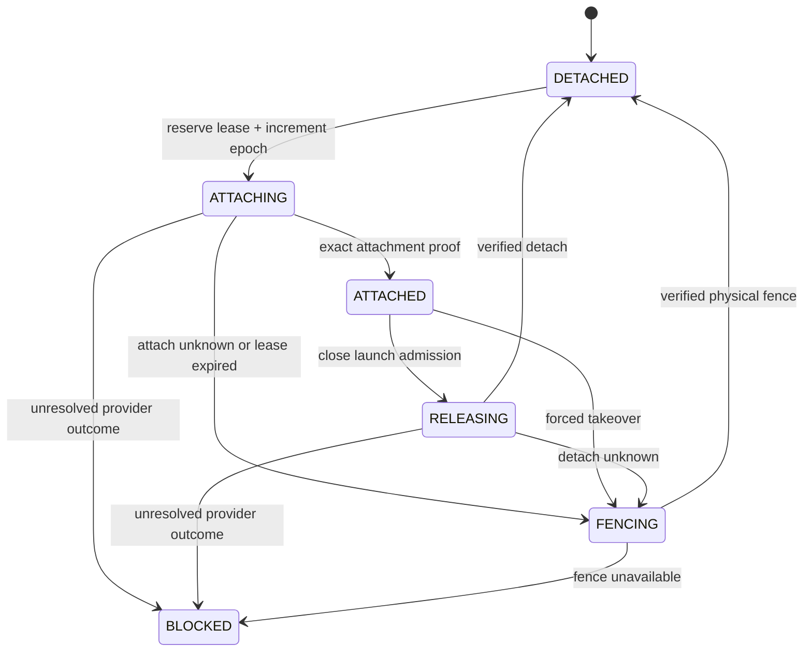

# Session Runtime Authority

## Scope

The implemented authority provides:

- a single-client PostgreSQL `SERIALIZABLE` transaction executor;
- database-authoritative transaction time;
- bounded, provenance-aware serialization and deadlock retry;
- a checksum-bound initial authority schema;
- real-PostgreSQL migration and concurrency tests; and
- bounded OCI/Docker runnable-image inspection plus a one-use reservation
  capability;
- canonical, idempotent session registration with strict readback; and
- a durable session-wide operation and reservation phase kernel.

Registration binds one immutable session manifest, storage reference, and
backend capability set to a canonical initial `DETACHED` document. The
operation kernel then binds one exact request to one active session reservation
before any external dispatch can begin. Subsequent authority slices will turn
the remaining structural records in `session-storage-contracts.mjs` into
serializable admission decisions for:

- writable lease allocation and renewal;
- attachment, release, and force-fence transitions;
- checkpoint-catalogue finalization; and
- logical launcher admission.

Registration and operation reservation are not writer admission: they do not
allocate a lease or epoch, create an attachment, invoke a provider, or authorize
a launcher. The kernel exposes a durable `starting` claim but deliberately does
not execute a provider callback. The authority also does not mount storage,
launch a container, resolve a registry tag, verify an image publisher, stop a
writer, or prove a physical fence. Those effects remain provider operations
that a later typed authority can invoke only after a reservation and dispatch
claim have committed. The current stopped-directory backend declares
`fencing: "manual"` and therefore cannot use lease expiration alone for
automatic host takeover.

## Protected Properties

The authority protects three different properties and keeps them distinct:

1. **Canonical identity**: one session record binds the immutable manifest,
   storage reference, backend capabilities, writer epoch, attachment, and
   operation state.
2. **Admission order**: every conflicting transition is serialized against the
   same PostgreSQL session row and revision. Database time, not a worker-host
   clock, decides lease expiry.
3. **Physical exclusion evidence**: only a backend proof can establish that a
   stale writer can no longer mutate storage. A higher database epoch blocks
   new logical admissions, but does not itself provide that proof.

The PostgreSQL registry protects the immutable part of canonical identity. The
operation kernel uses the executor and schema to provide the first
admission-order mechanism, while the remaining lifecycle transitions arrive in
later slices. Physical exclusion evidence must be supplied by a capable storage
backend or supervisor.

## Implemented Canonical Session Registry

`PostgresSessionAuthority.registerSession()` validates and stores one canonical
document:

```text
documentVersion = 2
manifest
storageRef
backendCapabilities
lifecycle = DETACHED
writerEpoch = 0
lease = null
attachment = null
activeOperation = null
lastOperation = null
recovery = null
launch = null
```

The manifest, storage reference, and backend capabilities are defensively
copied and frozen before they cross the transaction boundary. The manifest and
storage reference must name the same session. Registration uses PostgreSQL
`SERIALIZABLE` isolation and an insert-on-conflict path, then compares the
complete canonical identity:

- an exact replay returns the existing revision and timestamps without a
  write, including after mutable operation state has progressed;
- reusing the session ID with any different immutable identity returns
  `session_identity_conflict` and never overwrites the row; and
- database `transaction_timestamp()` supplies both initial timestamps.

Version 2 adds a bounded `lastOperation` terminal anchor. A canonical version 1
document remains readable with its exact original shape and serialization so
operation requests already bound to that snapshot retain the same digest.
Version 1 is accepted only as an inactive revision-zero snapshot. The first
state-changing session write upgrades it to version 2 before an active pointer
is stored; any active version 1 document is an impossible downgrade and fails
closed. Readback never rewrites a stored document merely to normalize its
version.
The previously merged version 1 registry exposed no session-state mutation
method, so its supported persisted state was revision zero; progressed version
1 operation states existed only in intermediate commits of this unmerged
operation-kernel workstream and are not a migration input.

`readSession()` validates the complete relational and JSON document shape,
immutable identity bindings, current mutable state, revision, timestamps, and
any active operation/reservation linkage before returning a deep-frozen
snapshot. For a progressed version 2 session, it also resolves the
`lastOperation` primary keys and proves that they name a matching committed
operation and released reservation, including request and result digests,
revisions, and terminal timestamps. Missing sessions return
`session_not_found`; malformed or inconsistent stored state returns
`session_state_invalid` or `operation_state_invalid`. Readback never repairs or
normalizes stored authority state implicitly.

## Implemented Operation and Reservation Kernel

The kernel uses one conservative conflict class,
`session-mutation`. Every authority-changing operation for one session
conflicts with every other such operation until a later schema and proof set
justify narrower classes. `kind` describes an operation; it does not weaken
this session-wide exclusion rule.

`reserveOperation()` binds a globally unique operation ID to the exact session,
kind, bounded canonical request, and complete caller-observed session snapshot.
Canonicalization incrementally bounds JSON nodes and UTF-8 bytes, rejects
accessors, proxies, lone surrogates, and U+0000 before PostgreSQL access, and
uses captured `String`, `JSON`, and `Buffer` intrinsics plus null-prototype
temporary arrays so post-import global or prototype mutation cannot change the
request digest.
In one `SERIALIZABLE` transaction it:

1. locks the canonical session row;
2. proves the expected immutable identity, lifecycle, and revision;
3. claims one operation row and one authority-generated reservation row; and
4. writes the matching `activeOperation` pointer while incrementing the session
   revision.

The stored request, relational rows, and session pointer bind the same IDs,
kind, conflict class, request digest, expected session revision, phase, and
operation revision. Readback cross-checks all three representations. A missing,
dangling, or mismatched representation is corruption and fails closed; it is
never repaired implicitly.

The durable pre-dispatch state machine is:

```text
absent
  └── reserve ───────────────> prepared
prepared
  ├── claim dispatch ────────> starting
  └── cancel before dispatch > committed + released
starting
  └── outcome not provable ──> uncertain
```

`claimOperationDispatch()` performs only the `prepared -> starting` database
CAS. It returns a dispatch grant only when that exact call definitely committed
the transition. A replay that observes `starting` or `uncertain`, a lost commit
acknowledgement, or a restart never produces another grant. The caller must
wait for this method to return before invoking a provider, and no provider
callback runs inside the database transaction.

`markOperationUncertain()` durably changes the operation, reservation, and
session pointer together while leaving both claim rows active.
`cancelPreparedOperation()` is the only generic terminal path in this slice:
it can release a reservation only while dispatch is still durably unclaimed,
records a canonical `cancelled-before-dispatch` result, and preserves the
operation ID permanently for exact replay. The same transaction clears the
active pointer and replaces `lastOperation` with a terminal anchor containing
the operation and reservation identities plus canonical request and result
digests. A `starting` or `uncertain` operation cannot use this cancellation
path.

`reconcileOperation()` is read-only and reports whether the exact request is
absent, prepared, starting, uncertain, or already committed. Reserve,
dispatch-claim, uncertainty, and cancellation retries replay exact durable
state without rewriting revisions or timestamps. Reusing an operation ID with
a different session, kind, expected snapshot, or request fails closed.

All real phase changes increment the session revision exactly once; operation
phase changes increment the operation revision exactly once. The reservation's
`expected_session_revision` remains the revision observed before the original
reserve. Writer epoch, session revision, and operation revision are independent
counters and are never inferred from one another. Every operation timestamp is
database time.

For version 2, an inactive revision-zero session has no terminal anchor. An
inactive progressed session has revision
`lastOperation.expectedSessionRevision + 2`; an active session either starts
from revision zero with no prior anchor or preserves the immediately preceding
anchor in its expected snapshot. Terminal validation performs bounded
primary-key reads and does not scan the complete operation history. This
protects the current session transition source under the authority's ordinary
database-integrity model; coordinated rewriting of the session document,
operation, reservation, and their bound hashes is outside that model.

The kernel has no expiry, steal, or automatic release rule. `starting` and
`uncertain` survive process restart and continue to block the session. A later
typed lease, attachment, fencing, catalogue, or launch authority must verify
its own completion evidence and atomically combine the business-state update
with operation finalization. It must not call a generic finalizer first and
update the canonical lifecycle in a second transaction.

## Implemented PostgreSQL Transaction Boundary

The executor gives one callback a checked-out PostgreSQL client and one
`SERIALIZABLE READ WRITE` transaction from a pool dedicated to this executor.
The constructor accepts that pool only through the explicit `dedicatedPool`
option; legacy or ambiguous `pool` input is rejected. It:

1. resets the checked-out session outside a transaction with a verified
   `DISCARD ALL`;
2. obtains `transaction_timestamp()` and a transaction ID from that same
   database transaction;
3. exposes only a callback-scoped extended-protocol `query(text, values?)`
   capability and the canonical timestamp; parameter input must be a built-in,
   non-Proxy array with at most 65,535 entries, and every entry is copied into
   an own data property that accepts only `null`, `undefined`, string, number,
   boolean, or bigint values, so node-postgres never invokes application
   converters while classifying a database retry; callers serialize structured
   values to strings and use explicit SQL casts such as `$1::jsonb`;
4. rejects an unsettled or suppressed failed query, and internally observes
   locally rejected query promises so a fire-and-forget call cannot emit an
   unhandled process rejection while the original promise remains rejected;
5. rejects `PREPARE TRANSACTION`, including leading empty statements and
   comment-separated forms, before submission so a callback cannot move the
   transaction and its locks into PostgreSQL's prepared-transaction registry;
   ordinary `PREPARE name [(types)] AS ...` remains available and is reset with
   the session; then rechecks the transaction ID after every successful user
   query so callback-issued transaction control cannot be hidden by a later
   throw, and treats a query failure without a trusted PostgreSQL SQLSTATE as
   outcome-uncertain;
6. immediately before `COMMIT`, executes a frozen extended-protocol
   `SET LOCAL synchronous_commit = on`, requires an exact `SET`
   acknowledgement, and rechecks the original transaction ID so a callback
   cannot lower this transaction's acknowledgement durability; and
7. accepts only an exact node-postgres `COMMIT` acknowledgement, then verifies
   another `DISCARD ALL` before returning the client to its dedicated pool.

Serialization failures and deadlocks may be retried only when the same
node-postgres `DatabaseError` object was first observed on that client's
`errorMessage` connection event and then rejected the active query with the
exact transaction-rollback SQLSTATE. The client is destroyed or reset after a
proved rollback. A client returned by the dedicated pool is also destroyed
with `release(error)` when its required query, release, or connection-event
shape is invalid; the acquisition failure remains primary even if destruction
fails. Merely constructing `DatabaseError` or matching its `code` is
insufficient: custom parameter conversion and result-parser failures never
receive protocol provenance. The executor captures the WeakMap, Set, Array,
RegExp, object, Promise, cryptographic Hash, and prototype-test intrinsics used
by that proof before any callback runs. Authority-bearing driver results must
expose own data fields rather than inherited values or accessors. A callback
limited to the transaction capability therefore cannot use built-in prototype
mutation to manufacture SQLSTATE provenance, hide pending queries, replace
migration checksum operations, or turn an unknown `COMMIT` result into a
retry. This is not an unforgeable brand against code that can access or replace
the dedicated pool, checked-out client, connection event source, or
node-postgres implementation: those objects form the trusted driver boundary
and must not be exposed to callbacks. For every query, the executor temporarily
pins the connection's own `emit` method to the module-captured native
`EventEmitter` implementation and uses captured listener intrinsics, then
restores the exact prior own descriptor. A callback that mutates
`EventEmitter.prototype` after its final user query therefore cannot redirect
a completed `COMMIT` event into forged retryable SQLSTATE evidence. That rule
also covers a server `40001` detected during a user-query boundary recheck,
the final durability/boundary recheck, or `COMMIT`. A trusted `40001` or
`40P01` from either recheck proves that PostgreSQL aborted the transaction, so
the executor destroys the client and may retry the complete callback within
the configured bound. A local, reused, or merely SQLSTATE-shaped exception
does not carry that proof and remains outcome-uncertain. A transport failure
or any other `COMMIT` error is outcome-uncertain and is never automatically
replayed as a fresh operation. Forcing `synchronous_commit=on` protects the
transaction from callback-local weakening; it does not compensate for a
PostgreSQL deployment that disables normal WAL or filesystem durability.
Reset failure destroys the connection and preserves the already proved
committed or not-committed outcome. User-query failures without a SQLSTATE,
the connection/operator/system/internal error classes, and the explicit
`40003` completion-unknown state are likewise outcome-uncertain; a later
`ROLLBACK` cannot reclassify them.
After a callback rollback is proved, only a store error minted by that exact
transaction attempt retains its specific state. A publicly constructed store
error or one replayed from another operation is translated to the generic
`transaction_rolled_back` / `not-committed` result. Constructor provenance is
recorded in a module-private identity set, including objects constructed with
an alternate `newTarget`; the captured public prototype chain independently
covers prototype-created or prototype-grafted counterfeits. An opaque Proxy
callback error also fails closed to the generic rollback result because its
target identity cannot be proved. Ordinary non-Proxy application errors remain
unchanged, while stale or forged `committed` / `uncertain` store state cannot
escape a transaction that definitely rolled back.

Migration rollback preserves a specific migration validation error only when
that exact error object was created and marked by the current `migrate()`
invocation. A publicly constructed store error or an internal error replayed
from another operation is translated to `migration_failed` after the current
rollback, so stale or forged `commitState` evidence cannot cross operation
boundaries. Store errors define frozen own data fields rather than consulting
mutable prototype accessors for their reported state.

The operation kernel uses that executor to lock the canonical session row,
claim operation and reservation rows, validate the complete expected identity
and revision, and commit durable `prepared` and `starting` phases before any
external provider callback starts. The owning session's current active
operation and reservation are locked in that order. A foreign or already
retired operation ID is read only as snapshot-consistent identity evidence,
not locked, so crossed foreign IDs cannot introduce a second lock order.
An external callback must not be held inside a database transaction. Later
typed lifecycle methods must preserve this protocol:

```text
serializable reserve commit
          │
          ▼
external physical operation
          │
          ▼
serializable exact-CAS finalize
```

The durable reservation closes launch, detach, fence, restore, and other
conflicting admission while the callback is in flight. If the callback or
finalization acknowledgement is uncertain, the reservation and operation phase
remain visible for explicit reconciliation; the authority never rolls back to
an apparently safe state.

## Required Canonical Session Lifecycle

The canonical document uses the lifecycle from the storage contract:


```mermaid
stateDiagram-v2
  [*] --> DETACHED
  DETACHED --> ATTACHING: reserve lease + increment epoch
  ATTACHING --> ATTACHED: exact attachment proof
  ATTACHED --> RELEASING: close launch admission
  RELEASING --> DETACHED: verified detach
  ATTACHING --> FENCING: attach unknown or lease expired
  ATTACHED --> FENCING: forced takeover
  RELEASING --> FENCING: detach unknown
  FENCING --> DETACHED: verified physical fence
  ATTACHING --> BLOCKED: unresolved provider outcome
  RELEASING --> BLOCKED: unresolved provider outcome
  FENCING --> BLOCKED: fence unavailable
```

A new writable acquisition and the beginning of force-fence advance the uint64
fencing epoch. Renewal preserves the complete writer tuple and extends only the
database-authoritative expiration. Epoch exhaustion fails closed.

Lease expiry closes mutation and launch admission. It does not change the
physical attachment state. After expiry, only exact-owner cleanup for the
unchanged tuple may attempt detach. Once a newer epoch has been allocated, the
old tuple is stale even for cleanup.

## Schema for Durable Claims and Reservations

Operation IDs, capture-attempt IDs, and reservation IDs are global authority
identities rather than session-volume data:

- an exact operation retry may replay only its complete canonical request and
  committed result;
- reusing an operation ID with a different session, kind, or request fails
  closed;
- an active reservation is unique for the operation and session conflict
  class;
- capture-attempt IDs and their operation IDs remain claimed by active records
  or permanent tombstones; and
- checkpoint catalogue entries are finalized only from the exact active
  capture attempt.

The PostgreSQL schema intentionally stores state-machine documents as `jsonb`
while keeping identities, revisions, timestamps, and uniqueness constraints in
relational columns. Business transitions remain in the authority code so a
database migration cannot silently invent a new lifecycle.

## Platform Image Reservation

The portable identity is the existing manifest's exact platform-manifest
digest, media type, Linux platform, and normalized Codex version. A trusted
resolver may add measured descriptor and executable evidence, but cannot
replace those four fields or accept an OCI index/tag as the portable identity.
The current resolver accepts a bounded runnable-image profile rather than every
OCI artifact extension: it validates the exact manifest and config bytes,
required config/rootfs structure, one or more recognized layer descriptors,
matching DiffID count, and supported standard descriptor metadata. OCI
manifest `mediaType` may be omitted as the specification permits. Artifact
manifests, unknown descriptor fields, non-HTTPS or credential-bearing
descriptor URLs, and unsupported layer media types are rejected deliberately.
Caller-supplied byte views are size-checked through captured typed-array
intrinsics before any source-sized private byte-buffer allocation, then copied
into an exact bounded buffer without invoking shadowable source properties.
Before full JSON parsing, the scanner also bounds nesting, total value nodes,
aggregate object members, aggregate array elements, each container, image
layers and rootfs DiffIDs, and config history entries. These structural budgets
prevent a byte-valid manifest or config from expanding into unbounded parser
work or duplicate-key tracking memory. The inspector is an external callback,
so every Promise crossing that boundary and every authority-owned async
operation is given a frozen, null-prototype species holder as its own
`constructor` before it is awaited or returned. Public operation Promises also
expose own hardened `then`, `catch`, and `finally` methods that protect every
returned chain and native Promise produced by a reaction. Callback mutation of
`Promise.prototype` or `Promise[Symbol.species]` therefore cannot substitute a
forged measurement, an unprotected reaction chain, a revalidation result, an
observation callback, or a public operation result. The JSON scanner and
copied-byte comparisons likewise use captured RegExp, Set, and typed-array
intrinsics rather than mutable prototype dispatch. Descriptor hashes use
captured cryptographic Hash methods; own-key and platform arrays use indexed
access instead of a mutable array iterator; and the private reservation ledger
uses the module-captured WeakMap constructor. Descriptor URL policy reads the
native parse result through module-captured `protocol`, `hostname`, `username`,
and `password` getters. Post-import intrinsic poisoning therefore cannot
replace the ledger, skip nested freezing, reinterpret a platform tuple, forge a
descriptor digest, or disguise an HTTP or credential-bearing descriptor URL as
admissible HTTPS. The shared complete session-manifest validator captures the
structure, array-membership, RegExp, integer, and freeze intrinsics that decide
manifest validity; post-import prototype or static-method mutation therefore
cannot admit an invalid UUID, history policy, runtime identity, or agent
policy. Its defensive clone and recursive freeze also use module-captured
intrinsics, so post-import replacement cannot mutate the validated session
binding or reenter image reservation. Image authority independently snapshots
every runtime field through captured own-data descriptors and ignores the
validator's defensive-clone result.

Image reservation follows one-process object capability semantics:

1. validate the complete session manifest and trusted resolver projection;
2. mint an opaque, non-serializable reservation bound to that exact projection;
3. revalidate the projection immediately before launch;
4. consume the reservation exactly once during launcher admission.

A clone, JSON value, proxy wrapper, or reconstructed record is not a
reservation. The object capability prevents an untrusted serialized
`"trusted": true` field from becoming launch authority. It does not prove
registry availability, publisher signatures, or that a future container driver
actually launched the reserved bytes.

## Required Logical Launcher Admission

Launcher admission atomically re-reads:

- the immutable session manifest and storage reference;
- the current unexpired lease and fencing epoch;
- the exact writable attachment;
- the absence of another active authority reservation;
- checkpoint/recovery state required by the selected recovery class; and
- the consumed exact-image reservation.

It then commits a durable launch attempt before invoking a launcher callback.
`prepared`, `starting`, and `uncertain` attempts all block a second writer.
Success records the returned process and writer incarnation bindings; failure
is launchable again only when the supervisor has proved the complete old writer
boundary stopped and the authority has finalized that proof.

The later logical-launcher slice will introduce this launcher callback seam. A
concrete Podman/Docker adapter must hold directory identity through the bind,
enforce rootless execution, fix the Codex CLI/config surface, and register the
exact writer with `StoppedWriterCapabilityCoordinator`.

## Operational Boundary

Production deployment requires:

- PostgreSQL 13 or newer for `pg_current_xact_id()`; CI validates PostgreSQL
  18.4;
- one authoritative PostgreSQL primary for these tables;
- a node-postgres pool dedicated to this executor so its verified
  `DISCARD ALL` lifecycle cannot invalidate another subsystem's session state;
- TLS, database authentication, backup, and access control outside this module;
- migration application before serving authority requests;
- durable database backups independent of session-volume snapshots;
- bounded retry and request deadlines at the service boundary; and
- reconciliation tooling for retained ambiguous reservations.

PostgreSQL availability is not storage fencing. A database failover must not
promote an unfenced session merely because a lease timestamp has passed.

## Validation

The foundation unit suite uses deterministic transaction doubles to cover
database time, query-capability lifetime, provenance-aware retry, migration,
commit uncertainty, fire-and-forget query rejection, and release failure.
Registry unit tests cover validation, exact replay, identity conflict, strict
readback, and immutable snapshots. Operation-kernel unit tests cover
incremental canonical-request byte and structure bounds, exact claim replay,
dispatch-grant single use, retained uncertainty, safe pre-dispatch
cancellation, cancellation acknowledgement loss, version 1 exact request
compatibility and upgrade-on-write, active-document downgrade rejection,
post-import global/prototype mutation, pre-database U+0000 rejection,
terminal-anchor relational corruption, and revision CAS. Image tests cover
exact bytes, pre-allocation resource limits, descriptor and config identity,
measurement drift, and one-use capability semantics. A separate GitHub Actions
job runs the schema, registration, operation/reservation concurrency,
active-document downgrade rejection, consecutive terminal-anchor replacement
and historical replay, terminal-row corruption, and a post-commit dispatch
acknowledgement-loss recovery case against a real PostgreSQL service. Later
authority slices must add lease, lifecycle, epoch, catalogue, and launch
transition tests. Physical-backend pull requests must add crash, detach/fence,
container-launch, and cross-host conformance evidence.
