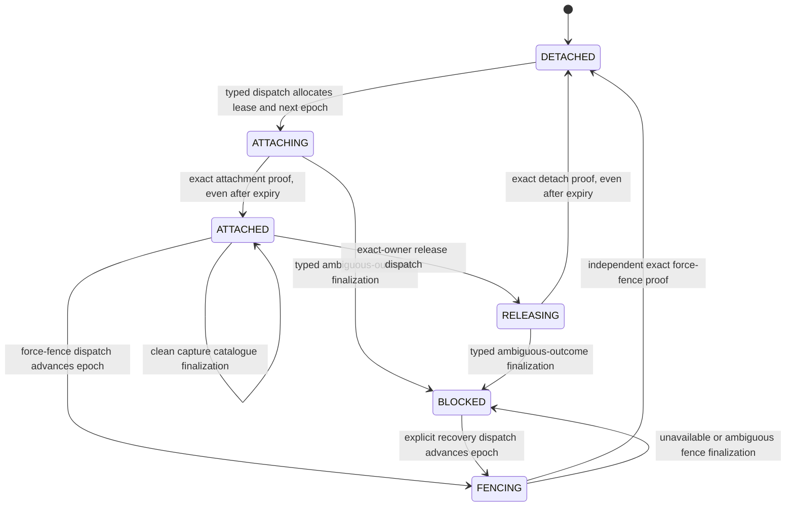

# Session Runtime Authority

## Scope

The implemented authority provides:

- a single-client PostgreSQL `SERIALIZABLE` transaction executor;
- database-authoritative transaction time;
- bounded, provenance-aware serialization and deadlock retry;
- an ordered, checksum-bound authority migration chain;
- a permanent global operation-ID registry shared by direct operations,
  restore-bound launch intents, and V3 writer-stop capture intents;
- permanent relational and typed state-machine authority for restore
  destination generations;
- real-PostgreSQL migration and concurrency tests;
- bounded OCI/Docker runnable-image inspection plus a one-use reservation
  capability;
- canonical, idempotent session registration with strict readback;
- a durable session-wide operation and reservation phase kernel;
- typed database-clock writer attachment dispatch, exact attachment
  finalization, exact lease renewal, exact-owner release, and force-fence
  reconciliation;
- production clean-checkpoint capture admission, durable attempt claims, and
  exact checkpoint-catalogue finalization;
- one fresh-only prepared-capture dispatch path plus committed-only,
  source-free active-capture reconciliation;
- typed durable writer-launch attempt reservation, single dispatch, exact
  started/stopped finalization, readback, and bounded recovery;
- a hardened process-local logical-writer-launcher facade with exact image
  consumption, external launch, provisional writer registration, and
  no-relaunch reconciliation;
- typed launch-stop authority plus bounded prepared/active/current-launch
  discovery;
- a legacy same-process durable stop-to-clean-capture composition that joins
  the complete prepared tuple, exact supervisor stop evidence, committed stop
  transition, and one opaque stopped-writer capability;
- a V3 durable stop-to-prepared-capture handoff that preclaims the exact
  capture operation before physical stop, commits stop and prepared capture
  atomically, and resumes that fixed capture without a new capability;
- capture-bound detached activation with atomic prepared-launch
  materialization; and
- bounded no-relaunch restore recovery with durable cursor primitives.

Registration binds one immutable session manifest, storage reference, and
backend capability set to a canonical initial `DETACHED` document. The
operation kernel then binds one exact request to one permanent global
operation-ID claim and one active session reservation before any external
dispatch can begin. The typed writer lifecycle turns the
lease, attachment, detach, and force-fence records in
`session-storage-contracts.mjs` into serializable decisions for
`ATTACHING`, `ATTACHED`, `RELEASING`, `FENCING`, `BLOCKED`, and `DETACHED`.
The checkpoint slice binds stopped-writer clean capture to the operation,
reservation, capture-attempt, tombstone, and catalogue tables. The migration
chain also installs the permanent relational identities and constraints needed
by restore destination generations, while the typed authority claims and
finalises one exact detached destination generation against a committed source
checkpoint. The launch-attempt slice binds that committed generation to an
exact current session, measured image, and trusted supervisor outcome without
calling a launcher. The logical-launcher foundation now composes the original
one-use image capability, external launch callback, and exact same-process
writer registration. Typed stop state preserves that original launch until
exact complete-stopped proof. The legacy same-process stop-to-capture
composition persists and validates that proof before capability-based
clean-capture admission. V3 instead embeds the complete capture intent in the
stop request, preclaims its operation ID before physical stop, and atomically
turns a committed stop into the prepared capture that holds the session active
pointer. Both paths retain local writer exclusion until exact capture success.
Detached-destination activation can now materialize an executable prepared
launch from a clean detached intent, and bounded no-relaunch recovery is
implemented under the database-global shared/exclusive lifecycle guard and
bounded recovery scheduler. The invocation-time detached-production gate,
durable read-only stable-plan lookup, deployment bindings, and final immutable
public checkpoint backend are now complete. The production-injectable Linux
physical components are also complete independently for clean/manual-fencing
operation: they supply an FD-bound ext4 raw-image lifecycle, an externally
anchored provider ledger, separate persistent publication-control identities,
and a rootless Podman supervisor. Their two-host conformance boundary verifies
clean detach, raw-image transfer, a verification-only first remount, and
distinct archive mount-root and artifact-child identity readback. The ext4
component operates only below host-prepared `rprivate` carriers in one
long-lived private mount namespace; a live producer barrier gates whether
those ext4 mounts propagate to its parent namespace. A trusted
bridge from committed ext4 identity to Podman filesystem authority and
same-process conformance evidence remain pending; the current evidence does not
claim power-loss/crash-prefix recovery or automatic stale-writer fencing.

Registration and generic operation reservation are not writer admission: they
do not allocate a lease or epoch, create an attachment, invoke a provider, or
authorize a launcher. Typed `claimWriterAttachmentDispatch()` allocates the
logical writer tuple only after the generic reservation is durable, but it
still does not execute a provider callback. The PostgreSQL authority does not
mount storage, launch a container, resolve a registry tag, verify an image
publisher, stop a writer, or prove a physical fence. A caller invokes the exact
provider request outside the transaction and returns its exact evidence for
typed finalization. The logical-launcher facade invokes only its explicitly
supplied external callbacks; it is not a concrete Podman/Docker adapter.
Release and force-fence use the same reserve, typed-dispatch,
external-provider, and typed-finalization order. The current
stopped-directory backend declares `fencing: "manual"` and therefore cannot
successfully finalize an automatic force-fence proof or use lease expiration
or a higher database epoch alone for host takeover. The durable launch-attempt
methods likewise execute no launcher or supervisor callback. They accept only
bounded canonical request data and exact evidence returned by a trusted caller.

## Protected Properties

The authority protects three different properties and keeps them distinct:

1. **Canonical identity**: one session record binds the immutable manifest,
   storage reference, backend capabilities, writer epoch, attachment, and
   operation state.
2. **Admission order**: every conflicting transition is serialized against the
   same PostgreSQL session row and revision. Database time, not a worker-host
   clock, decides lease expiry.
3. **Physical exclusion evidence**: only a backend proof can establish that a
   stale writer can no longer mutate storage. A higher database epoch blocks
   new logical admissions, but does not itself provide that proof.

The PostgreSQL session registry protects the immutable part of canonical
session identity. The global operation-ID registry separately protects
permanent non-reuse across ordinary operation claims and version 2 restore
launch intents. The operation kernel and typed writer lifecycle methods use
the executor and schema to order reservation, lease allocation, attachment
finalization, renewal, release, force-fence epoch advancement, and blocked
reconciliation.
The capture authority uses the same ordering boundary for exact attempt
admission and catalogue finalisation. The generation relation and typed
restore-generation transitions protect historical identity, same-session
linkage, single dispatch, exact finalisation, replay, and bounded recovery. A
generation row authorises restore publication only after the typed claim
commits; even a committed generation does not authorise a writer launch.
The launch-attempt transition reuses the operation and reservation rows to
protect one durable blocker and binds a started writer through a version 3
session pointer to its immutable launch operation. That durable pointer and its
serialized IDs still do not authorize process creation. The process-local
launcher facade consumes the exact opaque image reservation and registers the
exact returned writer; neither step supplies physical exclusion evidence.
The stop-to-capture compositions protect an additional joined property: only
the current launch's exact attachment and fence, process and writer
incarnations, supervisor identity, and `complete-stopped` evidence may cross
one committed `writer-launch-stop-v1` transition. Legacy V1/V2 crosses into
one opaque same-process capability for the exact prepared tuple. V3 crosses
instead into the exact durably prepared capture intent whose operation ID was
claimed before stop; its local writer exclusion remains until the fixed
committed capture result is returned. Ambiguity retains both durable and local
blockers. The ext4 cross-host flow begins only after a clean detach; automatic
exclusion of a partitioned or stale writer remains an operator/provider fencing
responsibility.

## Implemented Canonical Session Registry

`PostgresSessionAuthority.registerSession()` validates and stores one canonical
document:

```text
documentVersion = 3
manifest
storageRef
backendCapabilities
lifecycle = DETACHED
writerEpoch = 0
lease = null
attachment = null
activeOperation = null
lastOperation = null
recovery = null
launch = null
```

The manifest, storage reference, and backend capabilities are defensively
copied and frozen before they cross the transaction boundary. The manifest and
storage reference must name the same session. Registration uses PostgreSQL
`SERIALIZABLE` isolation and an insert-on-conflict path, then compares the
complete canonical identity:

- an exact replay returns the existing revision and timestamps without a
  write, including after mutable operation state has progressed;
- reusing the session ID with any different immutable identity returns
  `session_identity_conflict` and never overwrites the row; and
- database `transaction_timestamp()` supplies both initial timestamps.

Version 2 adds a bounded `lastOperation` terminal anchor. Version 3 adds the
canonical current-launch pointer. A canonical version 1 or version 2 document
remains readable with its exact original shape and serialization so operation
requests already bound to that snapshot retain the same digest. Version 1 is
accepted only as an inactive revision-zero snapshot. Version 2 remains valid
for every previously supported inactive and active operation state, but its
`launch` field must be null. The first state-changing session write upgrades a
version 1 or version 2 document to version 3; readback and exact replay never
rewrite a stored document merely to normalize its version. Unknown future
versions fail closed.
The previously merged version 1 registry exposed no session-state mutation
method, so its supported persisted state was revision zero; progressed version
1 operation states existed only in intermediate commits of this unmerged
operation-kernel workstream and are not a migration input.

`readSession()` validates the complete relational and JSON document shape,
immutable identity bindings, current mutable state, revision, timestamps, and
any active operation/reservation linkage before returning a deep-frozen
snapshot. For a progressed version 2 or version 3 session, it also resolves the
`lastOperation` primary keys and proves that they name a matching committed
operation and released reservation, including request and result digests,
revisions, and terminal timestamps. Missing sessions return
`session_not_found`; malformed or inconsistent stored state returns
`session_state_invalid` or `operation_state_invalid`. Readback never repairs or
normalizes stored authority state implicitly. When version 3 carries a current
launch pointer, readback also follows its launch-attempt operation ID
independently of `lastOperation` and proves the exact generation, attachment,
stable lease tuple, image measurement, process and writer incarnations, and
supervisor evidence.

## Implemented Operation and Reservation Kernel

The kernel uses one conservative conflict class,
`session-mutation`. Every authority-changing operation for one session
conflicts with every other such operation until a later schema and proof set
justify narrower classes. `kind` describes an operation; it does not weaken
this session-wide exclusion rule.

`reserveOperation()` binds a globally unique operation ID to the exact session,
kind, bounded canonical request, and complete caller-observed session snapshot.
Before it creates the ordinary operation row, it claims the same identity in
`session_authority.operation_id_registry` as a materialized
`direct-operation`. The registry row is permanent: neither cancellation nor
terminal completion makes that operation ID available for another direct
operation or a restore-bound launch intent.
Canonicalization incrementally bounds JSON nodes and UTF-8 bytes, rejects
accessors, proxies, lone surrogates, and U+0000 before PostgreSQL access, and
uses captured `String`, `JSON`, and `Buffer` intrinsics plus null-prototype
temporary arrays so post-import global or prototype mutation cannot change the
request digest.
In one `SERIALIZABLE` transaction it:

1. locks the canonical session row;
2. proves the expected immutable identity, lifecycle, and revision;
3. claims one registry row, one operation row, and one authority-generated
   reservation row; and
4. writes the matching `activeOperation` pointer while incrementing the session
   revision.

The stored request, relational rows, and session pointer bind the same IDs,
kind, conflict class, request digest, expected session revision, phase, and
operation revision. Readback cross-checks all three representations. A missing,
dangling, or mismatched representation is corruption and fails closed; it is
never repaired implicitly.

The durable pre-dispatch state machine is:

```text
absent
  └── reserve ───────────────> prepared
prepared
  ├── claim dispatch ────────> starting
  └── cancel before dispatch > committed + released
starting
  └── outcome not provable ──> uncertain
```

`claimOperationDispatch()` performs only the `prepared -> starting` database
CAS. It returns a dispatch grant only when that exact call definitely committed
the transition. A replay that observes `starting` or `uncertain`, a lost commit
acknowledgement, or a restart never produces another grant. The caller must
wait for this method to return before invoking a provider, and no provider
callback runs inside the database transaction.

`markOperationUncertain()` durably changes the operation, reservation, and
session pointer together while leaving both claim rows active.
`cancelPreparedOperation()` is the only generic terminal path in this slice:
it can release a reservation only while dispatch is still durably unclaimed,
records a canonical `cancelled-before-dispatch` result, and preserves the
operation ID permanently for exact replay. The same transaction clears the
active pointer and replaces `lastOperation` with a terminal anchor containing
the operation and reservation identities plus canonical request and result
digests. A `starting` or `uncertain` operation cannot use this cancellation
path. Reserve refuses before creating a blocker when the PostgreSQL bigint
session revision cannot also represent cancellation, and generic dispatch
refuses before granting an external effect when no revision remains to record
an uncertain outcome.

`reconcileOperation()` is read-only and reports whether the exact request is
absent, prepared, starting, uncertain, or already committed. Reserve,
dispatch-claim, uncertainty, and cancellation retries replay exact durable
state without rewriting revisions or timestamps. Reusing an operation ID with
a different session, kind, expected snapshot, or request fails closed.

All real phase changes increment the session revision exactly once; operation
phase changes increment the operation revision exactly once. The reservation's
`expected_session_revision` remains the revision observed before the original
reserve. Writer epoch, session revision, and operation revision are independent
counters and are never inferred from one another. Every operation timestamp is
database time.

For version 2, an inactive revision-zero session has no terminal anchor. An
inactive progressed session has revision
`lastOperation.expectedSessionRevision + lastOperation.operationRevision + 1`;
an active session either starts from revision zero with no prior anchor or
preserves the immediately preceding anchor in its expected snapshot. Terminal
validation performs bounded primary-key reads and does not scan the complete
operation history. This protects the current session transition source under
the authority's ordinary database-integrity model; coordinated rewriting of
the session document, operation, reservation, and their bound hashes is outside
that model.

The generic kernel has no expiry, steal, or automatic release rule. `starting`
and `uncertain` survive process restart and continue to block the session. The
typed writer methods described below verify their own completion evidence and
atomically combine the business-state update with operation finalization.
Checkpoint catalogue finalization preserves that rule: it never calls a
generic finalizer first and writes the catalogue in a second transaction.
Typed restore-destination claim and finalisation preserve the same boundary.
Future durable launch-attempt and launcher methods must preserve it as well.

## Implemented Writer Lease and Attachment Acquisition

This slice reuses the existing relational schema and canonical version 2 JSONB
documents; it requires no DDL. It defines two typed operation kinds:
`writer-attachment-acquire-v1` and `writer-lease-renew-v1`.

Acquisition begins with generic `reserveOperation()`, which persists the exact
request as `prepared` without allocating writer authority.
`claimWriterAttachmentDispatch()` then runs one typed `SERIALIZABLE`
transaction. After it locks and validates the canonical session, operation, and
reservation state, it reads PostgreSQL `clock_timestamp()` and atomically:

1. advances the decimal-string writer epoch by one within the complete uint64
   range, failing closed at exhaustion;
2. allocates a lease duration bounded to 1 through 86,400,000 milliseconds from
   that database clock;
3. derives deterministic lease and attachment IDs from the globally unique
   operation ID;
4. changes the operation and reservation from `prepared` to `starting`; and
5. persists the exact lease, next epoch, and `ATTACHING` lifecycle while the
   attachment remains null.

Only the call that definitely commits that typed transition receives
`dispatchGranted: true` and the exact attach mutation request. Replay or commit
uncertainty cannot allocate another epoch or grant dispatch again. The caller
invokes the provider outside every database transaction. Before granting that
external side effect, the authority also proves that the PostgreSQL bigint
session revision has capacity for `starting -> uncertain -> committed`, so an
otherwise valid exact proof cannot become unrecordable solely because the
counter reached its limit.

`finalizeWriterAttachment()` accepts only the exact successful mutation result
and exact attachment proof bound to that request, lease, holder, epoch,
operation, storage identity, attachment ID, proof ID, and canonical host-local
`rootPath`. The provider mutation result must carry the same `rootPath`; a
caller cannot splice a different structurally valid directory into the
attachment evidence. This writer-specific evidence validates its root-path-free
projection against the unchanged generic storage contract v1 result shape. It
can finalize an operation from `starting` revision 1 or `uncertain` revision 2.
In one
transaction it commits the exact `writer-attached` result, retires the
operation, releases the reservation, clears `activeOperation`, persists the
attachment and lease, changes the lifecycle to `ATTACHED`, and writes the
versioned `lastOperation` terminal anchor. A committed replay must reproduce
the exact terminal result and performs no write.

Finalization deliberately does not reject exact physical evidence because the
lease expired while the provider was running. That evidence records what
physically happened. Expiry closes later admission; it neither erases the
attachment nor proves a fence.

`renewWriterLease()` has no provider or prepared phase. It is one
`SERIALIZABLE` transaction that locks and validates the exact `ATTACHED`
session, proves that no active operation exists, reads `clock_timestamp()`, and
requires the old `expiresAt` to be strictly later than that clock. Equality is
already expired and cannot be renewed. A valid renewal preserves the complete
lease and attachment tuple and changes only `expiresAt`, which must advance
beyond the prior value. The transaction inserts a terminal committed operation
at revision 0, a released reservation, the matching terminal anchor, and the
updated session revision. The globally unique operation ID makes an exact
replay return the original result without another clock read or extension;
conflicting reuse fails closed.

## Implemented Writer Release and Force-Fence Reconciliation

This slice also reuses the existing schema and canonical version 2 JSONB
documents without DDL. It adds the typed operation kinds `writer-release-v1`
and `writer-force-fence-v1`. Both use the same ordered boundary as
acquisition:

```text
generic reserve commit
          │
          ▼
typed dispatch commit
          │
          ▼
provider outside every database transaction
          │
          ▼
typed exact-proof finalize
```

An ambiguous provider or acknowledgement outcome does not use a generic
terminal path. The caller first records `starting -> uncertain`, then invokes
`finalizeWriterOperationBlocked()` with the exact typed request and either
`provider-outcome-unresolved` or `fence-unavailable`. That terminal transaction
releases the reservation and enters `BLOCKED` while preserving the exact lease,
attachment when known, force-fence target, and current epoch for explicit
recovery.

Release starts only from the exact `ATTACHED` snapshot and target.
`claimWriterReleaseDispatch()` changes `prepared -> starting` and enters
`RELEASING` without changing the lease tuple or writer epoch. The exact-owner
detach request remains admissible after lease expiry, but only for that
unchanged session, lease, holder, epoch, attachment target, storage identity,
and operation. Expiry is not permission to detach a different or newer
attachment. `finalizeWriterRelease()` accepts only the matching successful
detach result and atomically enters `DETACHED`, clears the lease and
attachment, retires the operation, releases the reservation, and writes the
terminal anchor. Finalization may consume matching evidence from either
`starting` or `uncertain`; an exact committed replay performs no write.

Force-fence reservation starts only from an exact `ATTACHED` or `BLOCKED`
snapshot with a retained lease and exact attachment target. On the definite
typed dispatch commit, `claimWriterForceFenceDispatch()` advances the canonical
decimal-string epoch once within uint64, changes `prepared -> starting`, and
enters `FENCING`. Replay, restart, or commit uncertainty cannot grant dispatch
or advance the epoch again. The provider receives a dedicated force-fence
storage envelope that binds the new epoch, revoked old lease tuple, attachment
target, storage identity, and operation ID. It runs outside the transaction.

Only the independently validated matching force-fence result with
`status: "fenced"` and an opaque provider proof can let
`finalizeWriterForceFence()` enter `DETACHED`. A generic detach result, lease
expiry, the advanced database epoch, or a caller assertion is not that proof.
A backend declaring `fencing: "manual"` cannot successfully complete this
automatic proof path. If fencing is unavailable or its outcome is ambiguous,
typed blocked finalization enters `BLOCKED` and retains the already advanced
epoch, revoked lease, known attachment, and target. Recovery from `BLOCKED`
requires a new explicit force-fence reservation and dispatch; its dispatch
advances the epoch again before re-entering `FENCING`.

## Implemented Provider-Backed Writer Detach Composition

The provider-neutral writer-detach composition closes the live orchestration
gap between these typed authority transitions and storage backend v1. One
request supplies the complete pre-reserve session snapshot, a globally unique
operation ID, and the exact attachment target. The composition verifies that
the backend identity and complete capability tuple match the canonical session
before the first authority write, then retains that same operation base for
every later transition.

One branded `PostgresOperationGuard` spans generic reserve, typed dispatch,
provider execution, proof validation, and typed finalization. Structural guard
lookalikes cannot enter this composition. Every returned authority receipt is
boundedly cloned and passed through
`assertSessionOperationTransitionProof()` so its operation, reservation,
active or terminal session pointer, typed result, and provider proof form one
canonical transition before the facade consumes it. The provider is still
outside every authority transaction. Release passes only the exact
`mutationRequest` returned by `claimWriterReleaseDispatch()` to
`detachAttachment()` and validates the returned result with
`assertStorageMutationResult()`. Force-fence analogously passes only the exact
`fenceRequest` to `forceFence()` and validates it with
`assertStorageForceFenceResult()`. A generic detach result, a different proof,
or a caller-reconstructed envelope cannot cross those boundaries.

Only `dispatchGranted: true` authorizes a provider call. Exact committed replay
returns the durable terminal receipt without physical work. A retained
`prepared` operation may claim its first dispatch, but `starting` or
`uncertain` never authorizes provider replay. Storage backend contract v1 has
no provider-side reconciliation method keyed by the durable operation ID, so
the composition records such ambiguous state as `writer-blocked` with
`provider-outcome-unresolved`. A manual-fencing backend follows the same typed
force-fence dispatch boundary, calls no provider, and records
`fence-unavailable` while preserving the advanced epoch and revoked tuple.

Once the composition has validated a successful provider proof, database
finalization acknowledgement loss is a different uncertainty class. It
reconciles the durable operation and may replay only the same exact typed
finalizer at the observed active revision. It never invokes the provider again
or discards a valid proof by replacing it with `BLOCKED`. Stable public
completion exposes only the durable operation, reservation, and session, not
replay-sensitive `acquired`, `dispatchGranted`, or `finalized` flags.

This composition requires no DDL and remains unscheduled. It does not add a
provider reconciliation extension, choose a physical filesystem backend,
automatically escalate release to force-fence, enable the detached-production
fleet capability, or open `runRestore()`.

## Implemented PostgreSQL Transaction Boundary

The executor gives one callback a checked-out PostgreSQL client and one
`SERIALIZABLE READ WRITE` transaction from a pool dedicated to this executor.
The constructor accepts that pool only through the explicit `dedicatedPool`
option; legacy or ambiguous `pool` input is rejected. It:

1. resets the checked-out session outside a transaction with a verified
   `DISCARD ALL`;
2. obtains `transaction_timestamp()` and a transaction ID from that same
   database transaction;
3. exposes only a callback-scoped extended-protocol `query(text, values?)`
   capability and the canonical timestamp; parameter input must be a built-in,
   non-Proxy array with at most 65,535 entries, and every entry is copied into
   an own data property that accepts only `null`, `undefined`, string, number,
   boolean, or bigint values, so node-postgres never invokes application
   converters while classifying a database retry; callers serialize structured
   values to strings and use explicit SQL casts such as `$1::jsonb`;
4. rejects an unsettled or suppressed failed query, and internally observes
   locally rejected query promises so a fire-and-forget call cannot emit an
   unhandled process rejection while the original promise remains rejected;
5. rejects `PREPARE TRANSACTION`, including leading empty statements and
   comment-separated forms, before submission so a callback cannot move the
   transaction and its locks into PostgreSQL's prepared-transaction registry;
   ordinary `PREPARE name [(types)] AS ...` remains available and is reset with
   the session; then rechecks the transaction ID after every successful user
   query so callback-issued transaction control cannot be hidden by a later
   throw, and treats a query failure without a trusted PostgreSQL SQLSTATE as
   outcome-uncertain;
6. immediately before `COMMIT`, executes a frozen extended-protocol
   `SET LOCAL synchronous_commit = on`, requires an exact `SET`
   acknowledgement, and rechecks the original transaction ID so a callback
   cannot lower this transaction's acknowledgement durability; and
7. accepts only an exact node-postgres `COMMIT` acknowledgement, then verifies
   another `DISCARD ALL` before returning the client to its dedicated pool.

The operation guard obtains clients and submits queries only through the
node-postgres callback API. Driver callbacks place the raw client, error, or
query result inside a module-owned frozen null-prototype carrier before any
Promise is resolved; no authority-bearing driver object is itself a Promise
fulfillment value. Pool acquisition, query submission, and client release must
return synchronously with exact `undefined`. This boundary prevents mutable
`Object.prototype.then`, `Promise.prototype`, or `Promise[Symbol.species]`
from assimilating a driver result before the guard can validate it.

An operation callback receives `(probe, complete)`. Synchronous raw returns
remain supported, but a Promise-returning callback must fulfill with the exact
callback-scoped carrier minted by `complete(value)`. The guard drains that
Promise and all lock probes and cleanup before unwrapping the carrier and
returning the original value. Structural, stale, cross-run, or multiply minted
completion values fail closed. This keeps the advisory lock held until the
real callback settles even when callback code mutates the process-wide Promise
or object prototypes.

Ordinary operation locks and the database-global restore lifecycle lock use
different versioned advisory-key namespaces. The lifecycle facade reaches the
lifecycle namespace only through exact methods captured from a branded frozen
`PostgresOperationGuard`; its shared and exclusive modes still hash to the same
lifecycle key. A durable operation ID equal to the lifecycle lock label remains
in the ordinary namespace and therefore cannot self-conflict with an outer
lifecycle lease, including for historical operation rows.

The lifecycle facade requires separate branded operation guards backed by
distinct dedicated pool objects: one admits foreground shared leases and the
other admits recovery-exclusive leases. The factory proves the pool identities
through operation-guard-private bindings before accepting either guard. Thus a
foreground pool at capacity cannot delay recovery before its nonblocking
advisory-lock attempt; the recovery path can still report `busy` and let
scheduler shutdown drain. A pool supplied to either guard remains dedicated to
that role and must not be used by another runtime component.

Serialization failures and deadlocks may be retried only when the same
node-postgres `DatabaseError` object was first observed on that client's
`errorMessage` connection event and then rejected the active query with the
exact transaction-rollback SQLSTATE. The client is destroyed or reset after a
proved rollback. A client returned by the dedicated pool is also destroyed
with `release(error)` when its required query, release, or connection-event
shape is invalid; the acquisition failure remains primary even if destruction
fails. Merely constructing `DatabaseError` or matching its `code` is
insufficient: custom parameter conversion and result-parser failures never
receive protocol provenance. The executor captures the WeakMap, Set, Array,
RegExp, object, Promise, cryptographic Hash, and prototype-test intrinsics used
by that proof before any callback runs. Authority-bearing driver results must
expose own data fields rather than inherited values or accessors. A callback
limited to the transaction capability therefore cannot use built-in prototype
mutation to manufacture SQLSTATE provenance, hide pending queries, replace
migration checksum operations, or turn an unknown `COMMIT` result into a
retry. This is not an unforgeable brand against code that can access or replace
the dedicated pool, checked-out client, connection event source, or
node-postgres implementation: those objects form the trusted driver boundary
and must not be exposed to callbacks. For every query, the executor temporarily
pins the connection's own `emit` method to the module-captured native
`EventEmitter` implementation and uses captured listener intrinsics, then
restores the exact prior own descriptor. A callback that mutates
`EventEmitter.prototype` after its final user query therefore cannot redirect
a completed `COMMIT` event into forged retryable SQLSTATE evidence. That rule
also covers a server `40001` detected during a user-query boundary recheck,
the final durability/boundary recheck, or `COMMIT`. A trusted `40001` or
`40P01` from either recheck proves that PostgreSQL aborted the transaction, so
the executor destroys the client and may retry the complete callback within
the configured bound. A local, reused, or merely SQLSTATE-shaped exception
does not carry that proof and remains outcome-uncertain. A transport failure
or any other `COMMIT` error is outcome-uncertain and is never automatically
replayed as a fresh operation. Forcing `synchronous_commit=on` protects the
transaction from callback-local weakening; it does not compensate for a
PostgreSQL deployment that disables normal WAL or filesystem durability.
Reset failure destroys the connection and preserves the already proved
committed or not-committed outcome. User-query failures without a SQLSTATE,
the connection/operator/system/internal error classes, and the explicit
`40003` completion-unknown state are likewise outcome-uncertain; a later
`ROLLBACK` cannot reclassify them.
After a callback rollback is proved, only a store error minted by that exact
transaction attempt retains its specific state. A publicly constructed store
error or one replayed from another operation is translated to the generic
`transaction_rolled_back` / `not-committed` result. Constructor provenance is
recorded in a module-private identity set, including objects constructed with
an alternate `newTarget`; the captured public prototype chain independently
covers prototype-created or prototype-grafted counterfeits. An opaque Proxy
callback error also fails closed to the generic rollback result because its
target identity cannot be proved. Ordinary non-Proxy application errors remain
unchanged, while stale or forged `committed` / `uncertain` store state cannot
escape a transaction that definitely rolled back.

Migration rollback preserves a specific migration validation error only when
that exact error object was created and marked by the current `migrate()`
invocation. A publicly constructed store error or an internal error replayed
from another operation is translated to `migration_failed` after the current
rollback, so stale or forged `commitState` evidence cannot cross operation
boundaries. Store errors define frozen own data fields rather than consulting
mutable prototype accessors for their reported state.

The operation kernel and typed writer lifecycle paths use that executor to
lock the canonical session row, claim or validate operation and reservation
rows, validate the complete expected identity and revision, and commit durable
`prepared` and typed `starting` phases before any external provider callback
starts. The owning session's current active operation and reservation are
locked in that order. A foreign or already retired operation ID is read only as
snapshot-consistent identity evidence, not locked, so crossed foreign IDs
cannot introduce a second lock order. An external callback must not be held
inside a database transaction. Acquisition, release, and force-fence use this
protocol:

```text
generic serializable reserve commit
                  │
                  ▼
typed prepared -> starting commit
with lifecycle-specific tuple/epoch decision
                  │
                  ▼
external physical operation
                  │
                  ▼
typed serializable exact-CAS success finalize
or uncertain -> typed BLOCKED finalize
```

The durable reservation closes launch, detach, fence, restore, and other
conflicting admission while the callback is in flight. If the callback or
finalization acknowledgement is uncertain, the reservation and operation phase
remain visible for explicit reconciliation; the authority never rolls back to
an apparently safe state.

## Production Clean-Capture Mutation Authority

The private production checkpoint-mutation slice is deliberately capture-only.
Its original capability-based path reuses the version 1 authority schema and
composes the existing session-wide operation/reservation kernel with `capture_attempt_claims`,
`capture_attempt_tombstones`, and `checkpoint_catalogue`. Restore is not
admitted through this capture API. The separate typed restore-generation
authority can name and finalise one canonical detached destination generation.
At that historical slice boundary, production restore still failed closed
until durable logical launcher admission consumed that committed generation;
the final public checkpoint facade now closes that later boundary.

Normal capture begins from the exact canonical `ATTACHED` session snapshot.
Before publication, the authority uses database time to prove that the lease
is unexpired and that the complete session identity, storage reference,
attachment, lease, writer epoch, checkpoint descriptor, mutation request, and
stopped-writer correlation binding all agree. One exact operation and active
session reservation bind that admission. Capture never advances the writer
epoch or changes the attachment, lease, or lifecycle.

The capture order is:

```text
per-operation PostgreSQL session advisory guard
                  │
                  ▼
generic serializable reserve commit
                  │
                  ▼
typed prepared -> starting commit
+ globally unique durable capture-attempt claim
                  │
                  ▼
external stopped-directory publication
outside every database transaction
                  │
                  ▼
typed serializable exact-CAS catalogue finalize
+ operation commit + reservation release + terminal anchor
```

The V3 stop handoff joins this state machine one phase earlier. Its immutable
`writer-launch-stop-v1` request contains the exact canonical
`checkpoint-capture-v1` request: attachment, checkpoint, mutation request,
capture-attempt ID, process and writer incarnations, stop operation ID, and
predetermined result. `claimWriterLaunchStopDispatch()` first inserts the
permanent `writer-stop-capture-intent-v3` registry claim and only then commits
the stop's `prepared -> starting` grant, so physical stop cannot precede
capture-operation-ID ownership. After exact supervisor stop evidence,
`finalizeWriterLaunchStoppedAndReserveCheckpointCapture()` uses one
`SERIALIZABLE` transaction to materialize that claim, commit and release the
stop, clear the launch, create the exact capture operation and reservation as
`prepared`, and make that capture the session's active pointer. There is no
observable state with a V3 stop committed as `writer-launch-stopped` but no
durable capture continuation.

The prepared capture keeps the stopped attachment and historical lease tuple
as immutable source identity; it does not mint new writer authority or require
that old lease to remain unexpired. Only
`claimCheckpointCaptureDispatch()` may change that exact operation from
`prepared` to `starting` and create its canonical authorized attempt. The
fresh-only backend continuation may publish only after that definite grant.

Only a definitely committed typed dispatch may invoke publication. On the
legacy capability path, the capture-attempt UUID is minted inside the one-use
stopped-writer callback. On V3, that ID is already embedded in the stop's exact
capture intent and its operation ID has been preclaimed. In both paths, the
typed capture claim binds the complete immutable attempt and predetermined
result before physical publication begins. A collision or a matching retained
tombstone rejects admission before publication. Production retains claims
permanently; if a future retention workflow writes a tombstone, that tombstone
is non-authorizing and cannot be removed to revive the old attempt.

The PostgreSQL session advisory guard is keyed by the exact capture operation.
One acquisition is held across claim activation, the complete asynchronous
publication callback, and catalogue finalization; every committed
reconciliation independently reacquires the same key around verification and
finalization. The advisory lock is not durable across process, connection, or
database restart, and reacquiring it does not prove an older publication
callback has quiesced. The retained operation, attempt claim, and ordinary
active session reservation prevent another publisher and block detach, fence,
restore, launch, and any other conflicting session mutation while an
unfinalized capture may have effects. Same-operation recovery may overlap an
older callback after its database session is lost; that path is source-free
and read-only until the physical journal proves the exact artefact committed.
`absent`, `prepared`, and `materialized` publication therefore fail closed.

Successful publication returns an exact path-free completion containing the
trusted artefact proof, materialisation, and predetermined checkpoint mutation
result. In one `SERIALIZABLE` finalization transaction, the authority locks and
revalidates the same session, operation, reservation, canonical attempt, both
claim identities, and absence of a tombstone; writes or confirms the exact
catalogue entry; retires the operation; releases the reservation; clears the
active pointer; and writes the terminal anchor. The catalogue entry and
terminal operation result are two cross-checked representations of the same
durable completion. Neither may commit alone.

If dispatch acknowledgement is lost, no publication grant is returned and the
durable blocker remains for explicit recovery. Once publication can have
started, a callback failure or unprovable outcome moves the exact operation to
`uncertain` when that transition can be confirmed; it never cancels the
operation, reuses the stopped-writer capability, substitutes a new attempt, or
speculatively cleans physical evidence. A finalization acknowledgement loss may
therefore leave an `authorized` attempt beside an already committed physical
artefact, or may already have committed the matching catalogue and terminal
anchor.

For a V3 handoff that is still exactly `prepared`, cold recovery may retry the
single dispatch claim and then call fresh-only
`resumePreparedCheckpointCapture()`. Once that claim may have committed, the
operation is `starting` or `uncertain`; recovery discards the source path and
uses only committed-artifact verification. It never invokes the fresh
publisher a second time after an ambiguous grant.

Committed capture reconciliation accepts only the original checkpoint
descriptor and mutation request. It takes the same per-operation advisory
guard, loads the exact non-tombstoned durable attempt by its original
operation, and invokes the backend's source-free committed verifier. It has no
writer, lease, attachment, authority clock, mutable source, or stopped-writer
capability input. `absent`, `prepared`, and `materialized` journal phases never
become success through this path. After asynchronous verification, the
authority revalidates the same attempt and claims before it atomically
finalizes or confirms the catalogue and returns the verifier's exact completion.
If the original publisher commits the same exact result while verification is
in flight, finalization may return a committed replay instead of claiming the
write. The facade accepts that race only after validating the committed
operation, attempt, catalogue, exact completion, and historical session
identity/revision; it does not misclassify the confirmed replay as an uncertain
outcome.
Every historical committed-operation read also requires the current canonical
session to retain the operation's exact immutable document identity and
session-incarnation `createdAt`, and its revision must be at least
`operation.expectedSession.revision + operation.revision + 1`. Immutable
session identity alone is not ancestry evidence: a partially restored session
row that predates the committed operation fails closed even when the newer
operation, attempt, and catalogue rows remain present. Conversely, a newer
revision from another session incarnation or identity cannot adopt that
historical operation's attempt or catalogue.

## Bounded Checkpoint Recovery Enumeration and Service

`PostgresSessionAuthority.listCheckpointCaptureRecoveryCandidates()` exposes
one read-only operational page with exact `{afterSessionId, limit}` input. The
limit is an integer from 1 through 100. Its SQL selects unretired
`checkpoint-capture-v1` operations in `starting` or `uncertain`, plus
`prepared` operations only when migration 6's materialized V3 handoff claim
exists, orders by immutable `session_id`, and requests at most `limit + 1`
rows. The extra row determines whether the page has a continuation without
admitting extra work.

Enumeration does not trust the selection query as an authorization join. In
the same `SERIALIZABLE` snapshot it parses each complete canonical operation
envelope and revalidates the current session active pointer, matching
reservation, exact authorized attempt for active work or exact atomic handoff
relation for prepared work, tombstone absence, and catalogue absence. A
missing, malformed, tombstoned, catalogued, or crossed
relation fails the page closed instead of being hidden by SQL. A successful
entry is a frozen object containing only the exact durable
`{checkpoint, request}` admission plus its state. The enumerator does not
accept or reconstruct a writer handle, stopped-writer capability, publication
plan, or replacement attempt.

A non-null continuation cursor is the last settled candidate's session ID. It
is a progress and fairness hint, not an authority token, durable worker claim,
exactly-once boundary, or cross-page snapshot. Candidate and cursor rows share
one snapshot, but later pages do not. A concurrent finalizer may turn an
enumerated candidate into an exact committed replay; a new candidate at or
behind the cursor waits for the next sweep. When enumeration reaches the end,
the service returns a null cursor so the next scheduled pass begins at the
start. This deliberate wrap makes retained work replayable and eventually
revisits candidates that appeared behind an earlier cursor.

`createPostgresCheckpointRecoveryService()` installs fixed candidate-list and
committed-reconciliation collaborators for one backend, plus an optional
prepared-capture continuation. The backend identity and artefact-root resolver
must be constructed once from copied, frozen startup configuration; the same
backend ID cannot silently resolve to a different root between passes.
`runBatch({afterSessionId, limit, signal})` reads one page and processes
candidates sequentially with concurrency one. It routes only `prepared` to
the fresh continuation; `starting` and `uncertain` always use source-free
committed reconciliation. If no prepared continuation was configured, a
prepared candidate remains `pending`. The service also admits
at most one batch invocation at a time; an overlapping valid invocation fails
closed before candidate enumeration or reconciliation and can retry after the
in-flight batch drains. Each settled candidate produces an operation/session
receipt with status `reconciled` or `pending`. The batch returns
`sweep-complete`, `limit-reached`, or `aborted`, plus the cursor after the last
settled candidate. A sanitized pending result does not prevent later
already-admitted page candidates from running.

AbortSignal is an admission boundary rather than physical cancellation. A
signal already aborted before enumeration admits no work. Once reconciliation
has begun, a later abort prevents the next candidate from starting but awaits
the current verifier, authority finalization attempt, and advisory-guard
release before returning. The service does not use `Promise.race`, detach the
promise, abandon a guard, or report cancellation while provider work is still
live.

The page size and sequential batch give a hard count bound of 100 candidate
attempts. They do not create a worst-case wall-clock bound: the prepared
publisher and committed verifier have no cooperative cancellation seam, and
the active-row index may still inspect other active operation kinds before
filling a sparse checkpoint page. Production therefore retains statement,
request, and scheduler deadlines outside this module. Guard-busy and physically
unverifiable attempts report `pending` and preserve their durable operation,
reservation, and capture claim for another pass. Under the existing exact
reconciliation path, an unresolved `starting` attempt may durably advance to
`uncertain`; neither state authorizes a new publisher or mutable-source retry.

## Canonical Session Lifecycle

The canonical document uses the lifecycle from the storage contract:


```mermaid
stateDiagram-v2
  [*] --> DETACHED
  DETACHED --> ATTACHING: typed dispatch allocates lease and next epoch
  ATTACHING --> ATTACHED: exact attachment proof, even after expiry
  ATTACHING --> BLOCKED: typed ambiguous-outcome finalization
  ATTACHED --> ATTACHED: clean capture catalogue finalization
  ATTACHED --> RELEASING: exact-owner release dispatch
  RELEASING --> DETACHED: exact detach proof, even after expiry
  RELEASING --> BLOCKED: typed ambiguous-outcome finalization
  ATTACHED --> FENCING: force-fence dispatch advances epoch
  BLOCKED --> FENCING: explicit recovery dispatch advances epoch
  FENCING --> DETACHED: independent exact force-fence proof
  FENCING --> BLOCKED: unavailable or ambiguous fence finalization
```

The acquisition, renewal, clean-capture, release, force-fence, `FENCING`, and
`BLOCKED` authority transitions are implemented. A new writable acquisition
and each force-fence dispatch advance the uint64 fencing epoch. Capture,
release, and renewal do not. Renewal preserves the complete writer tuple and
extends only the database-authoritative `expiresAt`. Epoch exhaustion fails
closed.

Lease expiry closes subsequent mutation, renewal, and launch admission. It does
not change the physical attachment state, move the lifecycle to `FENCING`, or
prove a fence. Exact attachment finalization still persists matching physical
evidence after expiry, and exact-owner cleanup for the unchanged tuple and
target may detach after expiry only when no current launch is recorded. A
non-null launch requires exact supervisor-stopped evidence or a successful
physical force fence before storage release can proceed. Once a newer epoch
has been allocated, the old tuple is stale even for cleanup. Moving from
`BLOCKED` to `FENCING` always requires a separately reserved force-fence
operation and a definite typed dispatch commit.

## Schema for Durable Claims and Reservations

Operation IDs, capture-attempt IDs, and reservation IDs are global authority
identities rather than session-volume data:

- an exact operation retry may replay only its complete canonical request and
  committed result;
- `operation_id_registry` permanently assigns every operation ID to exactly
  one session and claim provenance before any external effect;
- a registry claim is a materialized `direct-operation`, a restore or
  activation launch intent owned by its claimant operation, a V3 capture
  intent owned by its writer-stop operation, or an immutable detached-restore
  stable-plan claim owned directly by its restore operation identity;
- reusing an operation ID with a different session, claim type, claimant,
  binding, kind, or request fails closed;
- an active reservation is unique for the operation and session conflict
  class;
- capture-attempt IDs and their operation IDs remain claimed by active records
  or permanent tombstones; and
- checkpoint catalogue entries are finalized only from the exact active
  capture attempt; and
- restore destination generation IDs remain independent permanent identities,
  each bound to one exact operation, session, and same-session checkpoint; and
- each writer launch attempt uses its globally registered operation ID and
  permanent request/result row instead of duplicating phase state in another
  lifecycle relation.

The PostgreSQL schema intentionally stores state-machine documents as `jsonb`
while keeping identities, revisions, timestamps, and uniqueness constraints in
relational columns. Business transitions remain in the authority code so a
database migration cannot silently invent a new lifecycle.

`session_authority.operation_id_registry` is the one global namespace shared
by every direct operation, pre-publication restore/activation launch intent,
pre-stop V3 capture intent, and detached-restore stable plan.
Its relational fields retain the operation ID, session ID, `claim_type`,
optional `claimant_operation_id`, `claimed_at`, and optional
`materialized_at`. A direct claim has no separate `binding`; intent claims
store their exact canonical launch or capture binding. A direct operation is
claimed and materialized in the same transaction. Restore and activation
launch intents are claimed before their external effect and remain
unmaterialized until the atomic handoff creates the matching launch operation.
A V3 writer-stop claim is created in the stop dispatch transaction before
physical stop and remains unmaterialized until the atomic stop finalizer
creates the matching capture operation. The primary key prevents cross-type
ID reuse, and same-session claimant relations prevent an intent from escaping
its owning operation. A stable-plan claim has no claimant operation and remains
unmaterialized until the matching version 1 restore-generation reservation
creates that operation. Registry rows are never deleted or released.

Writer acquisition, renewal, release, force-fence, blocked finalization, and
checkpoint capture use those existing structures without DDL. The canonical
session JSONB stores the lease, epoch, lifecycle, attachment, active pointer,
and terminal anchor; the existing operation and reservation JSONB records
store each exact typed request and terminal result. Capture-attempt claims bind
the exact operation and coordinator binding, tombstones are permanent
non-authorizing reuse fences, and each catalogue row binds one checkpoint to
one exact attempt and path-free committed completion. The permanent registry
identity and active session-conflict constraints remain the admission
boundary.

The ordered migration chain treats the installed
`session_authority.schema_migrations` ledger as an exact contiguous prefix
starting at version 1. Every installed checksum must match the corresponding
immutable tracked SQL source. A gap, future version, malformed row, or checksum
drift fails closed. One advisory-locked transaction applies every missing
migration in order and records each checksum before the commit boundary.

Migration version 2 adds
`session_authority.restore_destination_generations`. Its relational columns
keep `generation_id`, `operation_id`, `session_id`, and `checkpoint_id`
separate instead of deriving authority from a session revision, writer epoch,
or mutable session pointer. Composite foreign keys bind the row to the same
session's permanent operation claim and checkpoint catalogue entry.
`authorized` rows must have no finalized document or commit timestamp;
`committed` rows must have both. The authority exposes no deletion or
retirement API for these rows in this foundation.

Migration version 3 adds `session_authority.operation_id_registry`, backfills
every existing ordinary operation as a materialized `direct-operation`, and
routes later operation creation through that permanent namespace. It first
takes an `EXCLUSIVE` lock on `sessions`, then an `ACCESS EXCLUSIVE` lock on
`operation_claims`, matching the runtime's session-to-operation lock order
while still allowing plain session reads. The legacy-state gate therefore
observes every old operation writer already in flight without introducing a
reverse-order deadlock against a writer holding a session row. The installed
`operation_claims_enforce_restore_v2_launch_id_claim` trigger then rejects any
post-upgrade old-binary transition of a version 2 restore beyond `prepared`
unless the exact durable launch-intent claim already exists. The only
claim-free terminal exception is the exact
`prepared -> committed/cancelled-before-dispatch` transition, which proves no
restore publication was authorized. For an old
version 2 restore request, only a still-`prepared` operation can cross the
migration: it has not received publication dispatch, so its next claim under
the upgraded authority can safely install the exact
`restore-launch-intent-v2` row before any external effect. Migration fails
closed with SQLSTATE `55000` if any
`restore-destination-generation-v1` operation whose payload contract version
is 2 is already `starting`, `uncertain`, or `committed`. Such state cannot
prove that the launch-attempt ID was reserved before publication, and neither
a completed handoff nor later readback may manufacture that missing
provenance. Operators must drain or quarantine those rows before upgrade.

Migration version 6 adds the
`writer-stop-capture-intent-v3` claim type and relational enforcement for the
durable stop-to-capture handoff. It locks `sessions` before
`operation_claims` and `operation_id_registry`, preserving runtime lock order,
and fails with SQLSTATE `55000` if any legacy V3 stop row already exists
without the new provenance. A V3 stop may leave `prepared` only with the exact
same-session capture-operation claim bound to its complete `captureIntent`;
the claim stays unmaterialized in `starting` or `uncertain` and must be
materialized when the stop commits as `writer-launch-stopped`. The only
claim-free exception is exact pre-dispatch cancellation. A claimed
`checkpoint-capture-v1` row may then exist only when that materialized claim,
its committed claimant stop, and the byte-equivalent capture request all
agree. These triggers constrain old or direct SQL writers as well as the
runtime finalizer.

Migration version 7 adds
`session_authority.detached_restore_stable_plans` and the
`detached-restore-stable-plan-v1` operation-ID claim type. The immutable row
stores the exact clean-checkpoint admission, the nine canonical plan inputs,
the recomputed plan and binding digests, and the database provisioning time.
The claim and row share the restore operation ID and session ID; relational
checks bind the backend, destination storage, request identity, contract
version, digests, and timestamp. Updates are rejected. A deferred delete
constraint rejects any commit that removes the plan while its permanent stable-
plan claim remains, so an ordinary delete cannot strand an unrepairable
preclaim; complete authority teardown must remove the plan and claim in one
transaction. The stable claim is likewise immutable except for its single
`materialized_at: null -> timestamp` transition; a deferred reverse check
requires that transition's exact version 1 operation to exist by commit. The
shared operation-ID namespace prevents the same ID from being
reused by a different session, plan, or authority operation. The first
matching restore-generation reservation atomically materializes that exact
claim and creates the prepared operation; a mismatched admission cannot adopt
the reserved identity. Before that prepared operation may grant generation
dispatch, the caller must present the complete rehydrated stable plan. The
authority rechecks its `planSha256` against the permanent claim and requires
the plan's generation and destination-isolation identities to equal the typed
claim input.

`createPostgresDetachedRestoreStablePlanRegistry()` exposes two deliberately
different boundaries. `provisionStablePlan({admission, plan})` first requires
its separate deployment capability, then atomically inserts the claim and plan
or accepts canonically identical durable replay. A crossed identity fails
closed; a commit whose acknowledgement is lost returns success only when
exact durable readback proves the inserted plan, and otherwise reports an
uncertain outcome.
`resolveStablePlan({admission, expectedSession})` performs only serializable
reads, checks the canonical session and every stored identity/digest, and
rehydrates the authentic in-process plan from its canonical inputs. It never
provisions, repairs, updates, or materializes a missing plan.

These constraints are necessary but not sufficient authority. The typed
restore-generation layer now retains the backend's exact
`{checkpoint, request}` admission unchanged inside an operation payload that
also binds the contract version and predetermined result. The permanent
operation envelope separately retains the complete expected session snapshot,
including its lease, attachment, storage reference, revision, and terminal
anchor.

The `prepared -> starting` transition locks and revalidates the session,
operation, reservation, source checkpoint catalogue, and generation relation
in one serializable transaction. It requires an `ATTACHED` canonical session,
an unexpired database-clock lease, an exact destination storage and fence, a
clean committed source checkpoint, and a restore epoch strictly newer than the
source epoch. The source checkpoint and destination request name the same
backend and session but do not infer one another's storage identity.

Fresh `generationId` and `destinationIsolationProofId` values enter only at
this typed claim boundary. The generation binding retains those identities,
the exact destination attachment and request, the full source checkpoint,
capture-operation and attempt identities, and the checkpoint catalogue hash.
`destinationState: "detached"` describes the isolated physical restore target;
it does not change the canonical session lifecycle from `ATTACHED`. The proof
ID is a durable correlation value rather than a self-authenticating
capability, so later composition must obtain it from the trusted destination
authority.

Only a definitely committed claim returns `dispatchGranted: true`. For a
version 2 request, that same pre-publication transaction must first create or
exactly replay the permanent `restore-launch-intent-v2` registry row for
`launchIntent.launchAttemptId`, bound to the restore operation as its claimant.
An ID already claimed by any different direct operation, restore request,
session, or launch binding rejects dispatch before publication can occur. A
version 1 request creates no launch-intent claim and preserves its historical
dispatch and finalisation contract. A replay of `starting`, `uncertain`, or
committed state returns the retained generation without authorising another
publication. Exact finalisation may begin from
`starting` or `uncertain` and atomically changes the generation to `committed`,
retires the operation, releases the reservation, and advances the session
terminal anchor. The committed document binds the source artefact proof, the
`restore-destination` materialisation, and the predetermined restore result.
Restore generation document v2 requires materialisation contract v3, which
carries a domain-separated SHA-256 of the exact coordinator generation
binding retained by the publication journal. Finalisation recomputes that
digest from the locked generation before any write, so a materialisation from
another operation, generation, isolation proof, reservation, or destination
attachment cannot be spliced into the current predetermined result.
Finalisation replay accepts only the same canonical document. The filesystem
publication and stopped-directory backend may read-only replay a historical
restore materialisation contract v2 after an upgrade, but this typed authority
deliberately rejects that physical compatibility result because it lacks the
coordinator-binding digest.

Bounded recovery enumerates only retained `starting` or `uncertain`
restore-generation operations whose exact authorised generation and source
catalogue still validate. The generation relation has no deletion or
retirement path. These transitions neither invoke publication inside a
database transaction nor require launch-specific DDL. At that typed-authority
slice boundary, production restore remained disabled until exact publication
finalisation was wired to the implemented launcher and recovery facade without
weakening the no-second-writer boundary.

The then-current capture-oriented stopped-directory backend constructed its
legacy restore journal binding from only checkpoint, isolation-proof, and
reservation context. Production composition therefore had to pass the exact
claimed generation binding as the publisher's coordinator binding before it
could produce a materialisation accepted by generation document v2. The final
public checkpoint backend now supplies that composition.

## Implemented Durable Launch-Attempt Lifecycle

`writer-launch-attempt-v1` reuses the operation and reservation lifecycle
schema. The operation ID is also the launch-attempt ID. Migration version 3
adds only the shared operation-ID registry needed to reserve that identity
before a version 2 restore publication; it does not duplicate launch phase
state in a launch-specific lifecycle relation. The permanent operation request
binds:

- one exact committed restore-generation identity plus hashes of its binding
  and finalized document;
- the complete current attachment and lease snapshot, including the stable
  lease ID, holder, and fencing epoch;
- the bounded platform-image projection and measured Codex runtime identity;
  and
- one trusted supervisor identity.

`createWriterLaunchAttemptOperationRequest` accepts the complete committed
restore-generation snapshot returned by the typed authority: `binding`,
`checkpointId`, `claimedAt`, `committedAt`, `document`, `generationId`,
`operationId`, `sessionId`, and `state`. The builder validates that snapshot
against the expected session and derives the compact generation reference
stored in the durable request. Callers must not pass that compact reference
back as the builder input.

The serialized generation reference, image measurement, supervisor ID, proof
ID, process incarnation ID, and writer incarnation ID are correlation values.
They neither replace the committed generation relation nor authenticate
authority. In particular, the measured-image record is not the opaque one-use
reservation issued by `PlatformImageReservationCoordinator`.

Reservation writes `prepared` before any dispatch is possible. Typed claim
then locks the session, operation, reservation, and named restore generation,
revalidates the complete committed generation relation and its committed
operation's immutable session identity, creation timestamp, terminal revision
floor, and claim-time bounds, and only then reads the database clock to check
the exact current attachment and unexpired lease before advancing to
`starting`. A generation-row lock wait therefore cannot reuse a pre-wait lease
observation after expiry. Only that definite commit returns
`dispatchGranted: true`.
`starting` and `uncertain` both retain the active operation and reservation, so
neither acknowledgement loss nor process restart opens a second launch.
Bounded recovery lists only those two phases in stable `session_id` keyset
order and revalidates their durable relation without consulting a launcher.

Typed finalization accepts only exact evidence for the same attempt and
supervisor:

- `started` binds non-null process and writer incarnation IDs and stores a
  canonical current-launch pointer;
- `not-started` requires both incarnation IDs to be null; and
- `complete-stopped` binds both incarnation IDs and proves that the complete
  old container, cgroup, or VM writer boundary has joined.

PID disappearance, an exit code, Codex `ShutdownComplete`, lease expiry,
storage detach, or a copied `"stopped": true` field is not
`complete-stopped` evidence. Exact finalization from `starting` or `uncertain`
atomically commits the operation result, releases the reservation, clears the
active pointer, and advances `lastOperation`. Replays accept only the same
canonical evidence and never grant dispatch again.

Canonical session document version 3 stores the current started-launch pointer
separately from `lastOperation`. Later lease renewal or checkpoint capture may
replace the terminal anchor, so strict readback follows the pointer's operation
ID and reconstructs its immutable request/result. It rechecks the operation's
session identity, creation timestamp, terminal revision floor, generation,
attachment, stable lease tuple, non-regressing lease expiry, image hashes,
process and writer incarnations, and supervisor proof. A second launch requires
`launch = null`. Writer release also requires `launch = null`; storage detach
alone does not prove the process stopped. Force-fence `starting`, `uncertain`,
and unresolved `BLOCKED` states retain the launch pointer, while a successful
exact physical fence clears it. Checkpoint capture preserves the pointer and,
when present, must name the same process and writer incarnations.

The durable launch-attempt lifecycle slice deliberately did not consume an
image reservation, invoke a launcher or supervisor, register a writer
capability, or enable production restore. The following foundation composes
the process-local launch boundary without enabling restore.

## Implemented Logical Writer Launcher Foundation

`createPostgresLogicalWriterLauncher()` composes the process-local image and
stopped-writer coordinators with the PostgreSQL launch-attempt authority and
the external `launchWriter` and `reconcileWriterLaunch` callbacks. It returns
the exact frozen `prepareLaunchIntent`, `runLaunch`, `runPreparedLaunch`,
`reconcileLaunchAttempt`, `resolveStoppedWriter`, `stopWriterForCapture`,
`stopWriterForPreparedCapture`, `retireStoppedWriter`, and
`retirePreparedCapture` facade. The facade owns callback ordering and local
object capabilities; it does not turn their serialized projections into
authority.

The facade accepts exact own-data shapes under bounded traversal budgets,
rejects proxies, accessors, inherited fields, unsafe thenables, and non-native
callback promises, and snapshots collaborator methods and relevant intrinsics.
Its per-attempt operation guard revalidates its held probe immediately around
image consumption and supervisor callbacks. Public operations retain protected
Promise chains and expose only four fixed error codes without collaborator
details. `logical_writer_launch_admission_unavailable` is retryable only when
the initial session read, image revalidation, or operation-guard admission
fails before `reserveOperation` can create durable state. The remaining
`invalid_logical_writer_launch_request`, `logical_writer_handle_unavailable`,
and `logical_writer_launch_outcome_uncertain` codes are non-retryable.

The supervisor contract is version 1. `launchWriter` must return exact
`{ receiptVersion: 1, evidence, stopWriter }`: a `started` result requires one
trusted asynchronous `stopWriter`, while `not-started` or `complete-stopped`
requires `stopWriter: null`. `reconcileWriterLaunch` returns exact
`{ receiptVersion: 1, evidence }` and accepts only `not-started` or
`complete-stopped`; recovery cannot report a newly adopted started writer.

A new launch follows this order:

1. strictly read the current canonical session and revalidate the original
   opaque image reservation without consuming it;
2. build and reserve the exact durable launch attempt, then obtain the one
   definite `prepared -> starting` dispatch claim;
3. consume that same reservation exactly once and compare every retained image
   and runtime-measurement field with the durable request;
4. invoke the external launch callback at most once; and
5. for a started result, register the exact process and writer incarnations
   with the designated `StoppedWriterCapabilityCoordinator` before started
   finalisation, retain that handle as provisional, and expose it only after
   exact authority readback succeeds.

An admission failure before the first durable reservation call is explicitly
retryable because this invocation cannot itself have created an attempt. A
prior replay or concurrent holder may already own the same attempt, so retry
must preserve the same `launchAttemptId`; the next reservation call and its
readback or reconciliation path resolve that durable state. An image-inspection
failure revokes that opaque image reservation, so retrying that case also
requires a freshly prepared reservation. Once durable reservation invocation
begins, acknowledgement loss follows the durable readback and reconciliation
path rather than this pre-dispatch classification.

No external launch callback runs before durable `starting`. If image
consumption, launch, registration, finalisation, or acknowledgement becomes
ambiguous after that boundary, the durable attempt remains a blocker. A
`not-started` or already `complete-stopped` supervisor result uses the typed
stopped finaliser and never registers a writer.

Recovery is deliberately not another launch path. A still-`prepared`
standalone version 1 attempt is cancelled without consuming an image or
invoking either launch path. A proven version 2 atomic restore-to-launch
attempt instead remains prepared before lease expiry and can be retired only
through the closed expired-handoff cancellation protocol described below.
When the same facade instance retains an exact provisional writer record for a
`starting` or `uncertain` attempt, recovery first retries started finalisation
with the original supervisor evidence and exposes the same handle only after
exact committed readback. Without that record, `starting` is moved toward
durable uncertainty on a best-effort basis and the active attempt consults only
the trusted stopped-only supervisor reconciliation callback. Neither branch
relaunches. A committed started attempt is usable only when the facade still
retains its exact local record. A restart cannot deserialize that handle, so
readback fails with `logical_writer_handle_unavailable` and requires stop or
physical fencing. A committed not-started, completely stopped, or validly
cancelled attempt returns no writer.

`resolveStoppedWriter()` authenticates only a ready local record whose complete
attachment tuple matches the capture request. It also binds the checkpoint's
Codex session, root thread, and image digest to the launch manifest and pins the
first normalized attachment/checkpoint/request tuple against later resolver
calls. `stopWriterForCapture()` derives the stop operation from that complete
tuple and launch attempt, owns the joined durable stop admission, and returns
the exact frozen `{capability, evidence, resolution, stop}` receipt.
`retireStoppedWriter(resolution)` releases the retained indexes only after the
composition confirms exact capture completion. The launcher freezes each stop
operation input before reserve. `reconcileWriterLaunchStopOperation()` locks
the session before it proves absence, resolves an exact existing operation
before considering session drift, and reports whether an absent operation's
expected session still matches. Only when both the operation and operation-ID
claim are absent may the same session incarnation with a strictly newer
revision offer a replacement snapshot. The launcher then revalidates the
complete current stop relation and requires lease expiration to remain
monotonic from both registration and the retained stop precondition before
freezing a replacement input. This closes the read/renew/reserve race without
discarding an operation whose reserve acknowledgement may have been lost.
`prepared` may repeat claim. Stop request contract version 2 stores a
domain-separated SHA-256 digest of a high-entropy dispatch claimant token,
while the raw token remains only in the local writer record and travels as an
outer argument to typed claim and reconciliation. `starting` may enter the first physical stop
only when reconciliation proves that token match, the local record proves it
attempted the claim, and it has not entered the coordinator. This distinguishes
a committed claim whose acknowledgement was lost from a pre-commit failure or
a foreign token without persisting the bearer. An explicit mismatch,
never-attempted `starting`, `uncertain`, `committed`, and cold-start state remain
closed. Exact legacy request version 1 remains readable and finalizable; its
claim path retains the original edge-only grant and cannot use token recovery.

The stop preflight compares the current lease's stable contract, session,
lease, holder, and fencing-epoch identity with the lease registered for the
local writer. It accepts only a canonical `expiresAt` at or after the
registration value, so ordinary lease renewal does not invalidate the local
stop handle while expiry rollback or fence replacement remains closed. Lease
expiry itself is deliberately not a stop gate.

The immutable historical launch attempt still says `started` after the stop
operation clears the current launch. Only the facade's joined receipt bridges
that history to its retained same-process record; ordinary readback continues
to reject serialized history as a local handle or complete-stop authority.

The PostgreSQL authority separately adds typed `writer-launch-stop-v1` state.
`createWriterLaunchStopOperationRequest()` accepts only a version 3 `ATTACHED`
session with no other active operation. Exact request version 1 embeds the
complete current-launch pointer; version 2 additionally embeds the dispatch
claimant digest; version 3 additionally embeds the complete exact capture
intent. V1 claim/reconcile retains the original receipt shape and edge-only
semantics. V2 and V3 `claimWriterLaunchStopDispatch()` require the matching
raw token and grant the typed `prepared -> starting` transition once. For V3,
that same transaction first preclaims the capture operation ID.
Same-token replay reports a matched claimant without granting the edge again;
a mismatched token performs no transition. Lease validity is deliberately not
a stop gate, and `starting` or `uncertain` retains the launch.
`finalizeWriterLaunchStopped()` accepts only the complete seven-field
supervisor evidence for the original launch with `status: "complete-stopped"`.
After one confirmed physical stop, the launcher first finalizes revision 1 and
uses exact operation reconciliation to select revision 2 only when authority
readback proves `uncertain`. A committed readback is recovered through the
matching predecessor-revision replay; no finalization retry invokes physical
stop again.
For V1/V2, it leaves the original started operation unchanged while atomically
releasing the stop reservation, clearing the current launch, and advancing
`lastOperation`. V3 instead requires
`finalizeWriterLaunchStoppedAndReserveCheckpointCapture()`, whose one
transaction also materializes the preclaim, creates the exact capture and
reservation as `prepared`, and installs its active pointer. Fresh V3 reserve
is default-denied unless construction supplies
`writerLaunchStopV3FleetCompatible: true` after fleet compatibility is known.
The gate is evaluated only after lookup proves the operation absent; exact
replay and recovery of existing V3 state remain available when it is closed.
V1/V2 creation, capability issuance, replay, and finalization are unchanged.
The authority does not call a supervisor automatically.

`listWriterLaunchAttemptRecoveryCandidates()` now returns bounded keyset pages
of `prepared`, `starting`, and `uncertain` attempts with each candidate's exact
state. `listCurrentWriterLaunchRecoveryCandidates()` instead scans a bounded
keyset page of session rows and returns only relationally validated current
launches. Its cursor advances by the last scanned session, so a page can
contain fewer candidates, including none, while still carrying a continuation
cursor. Discovery records are recovery inputs only: they cannot consume an
image, invoke a launcher, reconstruct a writer handle, or prove a stopped
boundary.

## Implemented Durable Stop-to-Capture Compositions

`createPostgresDurableStopCaptureComposition({ launcher })` exposes frozen
`runCapture()` and `runPreparedCapture()` operations. Both prepare the
deterministic clean-capture tuple before stop, bind it to the launcher's exact
retained writer, and independently re-derive the stop operation ID from the
complete attachment/checkpoint/request tuple and launch-attempt ID.

Legacy `runCapture()` keeps the V1/V2 same-process capability protocol
unchanged. The launcher's registered coordinator callback definitely claims
the stop before one physical supervisor stop, validates exact
`complete-stopped` evidence and the committed stop transition, and issues one
opaque capability. The snapshot core dispatches the same tuple once with that
capability. Only confirmed capture completion permits
`retireStoppedWriter(resolution)` to release same-process identity.

V3 `runPreparedCapture()` calls `stopWriterForPreparedCapture()`. Before
physical stop, the V3 request fixes the complete capture intent and the stop
dispatch transaction preclaims its capture operation ID. The registered
callback then performs physical stop once and obtains the atomic handoff
receipt: committed stop plus the exact prepared capture, reservation, and
active session pointer. The transient stopped-writer capability is revoked;
the composition supplies no capability to storage. It instead calls the
backend's fresh-only `resumePreparedCheckpointCapture()` with the exact
checkpoint and mutation request already embedded in the stop.

The prepared backend path reads only that handoff-produced operation, obtains
its single exact `prepared -> starting` dispatch grant, publishes once, and
returns only after capture finalization or exact committed readback. If the
grant, publication, or finalization is ambiguous, neither the foreground path
nor cold recovery starts another publication. `starting` and `uncertain`
recovery are source-free and committed-only. Finally,
`retirePreparedCapture()` requires the returned checkpoint and mutation to
match the V3 request's exact predetermined result; only that match retires the
retained local writer identity.

Physical stop, finalisation, capability, capture, or retirement ambiguity
remains fail-closed. Until the applicable retirement succeeds, the canonical
local `StoppedWriterCapabilityCoordinator` uses retained per-session
identity—not a pathname or serialized receipt—to reject `runLaunch()` and
`runPreparedLaunch()` before durable claim, image consumption, or physical
launch, including when the candidate uses another backend or storage slot.
This exclusion applies only to launcher instances sharing that exact
same-process coordinator; it is not restart recovery, a cross-process or
cross-host fence, detached-destination activation, or production restore
enablement.

## Platform Image Reservation

The portable identity is the existing manifest's exact platform-manifest
digest, media type, Linux platform, and normalized Codex version. A trusted
resolver may add measured descriptor and executable evidence, but cannot
replace those four fields or accept an OCI index/tag as the portable identity.
The current resolver accepts a bounded runnable-image profile rather than every
OCI artifact extension: it validates the exact manifest and config bytes,
required config/rootfs structure, one or more recognized layer descriptors,
matching DiffID count, and supported standard descriptor metadata. OCI
manifest `mediaType` may be omitted as the specification permits. Artifact
manifests, unknown descriptor fields, non-HTTPS or credential-bearing
descriptor URLs, and unsupported layer media types are rejected deliberately.
Caller-supplied byte views are size-checked through captured typed-array
intrinsics before any source-sized private byte-buffer allocation, then copied
into an exact bounded buffer without invoking shadowable source properties.
Before full JSON parsing, the scanner also bounds nesting, total value nodes,
aggregate object members, aggregate array elements, each container, image
layers and rootfs DiffIDs, and config history entries. These structural budgets
prevent a byte-valid manifest or config from expanding into unbounded parser
work or duplicate-key tracking memory. The inspector is an external callback,
so every Promise crossing that boundary and every authority-owned async
operation is given a frozen, null-prototype species holder as its own
`constructor` before it is awaited or returned. Public operation Promises also
expose own hardened `then`, `catch`, and `finally` methods that protect every
returned chain and native Promise produced by a reaction. Callback mutation of
`Promise.prototype` or `Promise[Symbol.species]` therefore cannot substitute a
forged measurement, an unprotected reaction chain, a revalidation result, an
observation callback, or a public operation result. The JSON scanner and
copied-byte comparisons likewise use captured RegExp, Set, and typed-array
intrinsics rather than mutable prototype dispatch. Descriptor hashes use
captured cryptographic Hash methods; own-key and platform arrays use indexed
access instead of a mutable array iterator; and the private reservation ledger
uses the module-captured WeakMap constructor. Descriptor URL policy reads the
native parse result through module-captured `protocol`, `hostname`, `username`,
and `password` getters. Post-import intrinsic poisoning therefore cannot
replace the ledger, skip nested freezing, reinterpret a platform tuple, forge a
descriptor digest, or disguise an HTTP or credential-bearing descriptor URL as
admissible HTTPS. The shared complete session-manifest validator captures the
structure, array-membership, RegExp, integer, and freeze intrinsics that decide
manifest validity; post-import prototype or static-method mutation therefore
cannot admit an invalid UUID, history policy, runtime identity, or agent
policy. Its defensive clone and recursive freeze also use module-captured
intrinsics, so post-import replacement cannot mutate the validated session
binding or reenter image reservation. Image authority independently snapshots
every runtime field through captured own-data descriptors and ignores the
validator's defensive-clone result.

Image reservation follows one-process object capability semantics:

1. validate the complete session manifest and trusted resolver projection;
2. mint an opaque, non-serializable reservation bound to that exact projection;
3. revalidate the projection immediately before launch;
4. consume the reservation exactly once during launcher admission.

A clone, JSON value, proxy wrapper, or reconstructed record is not a
reservation. The object capability prevents an untrusted serialized
`"trusted": true` field from becoming launch authority. It does not prove
registry availability, publisher signatures, or that a future container driver
actually launched the reserved bytes.

## Implemented Atomic Restore-to-Launch Handoff

Sequentially calling restore-generation finalisation and then launcher
reservation leaves a real crash gap: the generation can be committed while no
active operation names launch work. Restore request version 2 closes that gap
by adding one exact durable `launchIntent` containing the launch-attempt ID,
measured-image projection, and supervisor identity. The request is fixed before
physical publication starts; changing any part of the intent changes the
durable restore request identity.

The version 2 restore dispatch transaction claims
`launchIntent.launchAttemptId` in the global registry before returning
`dispatchGranted: true`. The row is a permanent, initially unmaterialized
`restore-launch-intent-v2` claim bound to the exact session, claimant restore
operation, and launch-intent binding. This closes the earlier race in which a
different operation could claim the launch ID after publication but before
handoff. An exact retry may read the same claim; a different claim can neither
replace nor release it.

`finalizeRestoreDestinationGenerationAndReserveWriterLaunchAttempt()` performs
one serializable authority transition. It validates the version 2 intent and
then:

1. commits the exact authorized destination generation against its validated
   source catalogue relation;
2. commits the restore operation and releases its reservation;
3. advances the canonical session to the restore terminal anchor;
4. derives the existing `writer-launch-attempt-v1` request from that exact
   terminal snapshot and committed generation;
5. validates and materializes the pre-publication registry claim, inserts the
   prepared launch operation and reservation, and records `materialized_at`;
   and
6. advances the session again so its active pointer names that launch attempt.

The transaction exposes neither intermediate session revision. On rollback,
none of the generation, terminal restore state, registry materialization, or
launch reservation becomes visible. A lost commit acknowledgement is resolved
by exact readback of both operations, the registry claim, and the generation;
replay cannot reserve a different attempt.
Before restore dispatch can authorize physical publication, a version 2
request proves a seven-revision budget for restore claim, optional restore
uncertainty, both handoff writes, and the launch claim, uncertainty, and
terminal transition. Version 1 keeps its independent three-revision restore
budget.
Before the first write, the fresh handoff also proves that the session revision
can advance five times: twice for the handoff and three more for launch claim,
uncertainty, and terminal completion. It therefore cannot commit a prepared
launch attempt that is already unable to enter the claim lifecycle.
Version 1 restore requests remain readable and independently finalisable, but
they have no durable launch intent and cannot use the atomic handoff.
Version 1 recovery candidates also retain their historical three-field shape;
only version 2 candidates carry `launchIntent`.

The migration does not infer pre-publication provenance after the fact. It
allows an old version 2 restore operation to cross the upgrade only while that
operation is still `prepared`; the upgraded dispatch path creates its
launch-intent registry claim before granting publication. Any old version 2
operation already in `starting`, `uncertain`, or `committed` makes the upgrade
fail closed; it must be drained or quarantined rather than being given a
synthetic registry history. This also means an old completed handoff does not
gain new provenance merely because its operation row can be backfilled.

Version 2 creation is not yet reachable from production `runRestore()`. Fresh
generation request version 2 reservation is independently default-denied by
the authority unless startup supplies
`restoreGenerationV2FleetCompatible: true`. Exact durable lookup precedes that
backstop, so replay and recovery of existing work remain available if rollout
policy later closes the gate.
Before a later release enables the path, every authority and recovery node
that can observe the same database must understand the selected request
version. A mixed fleet must continue creating version 1 work rather than let
an older recovery worker fail an entire page on an unknown durable request.

The launcher facade adds a split preparation path for this transaction.
`prepareLaunchIntent()` revalidates the original opaque image reservation and
returns only its exact durable measured-image and supervisor projection; it
does not consume the reservation, create database state, or invoke the
launcher. After the authority transaction commits,
`runPreparedLaunch()` reads and claims only the named pre-reserved attempt. It
revalidates the durable request against the supplied opaque reservation before
the definite claim, consumes the reservation only after durable `starting`,
and then reuses the same at-most-once launch, registration, finalisation, and
no-relaunch reconciliation rules as `runLaunch()`.

The same preparation boundary also accepts an exact clean canonical version 3
`DETACHED` snapshot only when attachment, lease, launch, recovery, and active
operation are absent and the committed terminal operation is release or
force-fence. That path likewise performs no authority read, reservation, image
consumption, or launch. It exists so detached activation can bind the intent
before attaching the published destination.

A granted claim receipt must preserve the previously read expected-session
content. Its active session may differ only by the version-3 authority-state
projection, the exact starting pointer, the prescribed revision advance, and
the operation timestamp; the operation and reservation timestamps must also
agree. The canonical authority clock must be no earlier than that operation
timestamp and still precede the bound lease expiry. A malformed or co-mutated
receipt therefore falls back to durable readback without consuming the image
capability or invoking the supervisor.

The opaque reservation is not durable state. If the process restarts while the
attempt is still authoritatively `prepared`, a trusted image resolver may mint
a fresh reservation for the same fixed image. The launcher compares its full
measurement with the durable request before claim. A claim failure whose exact
readback remains `prepared` leaves the attempt retryable; `starting`,
`uncertain`, and terminal readback never consume that fresh capability or call
the launcher again.

A prepared mismatch cannot claim, consume, cancel, or replace the durable
attempt. A `starting` or `uncertain` attempt only reconciles, and a committed
attempt uses exact readback. The serialized `launchIntent` is therefore a
durable correlation and full-measurement recovery binding, not a replacement
for any image capability or a writer handle.

The authority admits one closed prepared-cancellation path for an atomic
handoff. It first locks the canonical session and active launch operation and
reservation, then reconstructs the exact version 2 provenance from the
terminal restore request, committed generation, launch intent, permanently
materialized registry claim, and same-transaction timestamps. The terminal
restore, generation, and registry provenance is committed and immutable while
the active rows remain locked.

Only that fully proven `writer-launch-attempt-v1` provenance may use the path,
and only with the exact reason `launch-dispatch-not-started`. After provenance
validation, the authority samples `authorityNow` and permits cancellation only
when `expiresAt <= authorityNow`; a wrong reason or a pre-expiry sample rejects
with `operation_transition_conflict` without a terminal mutation. The sampled
`authorityNow` becomes the durable operation, released-reservation, and
session terminal timestamp. The materialized registry claim is not changed or
released, so the launch-attempt ID remains permanently unavailable for reuse.

Dispatch claim and expiry cancellation are complementary while holding the
same active-row serialization boundary: claim requires
`expiresAt > authorityNow`, whereas cancellation requires
`expiresAt <= authorityNow`, with equality belonging only to cancellation.
Before expiry, reconciliation without the matching image capability leaves the
attempt prepared for `runPreparedLaunch()`; at or after expiry, recovery may
retire it without consuming an image or invoking the supervisor. Exact replay
of `finalizeRestoreDestinationGenerationAndReserveWriterLaunchAttempt()`
accepts that reason-bound, expiry-timestamped cancellation as the valid
successor of the original handoff and returns the same terminal launch state.
Standalone version 1 launch reservations retain their ordinary cancellation
reason, clock, timestamp, and replay behavior unchanged.

The historical atomic-handoff path intentionally retains its original
semantics: it does not activate a detached destination and therefore remains
unavailable to production restore. The detached activation path below is a
separate operation kind rather than a reinterpretation of version 2 restore
history.

## Implemented Capture-Bound Detached Restore Activation and Recovery

`restore-attachment-activation-v1` starts only from an exact version 3
`DETACHED` session with no lease, attachment, launch, or active operation. Its
immutable request binds one committed restore-generation reference, the
detached destination root, holder, bounded lease duration, launch intent, and
versioned predecessor. Request version 1 retains the historical
`{attachmentId, stopOperationId, detachOperationId}` relation: the bound
writer launch must have a committed complete-stop operation for the same
generation, followed directly by committed release or force-fence.

Request version 2 adds `captureOperationId` and follows the production
relation instead. The current writer must have a committed complete-stop
operation; one committed clean `checkpoint-capture-v1` must bind that exact
stop, attachment, capture attempt, result, and catalogue; and release or
force-fence must then detach the same old attachment. The committed target
restore generation binds that old attachment but need not equal the stopped
writer's launch generation. Durable last-operation pointers and complete
operation/reservation relations prove ordering; timestamps and path equality
do not. Version 1 remains readable and recoverable without reinterpretation.

The historical version 2 relation is the capture-predecessor topology: reading
durable `lastOperation` pointers backward yields detach, capture, and stop. It
remains accepted for old work and fresh compatible work. A generation-
predecessor topology additionally allows a committed version 1 target
generation after capture and before detach, so the backward chain is detach,
generation, capture, and stop. The generation row must preserve the captured
session pointer and old-attachment binding; the detach operation must preserve
that generation as its expected last pointer.

Fresh activation request version 2 reservation is separately default-denied
unless startup supplies
`restoreAttachmentActivationV2FleetCompatible: true` after confirming all
authority, API, and recovery nodes sharing the database understand that
request. The check runs only after exact lookup proves the operation absent
and before any write. The existing operation kind, JSON envelope, migration-4
launch-intent registry claim, and recovery candidate shape are unchanged, so
no schema migration is required.

Fresh generation-predecessor topology is independently default-denied unless
startup also supplies
`restoreAttachmentActivationV2GenerationPredecessorFleetCompatible: true`.
This second gate is evaluated only after the ordinary activation-v2 gate and
exact durable relation lookup identify the topology. Closing it leaves the
historical capture-predecessor topology and exact replay/recovery available.

Migration version 4 extends the permanent operation-ID registry with the
`restore-activation-launch-intent-v1` claim. Activation dispatch locks and
revalidates the session, operation, reservation, generation, versioned
stop/capture/detach predecessor, and registry relations; reserves the
launch-attempt ID; advances the writer epoch; and installs a deterministic
lease while the canonical session enters `ATTACHING`. The deterministic attach
mutation, lease ID, attachment ID, and launch intent are all derived or fixed
before the provider call. Providers remain outside PostgreSQL transactions.

The provider request carries the canonical manifest and storage reference,
the exact new lease and attach mutation, and the committed publication's
filesystem/object identity plus materialization digests. The provider result
must echo that publication and prove the exact attachment, mutation result,
lease, fence, and root path. Object identity and content binding come from the
publication proof; root-path equality is only correlation evidence.

`finalizeRestoreAttachmentActivationAndReserveWriterLaunchAttempt()` performs
one `SERIALIZABLE` transition that:

1. commits the exact provider activation result and retires its reservation;
2. installs the provider-proven attachment and lease as canonical `ATTACHED`
   state;
3. materializes the preclaimed `writer-launch-attempt-v1` operation and
   reservation for that exact attachment, generation, image, and supervisor;
4. marks the permanent launch-ID claim materialized; and
5. advances the session so its active pointer names the prepared launch.

Rollback exposes none of those writes. Exact replay validates the complete
activation result, launch operation, reservation, registry claim, generation,
and session revisions. A lost finalization acknowledgement is accepted only
when readback proves the same provider result; a conflicting committed result
remains uncertain and never invokes a second provider attachment.

After this atomic transition, `runPreparedLaunch()` recognizes the activation
terminal operation as the producer of the prepared attempt, requires the
generation commit not to follow activation, and binds the launch operation and
reservation creation time to the activation handoff snapshot. It claims the
existing attempt without calling `reserveOperation()`, consumes the opaque
image only after definite `starting`, and invokes the physical launcher once.
Exact replay adopts the same local writer and performs neither a second reserve
nor a second physical launch.

`PostgresRestoreActivationRecoveryCoordinator` supplies the source-free
physical reconciliation boundary. For a retained version 1 generation it
holds the per-operation PostgreSQL advisory guard, reads canonical authority,
converts `starting` to `uncertain` when needed, calls only
`verifyCommittedRestoreDestination()`, and binds the finalized or replayed
generation document to that exact verified materialization, result, and
catalogue artifact proof. Historical version 2 generations stay with their
original atomic handoff and are rejected by this coordinator so they cannot be
activated against the old attachment.

For a retained activation, the same guard spans committed destination
verification, read-only provider reconciliation, and atomic activation-to-
launch finalization. It never repeats the attachment call. Every authority and
provider result crosses an exact bounded data boundary; unsafe Promises,
generators, Proxies, accessors, malformed receipts, object replacement,
changed content, or changed access policy fail closed as an uncertain outcome.

`PostgresRestoreActivationRecoveryService` runs four independently paginated
keyset lanes in fixed order: generation reconciliation, activation
reconciliation, prepared/active launch-attempt reconciliation, and current
launch inventory. One service instance admits only one batch or sweep at a
time. Abort stops new admission but drains the one in-flight candidate before
advancing its settled cursor. Generation, activation, and launch-attempt
failures remain `pending`; current launches are reported only as
`requires-stop-or-fence`. The service accepts no image resolver, launch
callback, writer handle, publication callback, or opaque capability and can
neither relaunch nor adopt a running process.

`PostgresRestoreRecoveryCursorStore` persists each lane outside session
storage under a startup-selected recovery scope. Revision, cycle, and prior
keyset cursor form one serializable compare-and-swap; the committed row also
binds the transition UUID and canonical request digest so exact replay after a
lost commit acknowledgement cannot advance twice. Null continuation wraps the
lane to a new cycle. `PostgresRestoreRecoveryRunner` reads, reconciles, and
immediately persists generation, activation, launch-attempt, and current-launch
in that fixed order. Before each compare-and-swap, it consumes an authentic,
one-use service receipt bound to that lane's exact input cursor and limit. The
store is only cursor concurrency and replay authority; it cannot independently
prove candidate settlement. “Settled” here means that reconciliation attempt
has drained even when its business result remains `pending`, which the next
cursor cycle revisits. A later failure preserves already-settled lanes, while
an abort with no cursor progress performs no cursor transition. The runner is
a bounded orchestration primitive only and does not enable the production
adapter.

`PostgresRestoreLifecycleGuard` fixes one versioned advisory-lock identity for
the full authority candidate universe in an authoritative database. It wraps a
pair of `PostgresOperationGuard` instances with distinct dedicated pools:
foreground composition receives a shared lease from one, while recovery
receives the matching exclusive lease from the other. Cursor
`recoveryScopeId` is deliberately absent from this key because the authority
candidate queries are database-global; two cursor scopes can enumerate the
same durable operation.

Lifecycle callbacks receive `(lease, complete)` and pass the operation guard's
same callback-scoped `complete` function through the lifecycle boundary. An
asynchronous lifecycle callback must therefore fulfill with
`complete(result)`; the public lifecycle operation still resolves to the
original result only after the underlying operation guard has drained its
probe and release path.

The runner acquires the exclusive recovery lease for its complete four-lane
pass and revalidates it before and after cursor reads, service batches, and
cursor compare-and-swap. Guarded service calls revalidate the exact same lease
around list operations and every admitted candidate reconciliation. The batch
receipt is bound to that lease as well as its service, lane, cursor, and limit,
so an unguarded or cross-lease result cannot advance a durable cursor.

`PostgresRestoreRecoveryScheduler` starts with one immediate bounded pass and
then uses serial fixed-delay ticks. Concurrent explicit kicks coalesce with the
one active pass; a foreground shared lease yields a normal busy tick without
calling recovery. An uncertain pass is reported to a synchronous observer and
a later tick may retry. The observer must return `undefined`; Promise and
thenable returns fail closed so an observer cannot wait on the step or scheduler
completion that is waiting for that same observer. `stop()` prevents later
admission, aborts the active runner at its cooperative boundaries, and waits for
an admitted candidate plus any settled cursor transition to drain before the
exclusive lease is released.

Session advisory-lock loss is detected by the same checked dedicated-client
probe used by the operation guard. Those probes are cooperative fail-closed
boundaries, not durable provider fencing: they cannot prove that no instruction
executes in the interval between a successful probe and a later external side
effect. Typed authority transitions, exact provider idempotency, and the
per-operation guard remain the physical-dispatch safety boundary.

## Detached Restore Foreground Composition and Final Assembly

Foreground phase A introduces a caller-persisted contract version 1 root plan.
It binds the exact outer restore request, the source checkpoint's
`sourceArtifactDirectory` and `sourceArtifactOwnedRoot`, the detached
destination plan, stable `captureCreatedAt`, detach mode, target holder, image
plan, and bounded lease duration. Its domain-separated SHA-256 derivation fixes
the renewal operation, safety-capture operation/artifact/checkpoint,
restore-generation, destination-isolation proof, detach operation, activation
operation, and launch-attempt identities plus one complete `planSha256`.
Property order does not change the result; path aliases, nested source and
destination roots, accessors, Proxies, extra fields, and drift fail closed.

The source checkpoint artefact and the fresh safety capture are distinct
objects. The stable plan names only the former. The capture backend's frozen
resolver maps the derived capture identities to the latter's path. The logical
launcher still mints the formal writer-stop operation ID, and the checkpoint
authority still mints the formal capture-attempt UUID; the plan does not
pretend either existing authority has an injection seam.

The phase-A foreground facade evaluates the detached-production decision at
each invocation and requires the exact opaque confirmation capability for
fresh work. Exact durable lookup precedes the default-deny decision so closing
the gate does not strand an already-materialized V3 stop-to-capture handoff or
later subordinate operation owned by the stable plan. A stop that may have
started before that atomic handoff remains outcome-uncertain and cannot be
redispatched. After admission, one shared restore-lifecycle lease spans the
entire sequence:

1. renew the exact current writer lease before any stop dispatch;
2. use the V3 durable stop-to-prepared-capture handoff and permit fresh safety
   capture only from its definite prepared dispatch grant;
3. reserve, claim, publish, and finalize the target restore generation under
   request version 1;
4. detach the old writer through exactly the selected release or force-fence
   mode, with no automatic mode fallback;
5. prepare the launch intent from the exact clean `DETACHED` session and run
   capture-bound activation request version 2; and
6. consume only the activation-materialized prepared launch attempt.

The assembled matrix originally drove this seam through the private
two-argument foreground composition. The final public backend now binds that
composition internally and exposes only
`deployment.backend.restoreCheckpoint(request)`. Its private `publish`
callback receives one exact frozen
null-prototype context with exactly `artifactDirectory`, `artifactOwnedRoot`,
`artifactProof`, `canonicalLease`, `destinationDirectory`,
`destinationIsolationProofId`, `destinationOwnedRoot`, `destinationState`,
`generationBinding`, `now`, `publicationMode`, `reservationId`, `result`, and
`storageRef`.
It must return an exact frozen
`{materialization, replayed, result}` completion whose result matches that
predetermined result. `committed-only` requires `replayed: true`. The foreground
composition does not silently choose a raw publication method behind this
callback: the safety harness and final public backend route
fresh publication to `publishRestoreDestination()` and committed replay to
`verifyCommittedRestoreDestination()` without turning verification into a new
grant.

One narrow pre-dispatch retry cut is reconstructable without a new saga row.
The current session must expose the exact revision-zero `prepared` generation
active pointer, request and reservation identities derived from the stable
plan, the expected revision derived from its direct predecessor, and one exact
database timestamp shared by the reconstructed operation, reservation, and
current session. Its `lastOperation` must be the immediately preceding
committed safety-capture terminal. That complete transition witness permits
retry of the same claim without a second reserve or publication; the sole
publication remains gated on a definite claim grant. A missing, crossed,
unproved, or non-direct predecessor, including any request, pointer, revision,
timestamp, or reservation mismatch, remains outcome-uncertain and fails
closed.

Launch recovery separates preparation from reconciliation. Only a `prepared`
attempt may mint the image reservation and enter prepared-launch dispatch.
`starting`, `uncertain`, and `committed` attempts instead use no-relaunch
supervisor reconciliation and do not prepare another image. A committed
launch remains adoptable after a later active or terminal operation replaces
the session anchors only when its immutable operation and reservation rebuild
the original committed transition, the current `document.launch` pointer
matches it exactly, and the current session is proved to be the same identity
and a valid descendant. Missing or crossed launch pointers, results, requests,
reservations, or session identity fail closed.

Before it acquires any connection, the facade requires its nested per-
operation guard pool to be distinct from both the foreground-shared and
recovery-exclusive lifecycle pools. This protects callback-bound lock lifetime
from a max-one-pool self-deadlock; it proves pool-object separation, not DSN,
capacity, or primary identity.

This is a foreground composition seam, not a new monolithic saga journal. Its
resolver must return the exact durable plan on retry; the assembled runtime
binds that resolver privately to the PostgreSQL registry. Each typed authority
remains the source of truth for its own subordinate phase. A lost
database-finalization acknowledgement may replay exact readback/finalization,
but a stop, capture publication, generation publication, detach, provider
activation, or launch that may have crossed its dispatch boundary never gains
a second physical dispatch merely because the facade is called again. In
particular, retained `starting` or `uncertain` work stays on its existing
committed-only or no-relaunch recovery path; an unresolved earlier cut can
leave the caller-driven sequence blocked rather than being guessed forward.

Restore attachment activation makes that rule explicit at the physical
provider boundary. The coordinator performs the PostgreSQL claim and consumes
its `dispatchGranted: true` result only inside the same per-operation guard that
covers reconciliation, optional attachment, and finalization; neither
foreground nor recovery can submit a serialized grant. The activation backend
keeps durable request and result contract version 1, and adds a separate
read-only reconciliation contract version 1. Reconciliation is keyed by the
activation request's stable mutation operation ID and returns exactly `applied`
with the original validated activation result, `absent-and-quiescent`, or
`unknown`. Exact `applied` evidence is finalized; `absent-and-quiescent` permits
`prepareRestoreAttachment()` only from that same guarded claim; every retained,
acknowledgement-loss, copied-caller-data, or `unknown` path remains uncertain
without a second physical dispatch.

Renewal-before-stop narrows but does not remove the database-clock lease
boundary. On a fresh path, the successful renewal's PostgreSQL `authorityNow`,
not the worker's `Date.now()`, supplies the `now` used for local prepared-
capture construction as its database-authoritative timestamp. This local use
does not extend the lease. Lease expiry is deliberately not a stop-claim gate;
the V3 claim progresses only through its exact session identity, claimant
token, and capture intent. Generation V1 later reads the current database
clock independently in its dispatch-claim transaction; the preceding generic
reserve does not read that clock. `captureCreatedAt` and every derived ID stay
stable if a long safety capture crosses that boundary, but expiry discovered
after capture fails closed and does not authorize another stop or fresh
capture. Activation V2 creates the prepared launch under a new bounded lease;
expiry before the launch claim also fails closed and never authorizes
relaunch.

The deployment-owned operational lease policy now binds those two independent
database-clock windows without silently renewing through active physical work.
The renewal-to-generation-claim window sums the returned-writer stop boundary,
fresh checkpoint publication, and committed checkpoint verification. The last
term remains necessary because a fresh publication ambiguity can fall through
to source-free verification in the same admitted capture call. The activation-
to-launch-claim window shares destination resolution, committed destination
verification, and read-only attachment reconciliation. Its longest executable
path is the retained prepared continuation: that path obtains the fresh
dispatch grant, performs the guarded attach, resolves and inspects a new image
reservation, and reinspects it before the launch claim. Because every boundary
has a positive duration, this path strictly subsumes the shorter fresh and
retained-starting/uncertain branches without an additional branch maximum.
Each physical term is its complete result deadline plus settlement grace. The
window also includes the deployment's explicit aggregate database-request
allowance and a positive safety margin. Because renewal and activation mint
separate leases from separate PostgreSQL clock observations, the minimum
accepted duration is the maximum of the two complete windows, not their sum.

All arithmetic is checked and the derived minimum must fit the authority's
24-hour lease ceiling. The configured duration may exceed that minimum, but a
stable plan is admitted only when its already-hashed
`leaseDurationMilliseconds` exactly equals the deployment value. Provisioning
checks before its fleet gate or registry write, and every read-only resolution
checks the rehydrated authentic plan again before foreground physical work.
The database allowance is an operator-declared aggregate latency bound, not a
reinterpretation of one connection, query, statement, or lock timeout. The
runtime does not use it as mutation authority: the generation and launch claim
transactions still read the PostgreSQL clock after their locks and reject an
expired lease. Underestimating database time therefore fails progress closed;
it cannot authorize a second stop, publication, attachment, image dispatch, or
launch.

The fresh activation claim entry point repeats the exact-duration check before
it acquires the operation guard or asks PostgreSQL for the dispatch grant. A
retained activation or writer-launch recovery record is deliberately different:
it is settling an ambiguity created under an earlier grant, not admitting a new
critical path. Retained starting or uncertain activation has no local
attachment-dispatch grant and may only verify or reconcile. A retained prepared
activation is different: its durable request retains the original duration, so
the fresh claim entry point rechecks that duration before it can mint the one
local grant covered by the prepared-continuation branch above. Prepared launch
recovery may only cancel after database-confirmed expiry, while starting or
uncertain launch recovery may only reconcile the existing supervisor outcome.
Those launch recovery paths therefore do not compare an old durable record with
the current deployment policy, do not infer an original duration from
`expiresAt - authorityNow`, and never regain a physical launch grant.

Settlement grace remains a failure-drain window, not a late-success window.
Including it in the lease budget makes the configured bound cover observation
of the original physical Promise through its terminal settlement or fatal
no-settlement boundary when the database allowance holds. It does not prove
physical quiescence, extend a lease, permit retry, or replace a storage or
writer fence.

The production-neutral phase-B assembly now constructs one private capture
backend, one private foreground composition, one immutable public backend, an
idle scheduler, and narrow writer-launch, image-plan-reservation, and stable-
plan-provisioning facets from one internally consistent authority graph and
four pairwise-distinct borrowed pool objects. The launch facet exposes only `runLaunch()` and
`reconcileLaunchAttempt()` through receiver-preserving wrappers bound to the
same internal logical launcher. The frozen null-prototype provisioning facet
exposes only `provisionStablePlan()` from the registry built on that same
internal store;
its receiver-preserving `resolveStablePlan()` wrapper remains private to the
foreground facade. A successful same-process start therefore registers the
opaque writer handle that the capture backend later resolves; another launcher
or a durable committed-started row cannot reconstruct that handle. Stop,
retire, prepared-launch, handle-resolution, read-only plan resolution, and
internal map capabilities remain private.

The low-level assembly itself does not migrate the store, own scheduler or
pool lifecycle, or resolve deployment configuration. It keeps the original
capture backend private, constructs the foreground composition over that
backend, then constructs a second immutable stopped-directory implementation
whose restore authority is the foreground composition. That implementation
also remains private. Runtime returns only a branded frozen checkpoint facade
with metadata, `captureCheckpoint()`, and `restoreCheckpoint()`. Its advertised
capabilities are copied from the settled session lifecycle backend so
registration and writer-detach validation use one exact tuple; the private
stopped-directory checkpoint overlay's manual-fencing tuple is not served.
Raw lifecycle and operator/provider extension methods cannot bypass the later
controller.

The deployment controller owns the next lifecycle boundary. It invokes the
low-level runtime's same-store bootstrap migration,
starts the scheduler, and coalesces with the scheduler's immediate pass. It
opens checkpoint-backend, image-plan-reservation, stable-plan-provisioning, and
writer-launch admission only after an exact completed receipt proves a full four-lane
sweep. A failed, busy, uncertain, or malformed initial result leaves the
controller permanently closed. Exactly one controller claims each assembled
runtime for its lifetime, so one shutdown barrier cannot race a second
admission ledger over the same scheduler and pools. Stop first closes those
facets, requests scheduler shutdown, and then drains the scheduler plus every
already-admitted call. An
admitted call in the controller's ordinary asynchronous context is rejected if
it invokes that same controller's stop operation, which prevents common direct
or Promise-descendant self-wait mistakes. This is defense in depth, not an
authorization boundary across arbitrary `AsyncResource` context replacement.
The lifecycle `stop` capability belongs only to the deployment owner: injected
runtime collaborators must not hold or invoke it and must not return a Promise
that depends on it. The four pools remain borrowed; deployment closes them only
after that barrier settles. The raw runtime is a low-level assembly capability
and is not a second serving ingress.

`createPostgresDetachedRestoreDeployment()` now owns the concrete PostgreSQL
boundary above that controller. Its exact configuration names the host, port,
database, user, credential, verified TLS material or explicit TLS disablement,
bounded connection/query/statement/lock/idle-transaction timeouts, application
name prefix, and the capacity of each authority, per-operation,
foreground-lifecycle, and recovery-lifecycle pool. It accepts no DSN and does
not consult `PG*` environment configuration. In verified-TLS mode,
`serverName` must exactly equal `host`. The four `pg.Pool`
instances and the assembled runtime/controller graph stay private.

Deployment also accepts one exact image-plan provider configuration and
constructs one private binding for the assembled graph. The binding resolves
an authentic plan's `imagePlanId` through that named provider to exact OCI
platform-manifest and config bytes, passes those bytes through trusted Codex
inspection and the existing bounded image verifier, and returns only an opaque
process-local reservation. Each provider callback must return a direct native
Promise that settles an exact frozen null-prototype record; this excludes an
inherited `then` from Promise settlement before the binding can snapshot and
validate resolver or inspection evidence. The gated deployment facet exposes
preparation, not the bytes, provider, coordinator, or raw binding. Foreground
preparation and the logical launcher's later reservation revalidation use that
same binding, so a caller cannot substitute a resolver, inspector, or second
reservation coordinator at the handoff. This authority covers exact image
bytes, trusted inspection, and reservation identity. It does not fetch
registry content, verify publisher or signature trust, pin a concrete runtime
image, launch a container, implement the supervisor or physical
provider/storage backend, or fence a writer.

Image-plan provider contract version 2 now carries physical-collaborator
settlement inputs.
Deployment requires a separate exact policy for `resolveImagePlan` and
`inspectCodex`; each policy supplies `deadlineMilliseconds` and
`settlementGraceMilliseconds`, each an explicit integer from 1 through
86,400,000. It pre-binds the selected policy around each method so the provider
cannot choose or exchange its budget. Each call receives a fresh frozen null-
prototype zero-field opaque invocation identity and a fresh authentic non-
aborted `AbortSignal`. The exact frozen null-prototype resolver input is
`{imagePlanId, imagePlanProviderId, invocation, sessionManifest, signal}`; the
inspector input is
`{imagePlanId, imagePlanProviderId, inspection, invocation, signal}`. Reaching
the result deadline aborts that signal and permanently rejects the invocation
as uncertain. The following grace observes and drains only the original
Promise; a late fulfilment is never accepted as success and never grants a
retry. Timer callbacks and provider-settlement reactions both recheck a
module-captured monotonic clock, so event-loop delay cannot extend either the
result-acceptance window or the settlement grace.

If that Promise has still not settled when grace expires, the settlement
foundation invokes a deployment-private fatal hook at most once for that
invocation. The hook initiates the existing terminal deployment shutdown and
is not exposed as a provider callback or a public stop capability. A breach
does not prove that the provider, a child process, a network operation, or a
physical side effect is quiet. The deployment therefore cannot report a clean
stopped result or treat attempted dependency cleanup as proof of a safe drain
merely because the deadline or grace elapsed. It remains failed even if it
attempts every owned pool closure, while the original provider Promise stays
observed for any later settlement. Abort is a cooperative request and a timer
cannot preempt a synchronous callback that blocks the event loop.

The image-plan provider is therefore a trusted deployment collaborator, not an
arbitrary hostile-code sandbox. It must return a directly observable native
Promise. The settlement boundary rejects proxies, thenables, Promise
subclasses, and unsafe own Promise reaction or constructor surfaces without
executing their traps. A provider that first rejects a Promise and then installs
an unreplaceable throwing own `constructor` accessor has already made the
standard JavaScript observation mechanisms (`then` and `await`) unusable; the
boundary fails that invocation and starts fatal shutdown, but cannot suppress
the process-level unhandled rejection without a global handler that would
weaken unrelated failure isolation. Providers that require hostile-code
isolation must run behind a process boundary with an ordinary observable native
Promise adapter.

Deployment now extends that settlement lifecycle across the complete currently
assembled physical graph through one private branded binding. Seventeen
additional method-specific coordinators cover supervisor launch, stopped-only
launch reconciliation, returned writer stop, nine storage-lifecycle methods,
four publication methods, and restore-destination resolution. Together with
image resolution and inspection, shutdown owns nineteen settlement stops.
Every method has an independent exact deadline/grace policy selected by
deployment.

The raw supervisor boundary is transient contract version 2: launch,
reconciliation, and returned stop receive fresh opaque invocation identity and
authentic abort signal fields. Its adapter exposes the logical launcher's
existing version 1 facade and translates successful physical receipts without
changing any durable attempt, operation, reservation, or evidence shape. A
returned physical stop capability succeeds only with exact transient receipt
`{ contractVersion: 2, status: "stopped" }`; the adapter maps that receipt to
the launcher's existing opaque stop sentinel. The capability is itself wrapped
by the shared stop settlement boundary before it becomes the launcher's
one-shot local callback.

Storage keeps durable lifecycle contract version 1. Each raw method instead
receives a separate frozen invocation-context argument with contract version 1,
`invocation`, and `signal`; that context never enters a lifecycle request,
activation request/result, operation hash, or terminal evidence. Publication
and restore-destination resolution are likewise bounded at their lowest
external Promise. Fresh checkpoint/restore publication remains distinct from
committed-only verification, and activation preparation remains distinct from
read-only reconciliation under the same guarded one-shot grant. Settlement
cannot promote a verifier or reconciler into mutation authority.

The safety matrix classifies these contracts before measuring reachability.
The fourteen leaves on the private assembled protocol surface are:

- grant-bearing mutators: supervisor `stopWriter()`, publication
  `publishFreshCheckpointArtifact()` and `publishRestoreDestination()`,
  lifecycle `detachAttachment()`, `forceFence()`, and
  `prepareRestoreAttachment()`, and supervisor `launchWriter()`;
- repeatable observations: supervisor `reconcileWriterLaunch()`, lifecycle
  `reconcileRestoreAttachment()`, publication
  `verifyCommittedCheckpointArtifact()` and
  `verifyCommittedRestoreDestination()`, restore-destination resolution,
  image-plan resolution, and trusted Codex inspection.

The five remaining lifecycle leaves, `captureCheckpoint()`, `destroySession()`,
`prepareWritableAttachment()`, `provisionSession()`, and `restoreCheckpoint()`,
are still settled production contracts but are not called by the private
assembled restore protocol. In particular, raw lifecycle capture and restore are
not aliases for the stopped-directory publication paths.

"No second dispatch" is not a ban on every later physical observation. The
same settlement invocation is never automatically reissued after deadline,
and each durable mutator remains at-most-once for the exact operation grant.
A later recovery attempt may repeat a trusted read-only resolver, verifier,
inspector, or reconciler, including image resolution and inspection that mint a
new process-local reservation for one fixed prepared plan. Those observations
must not change durable state, reconstruct a writer handle, or authorize a
mutator.

Deployment keeps only the aggregate graph stop and two image-binding stop
capabilities in a private fixed registry. Shutdown first closes controller
admission and synchronously starts all three without short-circuiting; the graph
stop starts its seventeen method stops before it awaits any one. Deployment
then awaits admitted-work and settlement drain before closing any PostgreSQL
pool. Startup failure, explicit stop, and fatal shutdown use the same drain
rule; construction failure best-effort starts cleanup because no deployment
handle exists. Every stop and pool close is attempted; one failure makes the
memoized deployment stop outcome uncertain permanently. Neither a successful
abort request nor a completed cleanup attempt proves an external collaborator
or physical effect is quiet.

Startup simultaneously checks out one connection from every role before
migration. Every connection must report the configured database, PostgreSQL
13 or newer, `transaction_read_only = off`, `pg_is_in_recovery() = false`, and
a distinct backend PID. The authority connection must acquire one
deployment-instance-unique two-key advisory probe lock while each other held
connection fails its nonblocking attempt for that same lock; the authority
then releases it. This proves that those four observed connections share one
writable database lock domain at that instant. It does not prove that a proxy,
DNS target, failover manager, or later replacement connection will preserve
primary affinity, so deployment remains responsible for that continuous
routing invariant.

`stop()` first waits for the controller's scheduler and admitted-call drain,
then calls and awaits pool closure in recovery-lifecycle,
foreground-lifecycle, per-operation, and authority order. All four close
attempts are made even if one fails. Startup failure takes the same terminal
drain-and-close path. `start()` still rejects with the fixed deployment
outcome error. When that automatic cleanup completes cleanly, the deployment
is stopped and every later `stop()` call reuses the same fulfilled frozen
`{status: "stopped"}` receipt. A cleanup or fatal-shutdown failure instead
leaves the memoized stop result rejected with the fixed deployment outcome
error. This distinction applies only after the factory returned a deployment;
construction failure has no deployment handle. Neither failed nor stopped
deployments can reopen admission.

Deployment now admits the explicit operational lease budget across the bounded
critical path. The completed assembled matrix binds seven real-PostgreSQL
durable cuts to their existing acknowledgement-loss/replay evidence, adds a
same-database/stable-plan retry through fresh physical bindings, image binding,
runtime, and controller, references separate stable-plan-registry rehydration,
and layers representative settlement-foundation/deployment timer and drain
evidence. It does not claim one whole-saga deployment restart or operating-
system crash. The immutable public backend can now be supplied with the
production-injectable Linux physical components. The ext4 driver keeps raw-
image format, mount, sync, and loop-detach work bound to pinned descriptor
authority below host-owned `rprivate` carriers; clean unmount closes the
mounted-root descriptor before its non-lazy dispatch while retaining the
pinned parent/direct-child authority;
provider mutations and maintenance rotation require a version 2 generation
head anchored outside the replaceable image; and publication checks separately
authorized persistent control identities. That head binds monotonic anchor and
logical state revisions, generation and previous-head digest, a streamed
provider-state checkpoint boundary/digest, and the bounded active delta log.
Rotation syncs the new checkpoint, empty log, and parent directory before its
pure-maintenance CAS, preserving the logical state revision while advancing
the anchor revision and generation. Default soft rotation occurs at 8 MiB or
8,192 active frames, before the 64 MiB and 65,535-frame hard envelope.
The hot-path cache is not authority: only an exact head and pinned unchanged
metadata can reuse it, while metadata change triggers content revalidation and
does not alone prove mutation. The checkpoint retains every prepared and
committed operation for exact replay, current storage records, and destroyed
tombstones; a committed delta references its prepared operation instead of
repeating the request.
A database row, published directory, restore journal record, checkpoint
descriptor, catalogue entry, committed generation, serialized measurement,
discovery result, or durable attempt alone is never writable-launch authority.
The injected Podman v2 supervisor holds the sole session-directory bind,
requires rootless execution and a digest-pinned image, publishes immutable
local revisions, and supports stop/join plus read-only cold reconciliation.
The generic PostgreSQL deployment still constructs neither collaborator; a
production host injects them and owns their additional provider-state pool and
shutdown order.
Binding the provider's committed ext4 root identity into a trusted Podman
filesystem authority, together with same-process conformance evidence, remains
required before describing those components as one production graph.

The provider-state checkpoint above is a control-plane replay snapshot, not a
physical image checkpoint, published checkpoint artifact, or content root.
Automatic rotation bounds only the active delta log. Permanent exact replay
makes later provider-state checkpoints and aggregate persistent storage grow
with unique operations. This slice has no retention floor or garbage
collection: deployment hosts must monitor `inspectCapacity()` and the backing
directory until an authority-safe retention floor or PostgreSQL-indexed history
is designed.

The resulting scope is deliberately clean and manually fenced. Two hosted
Ubuntu runners independently anchor the archive mount-root and artifact-child
control tuples, then verify clean detach, transfer, a verification-only first
remount, publication identity, and provider-head continuity. They do not prove
sudden power-loss or crash-prefix recovery, and the backend does not revoke a
partitioned stale writer automatically. Differential export/compression,
encryption, retention, registry publisher/signature trust, and remote image
transport remain separate work.

## Operational Boundary

Production deployment requires:

- PostgreSQL 13 or newer for `pg_current_xact_id()`; CI validates PostgreSQL
  18.4;
- one authoritative PostgreSQL primary for these tables;
- a node-postgres pool dedicated to this executor so its verified
  `DISCARD ALL` lifecycle cannot invalidate another subsystem's session state;
- a separate node-postgres pool dedicated to the operation guard so one
  checked-out connection can hold its PostgreSQL session advisory lock across
  out-of-transaction publication without sharing connection state with the
  serializable executor;
- two additional restore-lifecycle operation guards, each with its own
  dedicated pool: one for foreground shared leases and one for recovery-
  exclusive leases. Their distinct capacity prevents a long-lived foreground
  lease from delaying recovery before its nonblocking lock attempt, while the
  separate per-operation guard pool prevents nested-operation self-deadlock;
- the executor pool, per-operation guard pool, and both lifecycle guard pools
  connected directly to the same authoritative database and primary; every
  guard connection requires backend-session affinity and cannot use PgBouncer
  transaction or statement pooling;
- explicit deployment configuration for verified TLS or an intentionally
  disabled TLS mode, with credential issuance, rotation, database access
  control, and trust-material provisioning remaining operational concerns;
- continuous primary-affinity enforcement outside the startup-only topology
  proof;
- migration application before serving authority requests;
- durable database backups independent of session-volume snapshots;
- provider-state capacity monitoring through `inspectCapacity()` plus backing-
  directory byte monitoring; active-log rotation is automatic, but retained
  exact operation history and checkpoint bytes are not bounded by this slice;
- authority-ledger promotion and recovery that never admits mutations from a
  database state older than any retained artefact or session-volume
  generation. Recovery must preserve or replay every later operation,
  reservation, attempt claim, and tombstone from synchronous replication,
  WAL, or an equivalent monotonic audit source. If that ordering cannot be
  proved, operators must fence and rekey the affected backend and session
  namespaces before reopening admission;
- bounded retry and request deadlines at the service boundary, plus explicit
  per-method physical-collaborator result deadlines and settlement grace where
  an in-process Promise fronts an external effect; and
- deployment scheduling for the bounded recovery enumerator and service loop.
  It must preserve the stable frozen backend and artefact-root configuration,
  enforce statement/request deadlines, and leave guard-busy or unverifiable
  attempts durably pending.

PostgreSQL availability is not storage fencing. A database failover must not
promote an unfenced session merely because a lease timestamp has passed.

## Validation

The foundation unit suite uses deterministic transaction doubles to cover
database time, query-capability lifetime, provenance-aware retry, ordered
migration application and ledger validation, commit uncertainty,
fire-and-forget query rejection, and release failure.
Registry unit tests cover validation, exact replay, identity conflict, strict
readback, and immutable snapshots. Operation-kernel unit tests cover
incremental canonical-request byte and structure bounds, exact claim replay,
dispatch-grant single use, retained uncertainty, safe pre-dispatch
cancellation, cancellation acknowledgement loss, version 1 and version 2 exact
request compatibility and version 3 upgrade-on-write, active-document
downgrade rejection,
post-import global/prototype mutation, pre-database U+0000 rejection,
terminal-anchor relational corruption, and revision CAS. Writer-acquisition
unit tests cover bounded DB-clock leases, deterministic typed dispatch, the
complete uint64 epoch range and exhaustion, exact finalization from `starting`
or `uncertain` after expiry, mismatched-proof rejection, terminal replay,
provider-free renewal, exact renewal replay, and the equality-expired boundary.
Writer lifecycle tests cover exact-owner release after expiry without epoch
advancement, target and tuple mismatch rejection, exact detach replay,
force-fence dispatch from `ATTACHED` or `BLOCKED`, single uint64 epoch
advancement per dispatch, dedicated force-fence proof binding, manual-backend
rejection, typed ambiguous/unavailable finalization to `BLOCKED`, retained
tuple/target/epoch state, and explicit `BLOCKED -> FENCING` recovery.
Image tests cover exact bytes, pre-allocation resource limits, descriptor and
config identity, measurement drift, and one-use capability semantics. A
separate GitHub Actions job runs the ordered migration chain,
restore-generation relational constraints, schema, registration,
operation/reservation concurrency, active-document downgrade rejection,
consecutive terminal-anchor replacement and historical replay, terminal-row
corruption, attachment acquisition and lease renewal, and post-commit dispatch
and attachment-finalization acknowledgement-loss recovery against a real
PostgreSQL service. Release and force-fence PostgreSQL integration coverage
exercises exact dispatch/finalization replay, uncertain-to-blocked recovery,
and retained advanced epochs. Checkpoint-authority validation must cover exact
fresh admission, global attempt and operation conflicts, tombstone rejection,
single dispatch, publication outside the transaction, advisory-guard
serialization, atomic catalogue and terminal finalisation, acknowledgement
loss, restart replay, committed-only source-free reconciliation, claim
revalidation after verification, and relational corruption. Restore-generation
tests cover exact claim and finalisation replay, replacement-storage admission,
transaction rollback, acknowledgement loss, bounded recovery, and relational
corruption. Launch-attempt tests cover exact committed-generation and
measured-image binding, single dispatch, retained `starting` and `uncertain`
blockers, started/not-started/complete-stopped evidence, exact replay,
acknowledgement loss, current-launch relational readback after terminal-anchor
replacement, lease renewal, second-launch rejection, release and checkpoint
interaction, successful-fence clearing, bounded recovery, and corruption.
Logical-launcher foundation validation must cover exact reservation
revalidation and one-use consumption, no callback before durable `starting`,
single external launch, register-before-finalise ordering, no-relaunch
reconciliation, provisional-handle loss, typed complete-stop finalisation, and
bounded discovery. Durable stop-to-capture validation covers exact tuple-bound
stop identity, one physical stop, unchanged V1/V2 capability behavior, V3
preclaim before stop, atomic committed-stop-to-prepared-capture handoff,
prepared-only fresh dispatch, source-free active recovery, no second
publication after ambiguity, and retained local identity until the exact
predetermined committed result. The invocation-time gate, production-neutral
object graph, same-launcher writer-start ingress, separately gated durable plan
provisioning, restart readback, private read-only resolver, deployment-owned
migration/admission/drain controller, explicit PostgreSQL pool-owning
deployment, and deployment-owned image-plan binding now exist. The physical-
collaborator settlement foundation and the complete assembled image,
supervisor, storage-lifecycle, publication, and restore-destination resolver
binding graph and operational lease admission also exist. The completed safety
matrix has an exact nineteen-contract/fourteen-protocol-surface scope and binds its
seven durable-cut aggregation, same-database/stable-plan fresh-object retry,
separate registry rehydration, and representative settlement timer/drain
evidence. The final public backend is wired through controller and deployment
admission. Production-injectable Linux components now add FD-bound raw-image
lifecycle and detach settlement, externally anchored provider-state
reconciliation, distinct mount-root and artifact-child publication-control
identity, and rootless Podman launch/stop coverage. Their producer/consumer jobs
verify a clean two-host image transfer and verification-only first remount; a
trusted persistent-identity bridge and same-process conformance evidence remain
pending. The ext4 producer additionally gates whether live child-namespace
mounts propagate to its parent namespace under the required host-owned
long-lived namespace contract.
Power-loss/crash-prefix recovery, automatic stale-writer fencing, differential
export/compression, encryption, retention, and registry trust remain unproved
or unimplemented by design.
