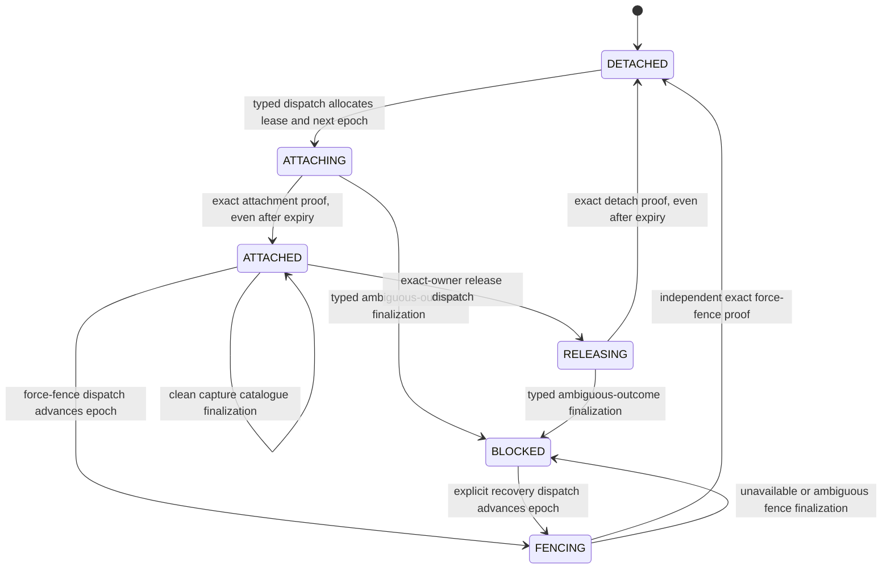

# Session Runtime Authority

## Scope

The implemented authority provides:

- a single-client PostgreSQL `SERIALIZABLE` transaction executor;
- database-authoritative transaction time;
- bounded, provenance-aware serialization and deadlock retry;
- an ordered, checksum-bound authority migration chain;
- permanent relational and typed state-machine authority for restore
  destination generations;
- real-PostgreSQL migration and concurrency tests;
- bounded OCI/Docker runnable-image inspection plus a one-use reservation
  capability;
- canonical, idempotent session registration with strict readback;
- a durable session-wide operation and reservation phase kernel;
- typed database-clock writer attachment dispatch, exact attachment
  finalization, exact lease renewal, exact-owner release, and force-fence
  reconciliation;
- production clean-checkpoint capture admission, durable attempt claims, and
  exact checkpoint-catalogue finalization;
- committed-only, source-free capture reconciliation;
- typed durable writer-launch attempt reservation, single dispatch, exact
  started/stopped finalization, readback, and bounded recovery;
- a hardened process-local logical-writer-launcher facade with exact image
  consumption, external launch, provisional writer registration, and
  no-relaunch reconciliation; and
- typed launch-stop authority plus bounded prepared/active/current-launch
  discovery.

Registration binds one immutable session manifest, storage reference, and
backend capability set to a canonical initial `DETACHED` document. The
operation kernel then binds one exact request to one active session reservation
before any external dispatch can begin. The typed writer lifecycle turns the
lease, attachment, detach, and force-fence records in
`session-storage-contracts.mjs` into serializable decisions for
`ATTACHING`, `ATTACHED`, `RELEASING`, `FENCING`, `BLOCKED`, and `DETACHED`.
The checkpoint slice binds stopped-writer clean capture to the operation,
reservation, capture-attempt, tombstone, and catalogue tables. The migration
chain also installs the permanent relational identities and constraints needed
by restore destination generations, while the typed authority claims and
finalises one exact detached destination generation against a committed source
checkpoint. The launch-attempt slice binds that committed generation to an
exact current session, measured image, and trusted supervisor outcome without
calling a launcher. The logical-launcher foundation now composes the original
one-use image capability, external launch callback, and exact same-process
writer registration. Typed stop state preserves that original launch until
exact complete-stopped proof. Production generation publication,
launcher/recovery, durable stop/capture, and `runRestore()` integration remain
the next serial slice.

Registration and generic operation reservation are not writer admission: they
do not allocate a lease or epoch, create an attachment, invoke a provider, or
authorize a launcher. Typed `claimWriterAttachmentDispatch()` allocates the
logical writer tuple only after the generic reservation is durable, but it
still does not execute a provider callback. The PostgreSQL authority does not
mount storage, launch a container, resolve a registry tag, verify an image
publisher, stop a writer, or prove a physical fence. A caller invokes the exact
provider request outside the transaction and returns its exact evidence for
typed finalization. The logical-launcher facade invokes only its explicitly
supplied external callbacks; it is not a concrete Podman/Docker adapter.
Release and force-fence use the same reserve, typed-dispatch,
external-provider, and typed-finalization order. The current
stopped-directory backend declares `fencing: "manual"` and therefore cannot
successfully finalize an automatic force-fence proof or use lease expiration
or a higher database epoch alone for host takeover. The durable launch-attempt
methods likewise execute no launcher or supervisor callback. They accept only
bounded canonical request data and exact evidence returned by a trusted caller.

## Protected Properties

The authority protects three different properties and keeps them distinct:

1. **Canonical identity**: one session record binds the immutable manifest,
   storage reference, backend capabilities, writer epoch, attachment, and
   operation state.
2. **Admission order**: every conflicting transition is serialized against the
   same PostgreSQL session row and revision. Database time, not a worker-host
   clock, decides lease expiry.
3. **Physical exclusion evidence**: only a backend proof can establish that a
   stale writer can no longer mutate storage. A higher database epoch blocks
   new logical admissions, but does not itself provide that proof.

The PostgreSQL registry protects the immutable part of canonical identity. The
operation kernel and typed writer lifecycle methods use the executor and
schema to order reservation, lease allocation, attachment finalization,
renewal, release, force-fence epoch advancement, and blocked reconciliation.
The capture authority uses the same ordering boundary for exact attempt
admission and catalogue finalisation. The generation relation and typed
restore-generation transitions protect historical identity, same-session
linkage, single dispatch, exact finalisation, replay, and bounded recovery. A
generation row authorises restore publication only after the typed claim
commits; even a committed generation does not authorise a writer launch.
The launch-attempt transition reuses the operation and reservation rows to
protect one durable blocker and binds a started writer through a version 3
session pointer to its immutable launch operation. That durable pointer and its
serialized IDs still do not authorize process creation. The process-local
launcher facade consumes the exact opaque image reservation and registers the
exact returned writer; neither step supplies physical exclusion evidence.
That evidence must come from a capable storage backend or supervisor, and full
production restore/stop composition remains a later slice.

## Implemented Canonical Session Registry

`PostgresSessionAuthority.registerSession()` validates and stores one canonical
document:

```text
documentVersion = 3
manifest
storageRef
backendCapabilities
lifecycle = DETACHED
writerEpoch = 0
lease = null
attachment = null
activeOperation = null
lastOperation = null
recovery = null
launch = null
```

The manifest, storage reference, and backend capabilities are defensively
copied and frozen before they cross the transaction boundary. The manifest and
storage reference must name the same session. Registration uses PostgreSQL
`SERIALIZABLE` isolation and an insert-on-conflict path, then compares the
complete canonical identity:

- an exact replay returns the existing revision and timestamps without a
  write, including after mutable operation state has progressed;
- reusing the session ID with any different immutable identity returns
  `session_identity_conflict` and never overwrites the row; and
- database `transaction_timestamp()` supplies both initial timestamps.

Version 2 adds a bounded `lastOperation` terminal anchor. Version 3 adds the
canonical current-launch pointer. A canonical version 1 or version 2 document
remains readable with its exact original shape and serialization so operation
requests already bound to that snapshot retain the same digest. Version 1 is
accepted only as an inactive revision-zero snapshot. Version 2 remains valid
for every previously supported inactive and active operation state, but its
`launch` field must be null. The first state-changing session write upgrades a
version 1 or version 2 document to version 3; readback and exact replay never
rewrite a stored document merely to normalize its version. Unknown future
versions fail closed.
The previously merged version 1 registry exposed no session-state mutation
method, so its supported persisted state was revision zero; progressed version
1 operation states existed only in intermediate commits of this unmerged
operation-kernel workstream and are not a migration input.

`readSession()` validates the complete relational and JSON document shape,
immutable identity bindings, current mutable state, revision, timestamps, and
any active operation/reservation linkage before returning a deep-frozen
snapshot. For a progressed version 2 or version 3 session, it also resolves the
`lastOperation` primary keys and proves that they name a matching committed
operation and released reservation, including request and result digests,
revisions, and terminal timestamps. Missing sessions return
`session_not_found`; malformed or inconsistent stored state returns
`session_state_invalid` or `operation_state_invalid`. Readback never repairs or
normalizes stored authority state implicitly. When version 3 carries a current
launch pointer, readback also follows its launch-attempt operation ID
independently of `lastOperation` and proves the exact generation, attachment,
stable lease tuple, image measurement, process and writer incarnations, and
supervisor evidence.

## Implemented Operation and Reservation Kernel

The kernel uses one conservative conflict class,
`session-mutation`. Every authority-changing operation for one session
conflicts with every other such operation until a later schema and proof set
justify narrower classes. `kind` describes an operation; it does not weaken
this session-wide exclusion rule.

`reserveOperation()` binds a globally unique operation ID to the exact session,
kind, bounded canonical request, and complete caller-observed session snapshot.
Canonicalization incrementally bounds JSON nodes and UTF-8 bytes, rejects
accessors, proxies, lone surrogates, and U+0000 before PostgreSQL access, and
uses captured `String`, `JSON`, and `Buffer` intrinsics plus null-prototype
temporary arrays so post-import global or prototype mutation cannot change the
request digest.
In one `SERIALIZABLE` transaction it:

1. locks the canonical session row;
2. proves the expected immutable identity, lifecycle, and revision;
3. claims one operation row and one authority-generated reservation row; and
4. writes the matching `activeOperation` pointer while incrementing the session
   revision.

The stored request, relational rows, and session pointer bind the same IDs,
kind, conflict class, request digest, expected session revision, phase, and
operation revision. Readback cross-checks all three representations. A missing,
dangling, or mismatched representation is corruption and fails closed; it is
never repaired implicitly.

The durable pre-dispatch state machine is:

```text
absent
  └── reserve ───────────────> prepared
prepared
  ├── claim dispatch ────────> starting
  └── cancel before dispatch > committed + released
starting
  └── outcome not provable ──> uncertain
```

`claimOperationDispatch()` performs only the `prepared -> starting` database
CAS. It returns a dispatch grant only when that exact call definitely committed
the transition. A replay that observes `starting` or `uncertain`, a lost commit
acknowledgement, or a restart never produces another grant. The caller must
wait for this method to return before invoking a provider, and no provider
callback runs inside the database transaction.

`markOperationUncertain()` durably changes the operation, reservation, and
session pointer together while leaving both claim rows active.
`cancelPreparedOperation()` is the only generic terminal path in this slice:
it can release a reservation only while dispatch is still durably unclaimed,
records a canonical `cancelled-before-dispatch` result, and preserves the
operation ID permanently for exact replay. The same transaction clears the
active pointer and replaces `lastOperation` with a terminal anchor containing
the operation and reservation identities plus canonical request and result
digests. A `starting` or `uncertain` operation cannot use this cancellation
path. Reserve refuses before creating a blocker when the PostgreSQL bigint
session revision cannot also represent cancellation, and generic dispatch
refuses before granting an external effect when no revision remains to record
an uncertain outcome.

`reconcileOperation()` is read-only and reports whether the exact request is
absent, prepared, starting, uncertain, or already committed. Reserve,
dispatch-claim, uncertainty, and cancellation retries replay exact durable
state without rewriting revisions or timestamps. Reusing an operation ID with
a different session, kind, expected snapshot, or request fails closed.

All real phase changes increment the session revision exactly once; operation
phase changes increment the operation revision exactly once. The reservation's
`expected_session_revision` remains the revision observed before the original
reserve. Writer epoch, session revision, and operation revision are independent
counters and are never inferred from one another. Every operation timestamp is
database time.

For version 2, an inactive revision-zero session has no terminal anchor. An
inactive progressed session has revision
`lastOperation.expectedSessionRevision + lastOperation.operationRevision + 1`;
an active session either starts from revision zero with no prior anchor or
preserves the immediately preceding anchor in its expected snapshot. Terminal
validation performs bounded primary-key reads and does not scan the complete
operation history. This protects the current session transition source under
the authority's ordinary database-integrity model; coordinated rewriting of
the session document, operation, reservation, and their bound hashes is outside
that model.

The generic kernel has no expiry, steal, or automatic release rule. `starting`
and `uncertain` survive process restart and continue to block the session. The
typed writer methods described below verify their own completion evidence and
atomically combine the business-state update with operation finalization.
Checkpoint catalogue finalization preserves that rule: it never calls a
generic finalizer first and writes the catalogue in a second transaction.
Typed restore-destination claim and finalisation preserve the same boundary.
Future durable launch-attempt and launcher methods must preserve it as well.

## Implemented Writer Lease and Attachment Acquisition

This slice reuses the existing relational schema and canonical version 2 JSONB
documents; it requires no DDL. It defines two typed operation kinds:
`writer-attachment-acquire-v1` and `writer-lease-renew-v1`.

Acquisition begins with generic `reserveOperation()`, which persists the exact
request as `prepared` without allocating writer authority.
`claimWriterAttachmentDispatch()` then runs one typed `SERIALIZABLE`
transaction. After it locks and validates the canonical session, operation, and
reservation state, it reads PostgreSQL `clock_timestamp()` and atomically:

1. advances the decimal-string writer epoch by one within the complete uint64
   range, failing closed at exhaustion;
2. allocates a lease duration bounded to 1 through 86,400,000 milliseconds from
   that database clock;
3. derives deterministic lease and attachment IDs from the globally unique
   operation ID;
4. changes the operation and reservation from `prepared` to `starting`; and
5. persists the exact lease, next epoch, and `ATTACHING` lifecycle while the
   attachment remains null.

Only the call that definitely commits that typed transition receives
`dispatchGranted: true` and the exact attach mutation request. Replay or commit
uncertainty cannot allocate another epoch or grant dispatch again. The caller
invokes the provider outside every database transaction. Before granting that
external side effect, the authority also proves that the PostgreSQL bigint
session revision has capacity for `starting -> uncertain -> committed`, so an
otherwise valid exact proof cannot become unrecordable solely because the
counter reached its limit.

`finalizeWriterAttachment()` accepts only the exact successful mutation result
and exact attachment proof bound to that request, lease, holder, epoch,
operation, storage identity, attachment ID, proof ID, and canonical host-local
`rootPath`. The provider mutation result must carry the same `rootPath`; a
caller cannot splice a different structurally valid directory into the
attachment evidence. This writer-specific evidence validates its root-path-free
projection against the unchanged generic storage contract v1 result shape. It
can finalize an operation from `starting` revision 1 or `uncertain` revision 2.
In one
transaction it commits the exact `writer-attached` result, retires the
operation, releases the reservation, clears `activeOperation`, persists the
attachment and lease, changes the lifecycle to `ATTACHED`, and writes the
versioned `lastOperation` terminal anchor. A committed replay must reproduce
the exact terminal result and performs no write.

Finalization deliberately does not reject exact physical evidence because the
lease expired while the provider was running. That evidence records what
physically happened. Expiry closes later admission; it neither erases the
attachment nor proves a fence.

`renewWriterLease()` has no provider or prepared phase. It is one
`SERIALIZABLE` transaction that locks and validates the exact `ATTACHED`
session, proves that no active operation exists, reads `clock_timestamp()`, and
requires the old `expiresAt` to be strictly later than that clock. Equality is
already expired and cannot be renewed. A valid renewal preserves the complete
lease and attachment tuple and changes only `expiresAt`, which must advance
beyond the prior value. The transaction inserts a terminal committed operation
at revision 0, a released reservation, the matching terminal anchor, and the
updated session revision. The globally unique operation ID makes an exact
replay return the original result without another clock read or extension;
conflicting reuse fails closed.

## Implemented Writer Release and Force-Fence Reconciliation

This slice also reuses the existing schema and canonical version 2 JSONB
documents without DDL. It adds the typed operation kinds `writer-release-v1`
and `writer-force-fence-v1`. Both use the same ordered boundary as
acquisition:

```text
generic reserve commit
          │
          ▼
typed dispatch commit
          │
          ▼
provider outside every database transaction
          │
          ▼
typed exact-proof finalize
```

An ambiguous provider or acknowledgement outcome does not use a generic
terminal path. The caller first records `starting -> uncertain`, then invokes
`finalizeWriterOperationBlocked()` with the exact typed request and either
`provider-outcome-unresolved` or `fence-unavailable`. That terminal transaction
releases the reservation and enters `BLOCKED` while preserving the exact lease,
attachment when known, force-fence target, and current epoch for explicit
recovery.

Release starts only from the exact `ATTACHED` snapshot and target.
`claimWriterReleaseDispatch()` changes `prepared -> starting` and enters
`RELEASING` without changing the lease tuple or writer epoch. The exact-owner
detach request remains admissible after lease expiry, but only for that
unchanged session, lease, holder, epoch, attachment target, storage identity,
and operation. Expiry is not permission to detach a different or newer
attachment. `finalizeWriterRelease()` accepts only the matching successful
detach result and atomically enters `DETACHED`, clears the lease and
attachment, retires the operation, releases the reservation, and writes the
terminal anchor. Finalization may consume matching evidence from either
`starting` or `uncertain`; an exact committed replay performs no write.

Force-fence reservation starts only from an exact `ATTACHED` or `BLOCKED`
snapshot with a retained lease and exact attachment target. On the definite
typed dispatch commit, `claimWriterForceFenceDispatch()` advances the canonical
decimal-string epoch once within uint64, changes `prepared -> starting`, and
enters `FENCING`. Replay, restart, or commit uncertainty cannot grant dispatch
or advance the epoch again. The provider receives a dedicated force-fence
storage envelope that binds the new epoch, revoked old lease tuple, attachment
target, storage identity, and operation ID. It runs outside the transaction.

Only the independently validated matching force-fence result with
`status: "fenced"` and an opaque provider proof can let
`finalizeWriterForceFence()` enter `DETACHED`. A generic detach result, lease
expiry, the advanced database epoch, or a caller assertion is not that proof.
A backend declaring `fencing: "manual"` cannot successfully complete this
automatic proof path. If fencing is unavailable or its outcome is ambiguous,
typed blocked finalization enters `BLOCKED` and retains the already advanced
epoch, revoked lease, known attachment, and target. Recovery from `BLOCKED`
requires a new explicit force-fence reservation and dispatch; its dispatch
advances the epoch again before re-entering `FENCING`.

## Implemented PostgreSQL Transaction Boundary

The executor gives one callback a checked-out PostgreSQL client and one
`SERIALIZABLE READ WRITE` transaction from a pool dedicated to this executor.
The constructor accepts that pool only through the explicit `dedicatedPool`
option; legacy or ambiguous `pool` input is rejected. It:

1. resets the checked-out session outside a transaction with a verified
   `DISCARD ALL`;
2. obtains `transaction_timestamp()` and a transaction ID from that same
   database transaction;
3. exposes only a callback-scoped extended-protocol `query(text, values?)`
   capability and the canonical timestamp; parameter input must be a built-in,
   non-Proxy array with at most 65,535 entries, and every entry is copied into
   an own data property that accepts only `null`, `undefined`, string, number,
   boolean, or bigint values, so node-postgres never invokes application
   converters while classifying a database retry; callers serialize structured
   values to strings and use explicit SQL casts such as `$1::jsonb`;
4. rejects an unsettled or suppressed failed query, and internally observes
   locally rejected query promises so a fire-and-forget call cannot emit an
   unhandled process rejection while the original promise remains rejected;
5. rejects `PREPARE TRANSACTION`, including leading empty statements and
   comment-separated forms, before submission so a callback cannot move the
   transaction and its locks into PostgreSQL's prepared-transaction registry;
   ordinary `PREPARE name [(types)] AS ...` remains available and is reset with
   the session; then rechecks the transaction ID after every successful user
   query so callback-issued transaction control cannot be hidden by a later
   throw, and treats a query failure without a trusted PostgreSQL SQLSTATE as
   outcome-uncertain;
6. immediately before `COMMIT`, executes a frozen extended-protocol
   `SET LOCAL synchronous_commit = on`, requires an exact `SET`
   acknowledgement, and rechecks the original transaction ID so a callback
   cannot lower this transaction's acknowledgement durability; and
7. accepts only an exact node-postgres `COMMIT` acknowledgement, then verifies
   another `DISCARD ALL` before returning the client to its dedicated pool.

Serialization failures and deadlocks may be retried only when the same
node-postgres `DatabaseError` object was first observed on that client's
`errorMessage` connection event and then rejected the active query with the
exact transaction-rollback SQLSTATE. The client is destroyed or reset after a
proved rollback. A client returned by the dedicated pool is also destroyed
with `release(error)` when its required query, release, or connection-event
shape is invalid; the acquisition failure remains primary even if destruction
fails. Merely constructing `DatabaseError` or matching its `code` is
insufficient: custom parameter conversion and result-parser failures never
receive protocol provenance. The executor captures the WeakMap, Set, Array,
RegExp, object, Promise, cryptographic Hash, and prototype-test intrinsics used
by that proof before any callback runs. Authority-bearing driver results must
expose own data fields rather than inherited values or accessors. A callback
limited to the transaction capability therefore cannot use built-in prototype
mutation to manufacture SQLSTATE provenance, hide pending queries, replace
migration checksum operations, or turn an unknown `COMMIT` result into a
retry. This is not an unforgeable brand against code that can access or replace
the dedicated pool, checked-out client, connection event source, or
node-postgres implementation: those objects form the trusted driver boundary
and must not be exposed to callbacks. For every query, the executor temporarily
pins the connection's own `emit` method to the module-captured native
`EventEmitter` implementation and uses captured listener intrinsics, then
restores the exact prior own descriptor. A callback that mutates
`EventEmitter.prototype` after its final user query therefore cannot redirect
a completed `COMMIT` event into forged retryable SQLSTATE evidence. That rule
also covers a server `40001` detected during a user-query boundary recheck,
the final durability/boundary recheck, or `COMMIT`. A trusted `40001` or
`40P01` from either recheck proves that PostgreSQL aborted the transaction, so
the executor destroys the client and may retry the complete callback within
the configured bound. A local, reused, or merely SQLSTATE-shaped exception
does not carry that proof and remains outcome-uncertain. A transport failure
or any other `COMMIT` error is outcome-uncertain and is never automatically
replayed as a fresh operation. Forcing `synchronous_commit=on` protects the
transaction from callback-local weakening; it does not compensate for a
PostgreSQL deployment that disables normal WAL or filesystem durability.
Reset failure destroys the connection and preserves the already proved
committed or not-committed outcome. User-query failures without a SQLSTATE,
the connection/operator/system/internal error classes, and the explicit
`40003` completion-unknown state are likewise outcome-uncertain; a later
`ROLLBACK` cannot reclassify them.
After a callback rollback is proved, only a store error minted by that exact
transaction attempt retains its specific state. A publicly constructed store
error or one replayed from another operation is translated to the generic
`transaction_rolled_back` / `not-committed` result. Constructor provenance is
recorded in a module-private identity set, including objects constructed with
an alternate `newTarget`; the captured public prototype chain independently
covers prototype-created or prototype-grafted counterfeits. An opaque Proxy
callback error also fails closed to the generic rollback result because its
target identity cannot be proved. Ordinary non-Proxy application errors remain
unchanged, while stale or forged `committed` / `uncertain` store state cannot
escape a transaction that definitely rolled back.

Migration rollback preserves a specific migration validation error only when
that exact error object was created and marked by the current `migrate()`
invocation. A publicly constructed store error or an internal error replayed
from another operation is translated to `migration_failed` after the current
rollback, so stale or forged `commitState` evidence cannot cross operation
boundaries. Store errors define frozen own data fields rather than consulting
mutable prototype accessors for their reported state.

The operation kernel and typed writer lifecycle paths use that executor to
lock the canonical session row, claim or validate operation and reservation
rows, validate the complete expected identity and revision, and commit durable
`prepared` and typed `starting` phases before any external provider callback
starts. The owning session's current active operation and reservation are
locked in that order. A foreign or already retired operation ID is read only as
snapshot-consistent identity evidence, not locked, so crossed foreign IDs
cannot introduce a second lock order. An external callback must not be held
inside a database transaction. Acquisition, release, and force-fence use this
protocol:

```text
generic serializable reserve commit
                  │
                  ▼
typed prepared -> starting commit
with lifecycle-specific tuple/epoch decision
                  │
                  ▼
external physical operation
                  │
                  ▼
typed serializable exact-CAS success finalize
or uncertain -> typed BLOCKED finalize
```

The durable reservation closes launch, detach, fence, restore, and other
conflicting admission while the callback is in flight. If the callback or
finalization acknowledgement is uncertain, the reservation and operation phase
remain visible for explicit reconciliation; the authority never rolls back to
an apparently safe state.

## Production Clean-Capture Mutation Authority

The production checkpoint slice is deliberately capture-only. It reuses the
version 1 authority schema without DDL and composes the existing session-wide
operation/reservation kernel with `capture_attempt_claims`,
`capture_attempt_tombstones`, and `checkpoint_catalogue`. Restore is not
admitted through this capture API. The separate typed restore-generation
authority can name and finalise one canonical detached destination generation,
but production restore still fails closed until durable logical launcher
admission consumes that committed generation.

Normal capture begins from the exact canonical `ATTACHED` session snapshot.
Before publication, the authority uses database time to prove that the lease
is unexpired and that the complete session identity, storage reference,
attachment, lease, writer epoch, checkpoint descriptor, mutation request, and
stopped-writer correlation binding all agree. One exact operation and active
session reservation bind that admission. Capture never advances the writer
epoch or changes the attachment, lease, or lifecycle.

The capture order is:

```text
per-operation PostgreSQL session advisory guard
                  │
                  ▼
generic serializable reserve commit
                  │
                  ▼
typed prepared -> starting commit
+ globally unique durable capture-attempt claim
                  │
                  ▼
external stopped-directory publication
outside every database transaction
                  │
                  ▼
typed serializable exact-CAS catalogue finalize
+ operation commit + reservation release + terminal anchor
```

Only a definitely committed typed dispatch may invoke publication. The
capture-attempt UUID minted inside the one-use stopped-writer callback and the
operation ID are globally non-reusable authority identities. Their single
canonical claim binds the complete immutable capture attempt and predetermined
result before physical publication begins. A collision or a matching retained
tombstone rejects admission before publication. Production retains claims
permanently; if a future retention workflow writes a tombstone, that tombstone
is non-authorizing and cannot be removed to revive the old attempt.

The PostgreSQL session advisory guard is keyed by the exact capture operation.
One acquisition is held across claim activation, the complete asynchronous
publication callback, and catalogue finalization; every committed
reconciliation independently reacquires the same key around verification and
finalization. The advisory lock is not durable across process, connection, or
database restart, and reacquiring it does not prove an older publication
callback has quiesced. The retained operation, attempt claim, and ordinary
active session reservation prevent another publisher and block detach, fence,
restore, launch, and any other conflicting session mutation while an
unfinalized capture may have effects. Same-operation recovery may overlap an
older callback after its database session is lost; that path is source-free
and read-only until the physical journal proves the exact artefact committed.
`absent`, `prepared`, and `materialized` publication therefore fail closed.

Successful publication returns an exact path-free completion containing the
trusted artefact proof, materialisation, and predetermined checkpoint mutation
result. In one `SERIALIZABLE` finalization transaction, the authority locks and
revalidates the same session, operation, reservation, canonical attempt, both
claim identities, and absence of a tombstone; writes or confirms the exact
catalogue entry; retires the operation; releases the reservation; clears the
active pointer; and writes the terminal anchor. The catalogue entry and
terminal operation result are two cross-checked representations of the same
durable completion. Neither may commit alone.

If dispatch acknowledgement is lost, no publication grant is returned and the
durable blocker remains for explicit recovery. Once publication can have
started, a callback failure or unprovable outcome moves the exact operation to
`uncertain` when that transition can be confirmed; it never cancels the
operation, reuses the stopped-writer capability, substitutes a new attempt, or
speculatively cleans physical evidence. A finalization acknowledgement loss may
therefore leave an `authorized` attempt beside an already committed physical
artefact, or may already have committed the matching catalogue and terminal
anchor.

Committed capture reconciliation accepts only the original checkpoint
descriptor and mutation request. It takes the same per-operation advisory
guard, loads the exact non-tombstoned durable attempt by its original
operation, and invokes the backend's source-free committed verifier. It has no
writer, lease, attachment, authority clock, mutable source, or stopped-writer
capability input. `absent`, `prepared`, and `materialized` journal phases never
become success through this path. After asynchronous verification, the
authority revalidates the same attempt and claims before it atomically
finalizes or confirms the catalogue and returns the verifier's exact completion.
If the original publisher commits the same exact result while verification is
in flight, finalization may return a committed replay instead of claiming the
write. The facade accepts that race only after validating the committed
operation, attempt, catalogue, exact completion, and historical session
identity/revision; it does not misclassify the confirmed replay as an uncertain
outcome.
Every historical committed-operation read also requires the current canonical
session to retain the operation's exact immutable document identity and
session-incarnation `createdAt`, and its revision must be at least
`operation.expectedSession.revision + operation.revision + 1`. Immutable
session identity alone is not ancestry evidence: a partially restored session
row that predates the committed operation fails closed even when the newer
operation, attempt, and catalogue rows remain present. Conversely, a newer
revision from another session incarnation or identity cannot adopt that
historical operation's attempt or catalogue.

## Bounded Checkpoint Recovery Enumeration and Service

`PostgresSessionAuthority.listCheckpointCaptureRecoveryCandidates()` exposes
one read-only operational page with exact `{afterSessionId, limit}` input. The
limit is an integer from 1 through 100. Its SQL selects only unretired
`checkpoint-capture-v1` operations in `starting` or `uncertain`, orders by the
immutable `session_id`, and requests at most `limit + 1` rows. The extra row
determines whether the page has a continuation without admitting extra work.
The existing unique active-operation partial index is already ordered by
`session_id`, so this slice requires no DDL or migration-runner change.

Enumeration does not trust the selection query as an authorization join. In
the same `SERIALIZABLE` snapshot it parses each complete canonical operation
envelope and revalidates the current session active pointer, matching
reservation, exact capture-attempt binding, tombstone absence, and catalogue
absence. A missing, malformed, tombstoned, catalogued, or crossed
relation fails the page closed instead of being hidden by SQL. A successful
entry is a frozen object containing only the exact durable
`{checkpoint, request}` reconciliation admission. The enumerator does not
accept or reconstruct a current session, attachment, lease, source path,
stopped-writer capability, publication plan, or replacement attempt.

A non-null continuation cursor is the last settled candidate's session ID. It
is a progress and fairness hint, not an authority token, durable worker claim,
exactly-once boundary, or cross-page snapshot. Candidate and cursor rows share
one snapshot, but later pages do not. A concurrent finalizer may turn an
enumerated candidate into an exact committed replay; a new candidate at or
behind the cursor waits for the next sweep. When enumeration reaches the end,
the service returns a null cursor so the next scheduled pass begins at the
start. This deliberate wrap makes retained work replayable and eventually
revisits candidates that appeared behind an earlier cursor.

`createPostgresCheckpointRecoveryService()` installs fixed candidate-list and
committed-reconciliation collaborators for one backend. The backend identity
and artefact-root resolver must be constructed once from copied, frozen startup
configuration; the same backend ID cannot silently resolve to a different root
between passes. `runBatch({afterSessionId, limit, signal})` reads one page and
processes candidates sequentially with concurrency one. The service also admits
at most one batch invocation at a time; an overlapping valid invocation fails
closed before candidate enumeration or reconciliation and can retry after the
in-flight batch drains. Each settled candidate produces an operation/session
receipt with status `reconciled` or `pending`. The batch returns
`sweep-complete`, `limit-reached`, or `aborted`, plus the cursor after the last
settled candidate. A sanitized pending result does not prevent later
already-admitted page candidates from running.

AbortSignal is an admission boundary rather than physical cancellation. A
signal already aborted before enumeration admits no work. Once reconciliation
has begun, a later abort prevents the next candidate from starting but awaits
the current verifier, authority finalization attempt, and advisory-guard
release before returning. The service does not use `Promise.race`, detach the
promise, abandon a guard, or report cancellation while provider work is still
live.

The page size and sequential batch give a hard count bound of 100 candidate
attempts. They do not create a worst-case wall-clock bound: the current
committed verifier has no cooperative cancellation seam, and the active-row
index may still inspect other active operation kinds before filling a sparse
checkpoint page. Production therefore retains statement, request, and
scheduler deadlines outside this module. Guard-busy and physically
unverifiable attempts report `pending` and preserve their durable operation,
reservation, and capture claim for another pass. Under the existing exact
reconciliation path, an unresolved `starting` attempt may durably advance to
`uncertain`; neither state authorizes a new publisher or mutable-source retry.

## Canonical Session Lifecycle

The canonical document uses the lifecycle from the storage contract:


```mermaid
stateDiagram-v2
  [*] --> DETACHED
  DETACHED --> ATTACHING: typed dispatch allocates lease and next epoch
  ATTACHING --> ATTACHED: exact attachment proof, even after expiry
  ATTACHING --> BLOCKED: typed ambiguous-outcome finalization
  ATTACHED --> ATTACHED: clean capture catalogue finalization
  ATTACHED --> RELEASING: exact-owner release dispatch
  RELEASING --> DETACHED: exact detach proof, even after expiry
  RELEASING --> BLOCKED: typed ambiguous-outcome finalization
  ATTACHED --> FENCING: force-fence dispatch advances epoch
  BLOCKED --> FENCING: explicit recovery dispatch advances epoch
  FENCING --> DETACHED: independent exact force-fence proof
  FENCING --> BLOCKED: unavailable or ambiguous fence finalization
```

The acquisition, renewal, clean-capture, release, force-fence, `FENCING`, and
`BLOCKED` authority transitions are implemented. A new writable acquisition
and each force-fence dispatch advance the uint64 fencing epoch. Capture,
release, and renewal do not. Renewal preserves the complete writer tuple and
extends only the database-authoritative `expiresAt`. Epoch exhaustion fails
closed.

Lease expiry closes subsequent mutation, renewal, and launch admission. It does
not change the physical attachment state, move the lifecycle to `FENCING`, or
prove a fence. Exact attachment finalization still persists matching physical
evidence after expiry, and exact-owner cleanup for the unchanged tuple and
target may detach after expiry only when no current launch is recorded. A
non-null launch requires exact supervisor-stopped evidence or a successful
physical force fence before storage release can proceed. Once a newer epoch
has been allocated, the old tuple is stale even for cleanup. Moving from
`BLOCKED` to `FENCING` always requires a separately reserved force-fence
operation and a definite typed dispatch commit.

## Schema for Durable Claims and Reservations

Operation IDs, capture-attempt IDs, and reservation IDs are global authority
identities rather than session-volume data:

- an exact operation retry may replay only its complete canonical request and
  committed result;
- reusing an operation ID with a different session, kind, or request fails
  closed;
- an active reservation is unique for the operation and session conflict
  class;
- capture-attempt IDs and their operation IDs remain claimed by active records
  or permanent tombstones; and
- checkpoint catalogue entries are finalized only from the exact active
  capture attempt; and
- restore destination generation IDs remain independent permanent identities,
  each bound to one exact operation, session, and same-session checkpoint; and
- each writer launch attempt reuses its globally unique operation ID and
  permanent request/result row instead of duplicating phase state in another
  relation.

The PostgreSQL schema intentionally stores state-machine documents as `jsonb`
while keeping identities, revisions, timestamps, and uniqueness constraints in
relational columns. Business transitions remain in the authority code so a
database migration cannot silently invent a new lifecycle.

Writer acquisition, renewal, release, force-fence, blocked finalization, and
checkpoint capture use those existing structures without DDL. The canonical
session JSONB stores the lease, epoch, lifecycle, attachment, active pointer,
and terminal anchor; the existing operation and reservation JSONB records
store each exact typed request and terminal result. Capture-attempt claims bind
the exact operation and coordinator binding, tombstones are permanent
non-authorizing reuse fences, and each catalogue row binds one checkpoint to
one exact attempt and path-free committed completion. The established global
operation identity and active session-conflict constraints remain the
admission boundary.

The ordered migration chain treats the installed
`session_authority.schema_migrations` ledger as an exact contiguous prefix
starting at version 1. Every installed checksum must match the corresponding
immutable tracked SQL source. A gap, future version, malformed row, or checksum
drift fails closed. One advisory-locked transaction applies every missing
migration in order and records each checksum before the commit boundary.

Migration version 2 adds
`session_authority.restore_destination_generations`. Its relational columns
keep `generation_id`, `operation_id`, `session_id`, and `checkpoint_id`
separate instead of deriving authority from a session revision, writer epoch,
or mutable session pointer. Composite foreign keys bind the row to the same
session's permanent operation claim and checkpoint catalogue entry.
`authorized` rows must have no finalized document or commit timestamp;
`committed` rows must have both. The authority exposes no deletion or
retirement API for these rows in this foundation.

These constraints are necessary but not sufficient authority. The typed
restore-generation layer now retains the backend's exact
`{checkpoint, request}` admission unchanged inside an operation payload that
also binds the contract version and predetermined result. The permanent
operation envelope separately retains the complete expected session snapshot,
including its lease, attachment, storage reference, revision, and terminal
anchor.

The `prepared -> starting` transition locks and revalidates the session,
operation, reservation, source checkpoint catalogue, and generation relation
in one serializable transaction. It requires an `ATTACHED` canonical session,
an unexpired database-clock lease, an exact destination storage and fence, a
clean committed source checkpoint, and a restore epoch strictly newer than the
source epoch. The source checkpoint and destination request name the same
backend and session but do not infer one another's storage identity.

Fresh `generationId` and `destinationIsolationProofId` values enter only at
this typed claim boundary. The generation binding retains those identities,
the exact destination attachment and request, the full source checkpoint,
capture-operation and attempt identities, and the checkpoint catalogue hash.
`destinationState: "detached"` describes the isolated physical restore target;
it does not change the canonical session lifecycle from `ATTACHED`. The proof
ID is a durable correlation value rather than a self-authenticating
capability, so later composition must obtain it from the trusted destination
authority.

Only a definitely committed claim returns `dispatchGranted: true`. A replay
of `starting`, `uncertain`, or committed state returns the retained generation
without authorising another publication. Exact finalisation may begin from
`starting` or `uncertain` and atomically changes the generation to `committed`,
retires the operation, releases the reservation, and advances the session
terminal anchor. The committed document binds the source artefact proof, the
`restore-destination` materialisation, and the predetermined restore result.
Restore generation document v2 requires materialisation contract v3, which
carries a domain-separated SHA-256 of the exact coordinator generation
binding retained by the publication journal. Finalisation recomputes that
digest from the locked generation before any write, so a materialisation from
another operation, generation, isolation proof, reservation, or destination
attachment cannot be spliced into the current predetermined result.
Finalisation replay accepts only the same canonical document. The filesystem
publication and stopped-directory backend may read-only replay a historical
restore materialisation contract v2 after an upgrade, but this typed authority
deliberately rejects that physical compatibility result because it lacks the
coordinator-binding digest.

Bounded recovery enumerates only retained `starting` or `uncertain`
restore-generation operations whose exact authorised generation and source
catalogue still validate. The generation relation has no deletion or
retirement path. These transitions neither invoke publication inside a
database transaction nor require launch-specific DDL. Production restore
remains disabled until exact publication finalisation is wired to the
implemented launcher and recovery facade without weakening the
no-second-writer boundary.

The current capture-oriented stopped-directory backend still constructs its
legacy restore journal binding from only checkpoint, isolation-proof, and
reservation context. Production composition must instead pass the exact
claimed generation binding as the publisher's coordinator binding before it
can produce a materialisation accepted by generation document v2. Restore
remains fail-closed until that composition exists.

## Implemented Durable Launch-Attempt Lifecycle

`writer-launch-attempt-v1` reuses the migration version 2 operation and
reservation schema. The operation ID is also the launch-attempt ID; no
migration version 3 or launch-specific relation is required. The permanent
operation request binds:

- one exact committed restore-generation identity plus hashes of its binding
  and finalized document;
- the complete current attachment and lease snapshot, including the stable
  lease ID, holder, and fencing epoch;
- the bounded platform-image projection and measured Codex runtime identity;
  and
- one trusted supervisor identity.

`createWriterLaunchAttemptOperationRequest` accepts the complete committed
restore-generation snapshot returned by the typed authority: `binding`,
`checkpointId`, `claimedAt`, `committedAt`, `document`, `generationId`,
`operationId`, `sessionId`, and `state`. The builder validates that snapshot
against the expected session and derives the compact generation reference
stored in the durable request. Callers must not pass that compact reference
back as the builder input.

The serialized generation reference, image measurement, supervisor ID, proof
ID, process incarnation ID, and writer incarnation ID are correlation values.
They neither replace the committed generation relation nor authenticate
authority. In particular, the measured-image record is not the opaque one-use
reservation issued by `PlatformImageReservationCoordinator`.

Reservation writes `prepared` before any dispatch is possible. Typed claim
then locks the session, operation, reservation, and named restore generation,
revalidates the complete committed generation relation and its committed
operation's immutable session identity, creation timestamp, terminal revision
floor, and claim-time bounds, and only then reads the database clock to check
the exact current attachment and unexpired lease before advancing to
`starting`. A generation-row lock wait therefore cannot reuse a pre-wait lease
observation after expiry. Only that definite commit returns
`dispatchGranted: true`.
`starting` and `uncertain` both retain the active operation and reservation, so
neither acknowledgement loss nor process restart opens a second launch.
Bounded recovery lists only those two phases in stable `session_id` keyset
order and revalidates their durable relation without consulting a launcher.

Typed finalization accepts only exact evidence for the same attempt and
supervisor:

- `started` binds non-null process and writer incarnation IDs and stores a
  canonical current-launch pointer;
- `not-started` requires both incarnation IDs to be null; and
- `complete-stopped` binds both incarnation IDs and proves that the complete
  old container, cgroup, or VM writer boundary has joined.

PID disappearance, an exit code, Codex `ShutdownComplete`, lease expiry,
storage detach, or a copied `"stopped": true` field is not
`complete-stopped` evidence. Exact finalization from `starting` or `uncertain`
atomically commits the operation result, releases the reservation, clears the
active pointer, and advances `lastOperation`. Replays accept only the same
canonical evidence and never grant dispatch again.

Canonical session document version 3 stores the current started-launch pointer
separately from `lastOperation`. Later lease renewal or checkpoint capture may
replace the terminal anchor, so strict readback follows the pointer's operation
ID and reconstructs its immutable request/result. It rechecks the operation's
session identity, creation timestamp, terminal revision floor, generation,
attachment, stable lease tuple, non-regressing lease expiry, image hashes,
process and writer incarnations, and supervisor proof. A second launch requires
`launch = null`. Writer release also requires `launch = null`; storage detach
alone does not prove the process stopped. Force-fence `starting`, `uncertain`,
and unresolved `BLOCKED` states retain the launch pointer, while a successful
exact physical fence clears it. Checkpoint capture preserves the pointer and,
when present, must name the same process and writer incarnations.

The durable launch-attempt lifecycle slice deliberately did not consume an
image reservation, invoke a launcher or supervisor, register a writer
capability, or enable production restore. The following foundation composes
the process-local launch boundary without enabling restore.

## Implemented Logical Writer Launcher Foundation

`createPostgresLogicalWriterLauncher()` composes the process-local image and
stopped-writer coordinators with the PostgreSQL launch-attempt authority and
the external `launchWriter` and `reconcileWriterLaunch` callbacks. It returns
the exact frozen `runLaunch`, `reconcileLaunchAttempt`, and
`resolveStoppedWriter` facade. The facade owns callback ordering and local
object capabilities; it does not turn their serialized projections into
authority.

The facade accepts exact own-data shapes under bounded traversal budgets,
rejects proxies, accessors, inherited fields, unsafe thenables, and non-native
callback promises, and snapshots collaborator methods and relevant intrinsics.
Its per-attempt operation guard revalidates its held probe immediately around
image consumption and supervisor callbacks. Public operations retain protected
Promise chains and expose only the fixed,
non-retryable `invalid_logical_writer_launch_request`,
`logical_writer_handle_unavailable`, and
`logical_writer_launch_outcome_uncertain` error codes without collaborator
details.

The supervisor contract is version 1. `launchWriter` must return exact
`{ receiptVersion: 1, evidence, stopWriter }`: a `started` result requires one
trusted asynchronous `stopWriter`, while `not-started` or `complete-stopped`
requires `stopWriter: null`. `reconcileWriterLaunch` returns exact
`{ receiptVersion: 1, evidence }` and accepts only `not-started` or
`complete-stopped`; recovery cannot report a newly adopted started writer.

A new launch follows this order:

1. strictly read the current canonical session and revalidate the original
   opaque image reservation without consuming it;
2. build and reserve the exact durable launch attempt, then obtain the one
   definite `prepared -> starting` dispatch claim;
3. consume that same reservation exactly once and compare every retained image
   and runtime-measurement field with the durable request;
4. invoke the external launch callback at most once; and
5. for a started result, register the exact process and writer incarnations
   with the designated `StoppedWriterCapabilityCoordinator` before started
   finalisation, retain that handle as provisional, and expose it only after
   exact authority readback succeeds.

No external launch callback runs before durable `starting`. If image
consumption, launch, registration, finalisation, or acknowledgement becomes
ambiguous after that boundary, the durable attempt remains a blocker. A
`not-started` or already `complete-stopped` supervisor result uses the typed
stopped finaliser and never registers a writer.

Recovery is deliberately not another launch path. A still-`prepared` attempt
is cancelled without consuming an image or invoking either launch path. When
the same facade instance retains an exact provisional writer record for a
`starting` or `uncertain` attempt, recovery first retries started finalisation
with the original supervisor evidence and exposes the same handle only after
exact committed readback. Without that record, `starting` is moved toward
durable uncertainty on a best-effort basis and the active attempt consults only
the trusted stopped-only supervisor reconciliation callback. Neither branch
relaunches. A committed started attempt is usable only when the facade still
retains its exact local record. A restart cannot deserialize that handle, so
readback fails with `logical_writer_handle_unavailable` and requires stop or
physical fencing. A committed not-started or completely stopped attempt
returns no writer.

`resolveStoppedWriter()` authenticates only a ready local record whose complete
attachment tuple matches the capture request. It also binds the checkpoint's
Codex session, root thread, and image digest to the launch manifest and pins the
first normalized attachment/checkpoint/request tuple against later resolver
calls. This is the local bridge needed by later capture composition. Its
registered stop wrapper checks the exact coordinator binding, calls the launch
receipt's local supervisor callback, and requires
`STOPPED_WRITER_STOP_CONFIRMED`; it does not yet claim or finalise the durable
PostgreSQL stop transition.

This foundation also keeps one later receipt shape deliberately closed. After
a separate durable stop operation clears the current launch, the immutable
historical launch attempt still says `started` while
`readWriterLaunchAttempt()` can return `launch: null`. The facade rejects that
combination instead of treating serialized history as a local handle or as a
complete stop receipt. The next durable stop-composition slice must add an
explicit joined receipt before this historical state can be consumed.

The PostgreSQL authority separately adds typed `writer-launch-stop-v1` state.
`createWriterLaunchStopOperationRequest()` accepts only a version 3 `ATTACHED`
session with no other active operation and embeds its complete current-launch
pointer. `claimWriterLaunchStopDispatch()` grants the typed
`prepared -> starting` transition once; it deliberately does not make lease
validity a stop gate, and `starting` or `uncertain` retains the launch.
`finalizeWriterLaunchStopped()` accepts only the complete seven-field
supervisor evidence for the original launch with `status: "complete-stopped"`.
It leaves the original started operation unchanged while atomically releasing
the stop reservation, clearing the current launch, and advancing
`lastOperation`. The authority does not call a supervisor automatically.

`listWriterLaunchAttemptRecoveryCandidates()` now returns bounded keyset pages
of `prepared`, `starting`, and `uncertain` attempts with each candidate's exact
state. `listCurrentWriterLaunchRecoveryCandidates()` instead scans a bounded
keyset page of session rows and returns only relationally validated current
launches. Its cursor advances by the last scanned session, so a page can
contain fewer candidates, including none, while still carrying a continuation
cursor. Discovery records are recovery inputs only: they cannot consume an
image, invoke a launcher, reconstruct a writer handle, or prove a stopped
boundary.

## Platform Image Reservation

The portable identity is the existing manifest's exact platform-manifest
digest, media type, Linux platform, and normalized Codex version. A trusted
resolver may add measured descriptor and executable evidence, but cannot
replace those four fields or accept an OCI index/tag as the portable identity.
The current resolver accepts a bounded runnable-image profile rather than every
OCI artifact extension: it validates the exact manifest and config bytes,
required config/rootfs structure, one or more recognized layer descriptors,
matching DiffID count, and supported standard descriptor metadata. OCI
manifest `mediaType` may be omitted as the specification permits. Artifact
manifests, unknown descriptor fields, non-HTTPS or credential-bearing
descriptor URLs, and unsupported layer media types are rejected deliberately.
Caller-supplied byte views are size-checked through captured typed-array
intrinsics before any source-sized private byte-buffer allocation, then copied
into an exact bounded buffer without invoking shadowable source properties.
Before full JSON parsing, the scanner also bounds nesting, total value nodes,
aggregate object members, aggregate array elements, each container, image
layers and rootfs DiffIDs, and config history entries. These structural budgets
prevent a byte-valid manifest or config from expanding into unbounded parser
work or duplicate-key tracking memory. The inspector is an external callback,
so every Promise crossing that boundary and every authority-owned async
operation is given a frozen, null-prototype species holder as its own
`constructor` before it is awaited or returned. Public operation Promises also
expose own hardened `then`, `catch`, and `finally` methods that protect every
returned chain and native Promise produced by a reaction. Callback mutation of
`Promise.prototype` or `Promise[Symbol.species]` therefore cannot substitute a
forged measurement, an unprotected reaction chain, a revalidation result, an
observation callback, or a public operation result. The JSON scanner and
copied-byte comparisons likewise use captured RegExp, Set, and typed-array
intrinsics rather than mutable prototype dispatch. Descriptor hashes use
captured cryptographic Hash methods; own-key and platform arrays use indexed
access instead of a mutable array iterator; and the private reservation ledger
uses the module-captured WeakMap constructor. Descriptor URL policy reads the
native parse result through module-captured `protocol`, `hostname`, `username`,
and `password` getters. Post-import intrinsic poisoning therefore cannot
replace the ledger, skip nested freezing, reinterpret a platform tuple, forge a
descriptor digest, or disguise an HTTP or credential-bearing descriptor URL as
admissible HTTPS. The shared complete session-manifest validator captures the
structure, array-membership, RegExp, integer, and freeze intrinsics that decide
manifest validity; post-import prototype or static-method mutation therefore
cannot admit an invalid UUID, history policy, runtime identity, or agent
policy. Its defensive clone and recursive freeze also use module-captured
intrinsics, so post-import replacement cannot mutate the validated session
binding or reenter image reservation. Image authority independently snapshots
every runtime field through captured own-data descriptors and ignores the
validator's defensive-clone result.

Image reservation follows one-process object capability semantics:

1. validate the complete session manifest and trusted resolver projection;
2. mint an opaque, non-serializable reservation bound to that exact projection;
3. revalidate the projection immediately before launch;
4. consume the reservation exactly once during launcher admission.

A clone, JSON value, proxy wrapper, or reconstructed record is not a
reservation. The object capability prevents an untrusted serialized
`"trusted": true` field from becoming launch authority. It does not prove
registry availability, publisher signatures, or that a future container driver
actually launched the reserved bytes.

## Remaining Production Restore Composition

The launcher foundation closes the process-local image-consumption, external
launch, provisional registration, and no-relaunch reconciliation boundary. It
does not yet compose the complete restore transaction. The next serial pull
request must:

- claim one typed destination generation and pass its exact coordinator
  binding through physical publication before finalising that generation;
- pass the exact committed generation and original image reservation to the
  launcher facade, and route active-attempt recovery without another launch;
- compose bounded generation, prepared-launch, active-attempt, and
  current-launch recovery into an operational service;
- route the coordinator's complete stop through `writer-launch-stop-v1` and
  persist the exact supervisor proof before treating the writer as stopped or
  admitting capture; and
- wire the whole protocol into `runRestore()` only after every uncertain
  publication, launch, registration, stop, and finalisation boundary remains
  fail-closed.

Until that integration lands, the production checkpoint adapter rejects
restore and the launcher resolver is not production stop/capture composition.
A database row, published directory, restore journal record, checkpoint
descriptor, catalogue entry, committed generation, serialized measurement,
discovery result, or durable attempt alone is never writable-launch authority.
A later concrete Podman/Docker adapter must also hold directory identity
through the bind, enforce rootless execution, and fix the Codex CLI/config
surface.

## Operational Boundary

Production deployment requires:

- PostgreSQL 13 or newer for `pg_current_xact_id()`; CI validates PostgreSQL
  18.4;
- one authoritative PostgreSQL primary for these tables;
- a node-postgres pool dedicated to this executor so its verified
  `DISCARD ALL` lifecycle cannot invalidate another subsystem's session state;
- a separate node-postgres pool dedicated to the operation guard so one
  checked-out connection can hold its PostgreSQL session advisory lock across
  out-of-transaction publication without sharing connection state with the
  serializable executor;
- both pools connected directly to the same authoritative database and primary;
  the guard connection requires backend-session affinity and cannot use
  PgBouncer transaction or statement pooling;
- TLS, database authentication, backup, and access control outside this module;
- migration application before serving authority requests;
- durable database backups independent of session-volume snapshots;
- authority-ledger promotion and recovery that never admits mutations from a
  database state older than any retained artefact or session-volume
  generation. Recovery must preserve or replay every later operation,
  reservation, attempt claim, and tombstone from synchronous replication,
  WAL, or an equivalent monotonic audit source. If that ordering cannot be
  proved, operators must fence and rekey the affected backend and session
  namespaces before reopening admission;
- bounded retry and request deadlines at the service boundary; and
- deployment scheduling for the bounded recovery enumerator and service loop.
  It must preserve the stable frozen backend and artefact-root configuration,
  enforce statement/request deadlines, and leave guard-busy or unverifiable
  attempts durably pending.

PostgreSQL availability is not storage fencing. A database failover must not
promote an unfenced session merely because a lease timestamp has passed.

## Validation

The foundation unit suite uses deterministic transaction doubles to cover
database time, query-capability lifetime, provenance-aware retry, ordered
migration application and ledger validation, commit uncertainty,
fire-and-forget query rejection, and release failure.
Registry unit tests cover validation, exact replay, identity conflict, strict
readback, and immutable snapshots. Operation-kernel unit tests cover
incremental canonical-request byte and structure bounds, exact claim replay,
dispatch-grant single use, retained uncertainty, safe pre-dispatch
cancellation, cancellation acknowledgement loss, version 1 and version 2 exact
request compatibility and version 3 upgrade-on-write, active-document
downgrade rejection,
post-import global/prototype mutation, pre-database U+0000 rejection,
terminal-anchor relational corruption, and revision CAS. Writer-acquisition
unit tests cover bounded DB-clock leases, deterministic typed dispatch, the
complete uint64 epoch range and exhaustion, exact finalization from `starting`
or `uncertain` after expiry, mismatched-proof rejection, terminal replay,
provider-free renewal, exact renewal replay, and the equality-expired boundary.
Writer lifecycle tests cover exact-owner release after expiry without epoch
advancement, target and tuple mismatch rejection, exact detach replay,
force-fence dispatch from `ATTACHED` or `BLOCKED`, single uint64 epoch
advancement per dispatch, dedicated force-fence proof binding, manual-backend
rejection, typed ambiguous/unavailable finalization to `BLOCKED`, retained
tuple/target/epoch state, and explicit `BLOCKED -> FENCING` recovery.
Image tests cover exact bytes, pre-allocation resource limits, descriptor and
config identity, measurement drift, and one-use capability semantics. A
separate GitHub Actions job runs the ordered migration chain,
restore-generation relational constraints, schema, registration,
operation/reservation concurrency, active-document downgrade rejection,
consecutive terminal-anchor replacement and historical replay, terminal-row
corruption, attachment acquisition and lease renewal, and post-commit dispatch
and attachment-finalization acknowledgement-loss recovery against a real
PostgreSQL service. Release and force-fence PostgreSQL integration coverage
exercises exact dispatch/finalization replay, uncertain-to-blocked recovery,
and retained advanced epochs. Checkpoint-authority validation must cover exact
fresh admission, global attempt and operation conflicts, tombstone rejection,
single dispatch, publication outside the transaction, advisory-guard
serialization, atomic catalogue and terminal finalisation, acknowledgement
loss, restart replay, committed-only source-free reconciliation, claim
revalidation after verification, and relational corruption. Restore-generation
tests cover exact claim and finalisation replay, replacement-storage admission,
transaction rollback, acknowledgement loss, bounded recovery, and relational
corruption. Launch-attempt tests cover exact committed-generation and
measured-image binding, single dispatch, retained `starting` and `uncertain`
blockers, started/not-started/complete-stopped evidence, exact replay,
acknowledgement loss, current-launch relational readback after terminal-anchor
replacement, lease renewal, second-launch rejection, release and checkpoint
interaction, successful-fence clearing, bounded recovery, and corruption.
Logical-launcher foundation validation must cover exact reservation
revalidation and one-use consumption, no callback before durable `starting`,
single external launch, register-before-finalise ordering, no-relaunch
reconciliation, provisional-handle loss, typed complete-stop finalisation, and
bounded discovery. The next integration slice must add whole-protocol
generation publication, launcher/recovery, durable stop/capture, and
`runRestore()` failure-injection coverage.
Physical-backend pull requests must add crash, detach/fence, container-launch,
and cross-host conformance evidence.
