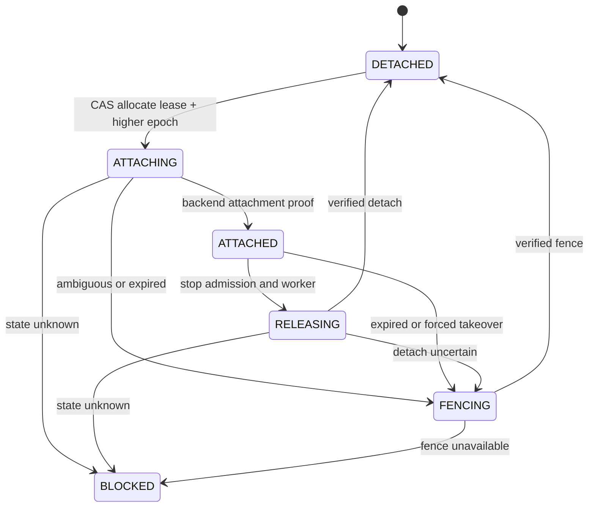

# Session Filesystem and Storage Contracts

## Scope

This document defines the versioned boundary between the portable runtime,
the storage control plane, a host-local storage backend, and a rootless Codex
worker. It deliberately does not implement a Podman or Docker launcher, a
volume driver, a distributed lease database, snapshots, or cross-host restore.

The contract has four independent records:

1. an immutable, secret-free session manifest;
2. an authoritative lease and fencing record outside the session volume;
3. a portable storage reference plus a host-local directory attachment; and
4. an immutable checkpoint descriptor that observes, but never restores,
   fencing state.

`src/session-storage-contracts.mjs` makes the portable record shapes,
fencing-number rules, declared backend capability surface, structural worker
template, and checkpoint classes executable and testable. These pure
validators do not perform a storage mutation, authorize a launch, stop a
writer, or prove a physical fence.

## Codex State Basis

The source analysis is pinned to Codex commit
`db887d03e1f907467e33271572dffb73bceecd6b`.

- `thread/start` does not accept a client-selected thread ID. The runtime must
  capture the root thread ID returned by app-server and persist it explicitly.
  See `codex-rs/app-server-protocol/src/protocol/v2/thread.rs`.
- A root thread's app-server `sessionId` equals its thread ID. Its subagents have
  distinct thread IDs but retain that shared root `sessionId`. Both semantic
  fields are recorded in the immutable manifest and v1 requires them to be
  equal for the root binding. See
  `codex-rs/app-server-protocol/src/protocol/v2/thread_data.rs`.
- Normal recovery uses `thread/resume { threadId, cwd }`; the rollout `path`
  override remains unstable and is not part of this contract. `thread/read`
  verifies the restored ID, session-tree ID, cwd, and turns.
- `$CODEX_HOME` contains versioned rollout state and auxiliary indexes. Codex
  can also place state, log, goal, and memory SQLite databases under
  `sqlite_home`. A persisted `config.toml` value takes precedence over
  `CODEX_SQLITE_HOME`, while app-server startup `--config` values are session
  flags above user and project configuration. App-server request `config`
  values are appended after those startup flags. The worker contract therefore
  supplies the environment fallback, requires the startup CLI override, denies
  request-level `sqlite_home`, and verifies the effective value. See
  `codex-rs/core/src/config/mod.rs`, `codex-rs/config/src/loader/mod.rs`, and
  `codex-rs/app-server/src/config_manager.rs`.
- Persistent sessions require `ephemeral=false`. `legacy` and `paginated` are
  the currently returned history modes; the selected mode is recorded rather
  than inferred.

The portable runtime never derives a rollout filename, SQLite filename, or
date-directory layout from a thread ID. Those remain Codex-owned details tied
to the fixed runtime image.

## Immutable Session Manifest

The v1 manifest contains no storage locator, host path, lease, fencing epoch,
credential, or Git summary:

```json
{
  "schemaVersion": 1,
  "sessionId": "019f2100-0000-7000-8000-000000000001",
  "codex": {
    "rootThreadId": "019f2100-0000-7000-8000-000000000002",
    "sessionId": "019f2100-0000-7000-8000-000000000002",
    "ephemeral": false,
    "historyMode": "paginated"
  },
  "runtime": {
    "imageDigest": "sha256:aaaaaaaaaaaaaaaaaaaaaaaaaaaaaaaaaaaaaaaaaaaaaaaaaaaaaaaaaaaaaaaa",
    "imageMediaType": "application/vnd.oci.image.manifest.v1+json",
    "platform": "linux/arm64",
    "codexVersion": "codex-cli 0.142.4",
    "codexSandbox": "danger-full-access"
  },
  "layoutVersion": 1,
  "authMode": "external-chatgpt-access-token",
  "agents": {
    "defaultMaxSubagents": 6,
    "maxSubagents": 10,
    "maxDepth": 2
  }
}
```

The image digest and media type declare a concrete Linux platform manifest, not
a tag or an architecture-selecting OCI index. The platform is recorded
separately. A record validator cannot inspect registry content or execute the
image, so this declaration is not proof: a trusted runtime probe must inspect
the descriptor and image configuration, measure `codex --version` from the
exact image, and then pass all four values through
`assertResolvedPlatformImageMatchesManifest()` before session creation and each
launch or restore. That helper only compares the trusted probe snapshot; it
does not contact a registry or execute a container. Before validation, the
trusted probe must reduce the raw version output to the allowlisted
`codex-cli x.y.z` core form; prerelease and build suffixes are rejected so
internal build labels or token-like text cannot enter portable metadata. The
image digest retains exact content identity after that sanitized comparison.
Publisher trust and image signature policy remain later operational work.

The manifest parser rejects unknown or missing fields, accessor properties,
duplicate JSON object keys, unsupported versions, mutable/ephemeral Codex
state, non-canonical IDs, tag-like image references, index media types,
credentials, and unsupported agent limits.
The serializer rebuilds the validated manifest in the schema order shown above,
so property insertion order cannot change its canonical UTF-8 bytes.

## Fixed Worker Layout

The storage backend returns a host-local directory only after establishing the
writer fence. The rootless launcher bind-mounts that directory with recursively
private (`rprivate`) propagation:

```text
host-local fenced directory    rootless worker
───────────────────────────    ───────────────
<attachment.rootPath>       -> /session
                               ├── codex-home
                               ├── workspace
                               └── .portable-runtime
```

The runner-neutral worker template fixes:

- `cwd=/session/workspace`;
- `CODEX_HOME=/session/codex-home`;
- `CODEX_SQLITE_HOME=/session/codex-home`;
- a Codex app-server CLI config override fixing
  `sqlite_home=/session/codex-home`;
- rejection of request-level `sqlite_home` overrides and an effective-config
  equality check before accepting work;
- a read-write `rprivate` bind at `/session`;
- a rootless container boundary; and
- Codex `danger-full-access` inside that container.

The worker never receives a raw block device, filesystem image, loop/NBD
handle, mount capability, storage credential, canonical lease record, or auth
authority directory. A host storage agent may attach an existing filesystem
volume or mount an image and then expose its mounted directory. Giving the
image or raw device directly to the rootless worker violates this contract.

`createRootlessWorkerTemplate()` is deliberately non-authorizing. It checks
that the manifest, storage reference, lease, and attachment describe the same
session and returns runner-neutral bind data; it neither checks canonical
lease authority nor launches a process. A trusted launcher must atomically
re-read the canonical lease at admission, resolve and inspect the attachment,
reject `/`, symlinks, non-directories, and paths outside its configured
attachment root, and keep the directory authority pinned through the actual
bind. A self-declared `kind: "directory"` or an opaque `proofId` is not enough.
If the launcher cannot hold that authority through the bind, it must fail
closed rather than consume this template as an authorization decision.

`CODEX_SQLITE_HOME` is only a fallback: a user-writable
`/session/codex-home/config.toml` can override it. The trusted launcher must
serialize `codexConfig.cliOverrides` as typed TOML values passed directly to
`codex app-server --config`, never as a shell fragment. Its app-server gateway
must reject every key in `deniedRequestOverrideKeys`, including nested
`thread/start`, `thread/resume`, or `thread/fork` request configuration, and
must fail closed unless app-server's effective configuration matches
`requiredEffectiveValues`.
This preserves the SQLite databases and their WAL/SHM files inside the
checkpointed volume even when persisted user configuration requests another
path. A later concrete launcher must exercise these obligations in conformance
tests.

`auth.json` is forbidden in the persistent worker home. External ChatGPT
access tokens are delivered through the app-server boundary and are not part
of the manifest. Because Codex shell snapshots can capture exported
environment variables, credentials must not be injected as general worker
environment variables. Session backups still contain sensitive company data
and require access control and encryption independently of `auth.json`.

## Authoritative Lease and Fencing

The canonical session-to-volume binding lives in one linearizable control
plane. It is never stored authoritatively under `/session` and is never
restored from a checkpoint.

A writer grant contains:

```json
{
  "contractVersion": 1,
  "sessionId": "019f2100-0000-7000-8000-000000000001",
  "leaseId": "lease-001",
  "holderId": "host-001",
  "fencingEpoch": "42",
  "expiresAt": "2026-07-02T12:00:30.000Z"
}
```

Fencing epochs are canonical positive decimal strings in the uint64 range.
Implementations compare them as integers such as `BigInt`, never JavaScript
`Number`. A new writable acquisition and the start of a force-fence operation
advance the epoch. Renewal and checkpoint capture do not.

Renewal accepts only the exact canonical lease before its authority expiration
and retains the same session, lease, holder, and epoch. It cannot resurrect an
expired lease or renew from a stale control-plane record. Renewal, canonical
fence matching, and mutation admission receive the current time explicitly from
the lease authority or its trusted control-plane clock; a worker host's local
wall clock must not decide whether authority is still valid.

Provisioning is the only storage mutation outside the writer-fenced envelope.
It runs before writer lease allocation under control-plane authority. Its
secret-free request binds an idempotent operation ID to the backend and runtime
session ID; its result echoes that tuple and returns the new storage ID plus an
opaque backend proof. Before reporting success, a concrete adapter must
atomically persist the operation ID, canonical request, and complete result.
An exact retry must replay the original storage ID, proof ID, status, and full
result without invoking the provider allocation again; reuse for a different
backend or session must fail closed. Adapter conformance tests must cover both a
lost-response retry and a conflicting operation-ID reuse. Neither the request
nor result contains or creates writer authority, and successful provisioning
does not authorize attachment or launch. The optional `previousResult` input to
`assertSessionProvisionResult()` makes the exact replay comparison executable
when an adapter loads its persisted idempotency record.

Every writer-authorized mutating backend request after provisioning carries the
complete writer identity:
`sessionId`, `leaseId`, `holderId`, `fencingEpoch`, and an idempotent operation
ID. It also carries an operation-specific target: attachment ID for
attach/detach, checkpoint plus artifact IDs for
capture/restore, and storage ID for destroy. The backend must bind the operation
ID to that target and compare the writer tuple atomically with its canonical
state as part of the mutation. Calling `assertCanonicalFenceMatch()` and then
performing an unrelated write is only structural validation and remains a
TOCTOU bug. Executable request and result validators bind the operation, target,
operation ID, full writer tuple, status, and backend proof. The snapshot
comparison helper also checks the portable storage reference, but remains
non-atomic and non-authorizing. A concrete adapter must repeat the
storage-reference and writer-tuple comparison atomically with its mutation. Its
conformance test must show that epoch-1 checkpoint, detach, and destroy requests
fail after an epoch-2 takeover, and that reusing an operation ID with a different
target fails.

Lease expiry closes control-plane admission; it does not prove that a stale
host stopped writing. Automatic takeover requires either a storage-native
epoch/reservation that rejects the old writer or verified revocation/detach of
the old attachment. Without that proof, the session remains `BLOCKED` and a new
writer must not start.

After expiry, only an exact-owner detach for the unchanged canonical tuple and
explicit attachment target may continue as cleanup. Checkpoint, destroy,
restore, or other mutations cannot use the expired-lease exception. Force-fence
is intentionally not represented by the generic mutation envelope: a concrete
adapter must define a transition that identifies the revoked old tuple,
advances to a distinct new canonical epoch, and returns provider evidence that
the old attachment can no longer write. Once that transition advances the
epoch, even the old detach is stale and must not affect the new attachment. A
`manual` backend cannot provide this proof and therefore cannot automatically
fail over.

The canonical lifecycle is:



An ambiguous attach, detach, or fence never rolls back optimistically to
`DETACHED`. A force-fence failure retains the advanced epoch and remains
blocked.

## Storage Backend Contract

A v1 backend exposes these capabilities:

```js
{
  normalDirectoryAttachment: true,
  exclusiveWriterAttachment: true,
  fencing: "epoch-enforced" | "verified-detach" | "manual",
  atomicPointInTimeCheckpoint: true | false
}
```

It declares implementations of `provisionSession`, `prepareWritableAttachment`,
`detachAttachment`, `forceFence`, `captureCheckpoint`, `restoreCheckpoint`,
and `destroySession`. The portable storage reference contains only backend,
storage, and runtime session IDs. The attachment adds the host-local absolute
directory path, holder, operation, proof, and exact lease/epoch; it is ephemeral
and must not be written to the session manifest, checkpoint descriptor, or
portable evidence. Passing the capability validator confirms only this object
shape and declaration; backend behavior remains untrusted until the concrete
adapter passes its conformance suite.

`assertSessionProvisionRequest()` and `assertSessionProvisionResult()` define
the separate control-plane provisioning boundary. The remaining attachment,
checkpoint, restore, detach, and destroy operations use the writer-fenced
mutation envelope. A backend must not treat a provisioning proof as a lease,
attachment proof, or launch authorization.

`manual` fencing is a valid declared backend capability for development and
operator-driven recovery, but it cannot perform automatic failover. A local
directory backend is single-host development only. NFS or another shared
filesystem satisfies the read-write contract only when its backend can enforce
exclusive writer access and revoke or fence a partitioned stale host. A lock
file or lease record on the same share is not sufficient.

## Checkpoint Classes

Checkpoint capture is separate from attachment release:

| Class | Required boundary | Resume rule |
| --- | --- | --- |
| `clean` | No active turn or background terminal; stopped writer; storage barrier | New lease |
| `graceful-abort` | Stable `turn/interrupt` result and abort marker; stopped writer; storage barrier | New lease |
| `crash-prefix` | Process stopped or conclusively fenced; atomic crash-consistent volume capture | Tail repair, then new lease |

The executable policy records this distinction as `writerBoundary: "stopped"`
plus `captureBoundary: "storage-barrier"` for `clean` and `graceful-abort`, and
`writerBoundary: "stopped-or-fenced"` plus
`captureBoundary: "atomic-crash-capture"` for `crash-prefix`.

A `crash-prefix` checkpoint must not invent the explicit abort marker seen
after `turn/interrupt`. Its descriptor records the observed source epoch for
audit, but the value never becomes canonical authority and the descriptor is
not a stop, barrier, or fence proof. This module validates descriptor identity
only; it does not authorize capture or restore.

A concrete checkpoint adapter must consume writer-stop or physical-fence
evidence and the matching backend mutation result, require atomic
crash-consistent capture before emitting `crash-prefix`, and prove tail repair
before writable resume. A concrete restore adapter must obtain a canonical
writable epoch strictly greater than the source epoch and retain physical
fence evidence through worker admission. These rules belong to adapter
conformance tests rather than a metadata-only validator.

Checkpoint descriptors record the source backend and storage ID, but
intentionally omit lease ID, expiration, host-local attachment path,
credentials, and Git Summary. Differential export consumes an immutable
checkpoint in a later pull request; it does not scan the live read-write
volume.

## Agent Limits

The default session-wide subagent limit is 6 and the hard limit is 10. The root
agent does not consume a subagent slot. Depth is counted as root `0`, child `1`,
and grandchild `2`; a depth-2 agent cannot spawn another agent. These are
runtime policy limits, not per-parent multipliers.

## Deferred Implementation

Later pull requests own:

- the auth broker and access-token delivery;
- Podman/Docker launch and UID/SELinux mapping;
- concrete local, NFS, LVM, ZFS, cloud-volume, or filesystem-image adapters;
- the linearizable binding database, renewer, idempotency store, and host fence;
- held-directory launch authority, atomic mutation/fence transitions, provider
  proofs, and adapter conformance validators;
- quiesce, sync/freeze, snapshot, restore, rollout-tail repair, and resume
  verification;
- differential compression, encryption, retention, and atomic publication;
- cross-host migration and fault injection; and
- the read-only Git Summary.
